SD-WAN Programmability Lab Guide 
================================


Table of Contents
=================

   * [Introduction](#introduction)
      * [vManage REST API's](#vmanage-rest-apis)
      * [Available API Calls](#available-api-calls)
   * [Lab Overview](#lab-overview)
      * [Platforms and software used](#platforms-and-software-used)
      * [Accessing the lab](#accessing-the-lab)
   * [Lab Flow/Use cases](#lab-flowuse-cases)
   * [Usecase-1: Device and Monitoring API's](#usecase-1-device-and-monitoring-apis)
      * [Code Components](#code-components)
      * [Authentication](#authentication)
      * [GET Request](#get-request)
      * [POST Request](#post-request)
      * [Resource URL Structure Components](#resource-url-structure-components)
      * [List Devices](#list-devices)
      * [Control Status](#control-status)
      * [Interface Status](#interface-status)
      * [Device Counters](#device-counters)
      * [System Status](#system-status)
      * [Conclusion](#conclusion)
   * [Usecase-2: Configuration API's](#usecase-2-configuration-apis)
      * [Resource URL Structure Components](#resource-url-structure-components-1)
      * [Templates list](#templates-list)
      * [Create Templates](#create-templates)
         * [Code Components](#code-components-1)
      * [Conclusion](#conclusion-1)
   * [Usecase-3: Firewall Statistics API's](#usecase-3-firewall-statistics-apis)
      * [Resource URL Structure Components](#resource-url-structure-components-2)
      * [Query Payload](#query-payload)
         * [Example-1](#example-1)
         * [Example-2](#example-2)
         * [Example-3](#example-3)
      * [POST Operation](#post-operation)
      * [Influx DB:](#influx-db)
         * [Connect to InfluxDB](#connect-to-influxdb)
         * [Code snip](#code-snip-6)
      * [Grafana](#grafana)
         * [Configure Grafana](#configure-grafana)
         * [Create a Dashboard](#create-a-dashboard)
      * [Conclusion](#conclusion-2)
   * [Usecase-4: Alarms API’s](#usecase-4-alarms-apis)
      * [Resource URL Structure Components](#resource-url-structure-components-3)
      * [Query Payload](#query-payload-1)
         * [Example-1](#example-1-1)
         * [Example-2](#example-2-1)
         * [Example-3](#example-3-1)
      * [POST Operation](#post-operation-1)
      * [Sample Responses](#sample-responses)
         * [Example-1](#example-1-2)
         * [Example-2](#example-2-2)
      * [Conclusion](#conclusion-3)
   * [Usecase-5: Webhook](#usecase-5-webhook)
      * [Prerequisites](#prerequisites)
      * [Configure](#configure)
      * [Notifications Dashboard](#notifications-dashboard)
      * [Set up Webhook server on Windows VM](#set-up-webhook-server-on-windows-vm)
      * [Enable Webhook Server](#enable-webhook-server)
      * [Alarms on vManage](#alarms-on-vmanage)
      * [Conclusion](#conclusion-4)
   * [References](#references)
  
# Introduction

## vManage REST API's

  - REpresentational State Transfer (REST) is an architecture style for designing web-services applications
  - REST architecture uses a stateless, client–server, cacheable communications protocol.
  - The vManage web server uses HTTP and its secure counterpart, HTTPS, as the communications protocol
  - vManage API Documentation is built-in at https://<vmanage-ip:port>/apidocs
  - Test API calls can be tried out from swagger UI at /apidocs

## Available API Calls

- 	In REST API terminology, each of these features or operations is called a resource. 
-	A resource is an object with a type, associated data, relationships to other resources, and a set of methods that operate on it.
- Resources are grouped into collections and below is that list.

| Resource Collection | Resources for |
| ------ | ------ |		
| Device Action | Manage device actions viz. reboot, upgrade, lxcinstall etc. <br>**Resource URL:** /device/action/|	
|Device Inventory | Retrieving device inventory information, including serial numbers and system status. <br>**Resource URL:** /system/device/ |
| Administration | 	Managing users and user groups, viewing audit logs, and managing the local vManage server. <br>**Resource URL:** /admin, /auditlog |
| Certificate Management | Managing certificates and security keys. <br>**Resource URL:** /certificate|
| Configuration	| Creating feature and device configuration templates, retrieving the configurations in existing templates. <br>**Resource URL:** /template/feature/ , /template/policy/ , /template/device/ |
| Monitoring	| Viewing status, statistics, and other information about operational devices in the overlay network. <br>**Resource URL:** /alarms,  /statistics , /event |
| Real-Time Monitoring	| Retrieving, viewing, and managing real-time statistics and traffic information. Real-time monitoring information is gathered in real time, approximately once per second. <br>**Resource URL:** /device/app-route/statistics , /device/bfd/status |
| Troubleshooting Tools | Troubleshooting devices, for determining the effect of policy, for updating software, and for retrieving software version information. <br>**Resource URL:** /device/action/software , /device/tools/ping/|
|Cross-Domain Integration API's| API's to integrate with SDA and ACI. <br>**Resource URL:** /partner |


# Lab Overview

## Platforms and software used

| Component | Software Version |
| ------ | ------ |
| vManage  | 18.4.0 |
| cEdge (CSR1000v) | 16.10.1 |
| vEdge (vedge-cloud) | 18.4.0 |
| InfluxDB  | 1.7.4 |
| Grafana   | 6.0.2 |

##	 Accessing the lab

**Note:** This lab utilizes the dCloud SD-WAN platform so, please schedule dcloud lab ahead of time before proceeding with below steps.


**Step-1**

Connect to your dCloud session by opening your Cisco AnyConnect client and
providing the following information to connect into the lab session:

| Parameter | Input |
| ------ | ------ |
| AnyConnect Host | **Instructor Provided** |
| Username | **Instructor Provided** |
| Password| **Instructor Provided** |

**Step-2**

**RDP**


For MAC laptop users download link:
https://itunes.apple.com/us/app/microsoft-remote-desktop-10/id1295203466 

Open your local Remote Desktop Client application and connect to the lab Jumphost
. This host has access to all network devices and can run our python scripts.  

| Parameter | Input |
| ------ | ------ |
| Host | **Instructor Provided** |
| Username | **Instructor Provided**  |
| Password| **Instructor Provided** |

Click ignore/continue if prompted with an invalid certificate warning:


This will place you onto “WKST1,” which is the launching point for all lab tasks.

On this workstation, we have python scripts in directory `sdwan_prog_lab` on Desktop

**Step-3**

Run below commands in windows command prompt to set the environment variables which stores vmanage details. 

```
set vmanage_host=198.18.1.10
set vmanage_port=443
set username=admin
set password=admin
``` 

#	 Lab Flow/Use cases

The Lab begins with the all devices in fabric being up and running. We use the python scripts to execute below REST API calls.

1.	Device and Monitoring API's

	-	Use CLI based python application script that leverages the REST API's to retrieve Inventory data from vmanage and control connections, OMP peers, BFD sessions, System status of wan edge router. 
2.	Configuration API's

   	- 	Use CLI based python script to retrieve list of templates and create a banner template.
3.	Firewall Statistics API's

   	- 	Use python script to retrieve firewall inspect counter values, then store these firewall inspect count values in a Time Series Database (TSDB) Influx DB and plot it on to Grafana Dashboard
4.	Alarms API’s

	- 	Learn different Query examples to retrieve the alarms from the vManage and parse the json data about alarms that is received.
5. Webhooks

	- 	Learn how to enable webhooks on vManage and write API route to consume the data sent from vManage to webhook server.

Now let's start with 1st use case and learn how to use Device and Monitoring API's

#	Usecase-1: Device and Monitoring API's

## Objective 

How to retrieve devices list, control connection status, interface status, system status using vManage REST API's.

## Code Components

Please note that this is a FYI section which includes code snippets and structure of CLI based python application script **vmanage_apis.py**. 

<details>
  <summary>Click to expand!</summary>

-	Python function that does login and authenticate with vManage instance
-	Python functions to perform GET and POST operations on REST API's

In `vmanage_apis.py` code , we have defined a class `rest_api_lib` which has methods `login()`, `get_request()` and `post_request()`

## Authentication

Let's start by going through login() function which is used to get authenticated with vManage and receive cookie which is used for authentication in subsequent API calls. 

Input parameters for login function are

-  endpoint vManage i.e. https://{{vmanage}}:{{port}} 
-  login resource URL i.e. /j_security_check. 

The vManage username and password are specified using dictionary variable `login_data`.

On successful POST operation we get JSESSIONID or cookie which is used in future API calls by client. By nature REST API is stateless so we use JSESSIONID for doing session tracking.

To get cookie check out "sess.cookies" which would contain JSESSIONID 

```
import requests
sess = requests.session()
Now after login check sess.cookies for JESSIONID value
```

### Code snip

```
def login(self, vmanage_host, username, password):
      """Login to vmanage"""
     base_url = 'https://%s:%s/'%(self.vmanage_host, self.vmanage_port)
     login_action = '/j_security_check'
     #Format data for loginForm
     login_data = {'j_username' : username, 'j_password' : password}
     #Url for posting login data
     login_url = base_url + login_action
     url = base_url + login_url
     sess = requests.session()
     #If the vmanage has a certificate signed by a trusted authority change verify to True
     login_response = sess.post(url=login_url, data=login_data, verify=False)
     if b'<html>' in login_response.content:
         print ("Login Failed")
         sys.exit(0)
     
     self.session[vmanage_host] = sess
```

## GET Request

Input parameters for GET operation

-   endpoint (vmanage server ip address)
-   resource or mountpoint represented by the URL

Now we use the python requests library again but this time we don't build a new session, we use the request method to perform a GET operation on the Resource url.

All the REST API resource URL's starts with https://{{vmanage_ip}}:{{port}}/dataservice/. 

### Code snip

```
    def get_request(self, mount_point):
        """GET request"""
        url = "https://%s:%s/dataservice/%s"%(self.vmanage_host, self.vmanage_port, mount_point)
        print(url)
      
        response = self.session[self.vmanage_host].get(url, verify=False)
        
        return response
```

## POST Request

Input parameters for POST operation

-   endpoint (vmanage server ip address)
-   resource or mountpoint represented by the URL
-   headers (Content-type and Accept are set to application/json)
-   payload, for example the query which defines how firewall statistics are collected.
 
"verify=False" parameter is passed in POST operation because the SSL verification is disabled.

### Code snip

```
def post_request(self, mount_point, payload, headers={'Content-type': 'application/json', 'Accept': 'application/json'}):

        """POST request"""
        url = "https://%s:%s/dataservice/%s"%(self.vmanage_host, self.vmanage_port, mount_point)
        payload = json.dumps(payload)
        response = self.session[self.vmanage_host].post(url=url, data=payload, headers=headers, a)
        return response
```

</details>
<br>
Now let's have a look at resource URL structure components that are used in GET and POST requests.

## Resource URL Structure Components

Resource URL to retrieve the inventory from the vmanage is `https://<vmanage-ip:port>/dataservice/device`

| Component | Description |
| ------ | ------ |
| http:// or https://  | Protocol over which data is sent  between client and server |
| Server or Host  | Resolves to the IP and port to which to connect, example : "<vmanage-ip:port>" |
| Resource | The location of the data or object of  interest, example : "/device" |
| Parameters  | Details to scope, filter, or clarify a request. Often optional|

Example for Parameters
  -   URL : https://<vmanage-ip:port>/dataservice/device/bfd/state/device?deviceId=1.1.1.7 
  -   "?deviceId=1.1.1.7" is used to filter out bfd state for device with system-ip/deviceId = 1.1.1.7

Note:  All REST API calls to vmanage contains the root "/dataservice".
	
**Step-1:**

<pre>
Open Windows Command prompt and execute the command <b>py -3.7 vmanage_apis.py</b> to see the list of<br>available options in this CLI based python application script. 
</pre>

**Sample Response**

```
C:\Users\Administrator\Desktop\sdwan_prog_lab>py -3.7 vmanage_apis.py
Usage: vmanage_apis.py [OPTIONS] COMMAND [ARGS]...

  Command line tool for deploying templates to CISCO SDWAN.

Options:
  --help  Show this message and exit.

Commands:
  control-status           Retrieve and return information about Control...
  create-feature-template  create template with Cisco SDWAN.
  device-counters          Retrieve and return information about Device...
  interface-status         Retrieve and return information about Interface...
  list-devices             Retrieve and return information about network...
  system-status            Retrieve and return information about system...
  template-list            Retrieve and return templates list.
```

Now let’s make an API call to fetch the list of devices in the SD-WAN fabric. 

Resource URI for this is "device" so, URL to fetch devices is  "https://vmanage-ip:port/dataservice/device"

## List Devices

Once authentication is done with the vManage using `login()` function, we will run the `get_request` method of `rest_api_lib` class object to get a list of all the devices in the fabric and store the JSON data that is returned by the API in the response variable.

Now we extract just the `[data]` portion of the JSON and store it in a variable called items. The items variable at this point contains lot of information about all the devices in the fabric.
 
**Step-2:** 	

<pre>
On windows command prompt, run the command <b>py -3.7 vmanage_apis.py list-devices</b> to retrieve the list <br>of devices and print information such as Host-name, Site-ID, system-ip etc.. in table format.
</pre>
  
See the below sample response which includes all the information retrieved for one such network device in fabric and also filtered information which is printed in table format about all network devices. 

**Sample Response**  
  
```
C:\Users\Administrator\Desktop\sdwan_prog_lab>py -3.7 vmanage_apis.py list-devices
Retrieving the device list
https://198.18.1.10:443/dataservice/device

Device details retrieved for one network device
{'bfdSessions': '8',
 'bfdSessionsUp': 8,
 'board-serial': '9B1519EB',
 'certificate-validity': 'Valid',
 'connectedVManages': ['"10.10.10.10"'],
 'controlConnections': '5',
 'device-groups': ['"No groups"'],
 'device-model': 'vedge-CSR-1000v',
 'device-os': 'next',
 'device-type': 'vedge',
 'deviceId': '10.3.0.1',
 'domain-id': '1',
 'host-name': 'BR1-CEDGE1',
 'isDeviceGeoData': True,
 'lastupdated': 1553408172589,
 'latitude': '41.87',
 'layoutLevel': 4,
 'linux_cpu_count': '4',
 'local-system-ip': '10.3.0.1',
 'longitude': '-121.88',
 'max-controllers': '0',
 'model_sku': 'None',
 'ompPeers': '2',
 'personality': 'vedge',
 'platform': 'x86_64',
 'reachability': 'reachable',
 'site-id': '300',
 'state': 'green',
 'state_description': 'All daemons up',
 'status': 'normal',
 'statusOrder': 4,
 'system-ip': '10.3.0.1',
 'testbed_mode': False,
 'timezone': 'UTC +0000',
 'total_cpu_count': '4',
 'uptime-date': 1553046900000,
 'uuid': 'CSR-940ad679-a16a-48ea-9920-16278597d98e',
 'validity': 'valid',
 'version': '16.10.1'}

list of all devices retrieved
╒═════════════╤═══════════════╤════════════╤═════════════╤═══════════════╤═══════════╤═════════════════╤═════════════╕
│ Host-Name   │ Device Type   │   Latitude │   Longitude │ Certificate   │ Version   │ Device Model    │ System IP   │
│             │               │            │             │ Validity      │           │                 │             │
╞═════════════╪═══════════════╪════════════╪═════════════╪═══════════════╪═══════════╪═════════════════╪═════════════╡
│ vManage     │ vmanage       │    37.33   │    -121.88  │ Valid         │ 18.4.0    │ vmanage         │ 10.10.10.10 │
├─────────────┼───────────────┼────────────┼─────────────┼───────────────┼───────────┼─────────────────┼─────────────┤
│ vSmart-1    │ vsmart        │    37.6667 │    -122.777 │ Valid         │ 18.4.0    │ vsmart          │ 12.12.12.12 │
├─────────────┼───────────────┼────────────┼─────────────┼───────────────┼───────────┼─────────────────┼─────────────┤
│ vSmart-2    │ vsmart        │    37.6667 │    -122.777 │ Valid         │ 18.4.0    │ vsmart          │ 22.22.22.22 │
├─────────────┼───────────────┼────────────┼─────────────┼───────────────┼───────────┼─────────────────┼─────────────┤
│ vBond-1     │ vbond         │    37.33   │    -121.88  │ Valid         │ 18.4.0    │ vedge-cloud     │ 11.11.11.11 │
├─────────────┼───────────────┼────────────┼─────────────┼───────────────┼───────────┼─────────────────┼─────────────┤
│ vBond-2     │ vbond         │    41.87   │     -87.62  │ Valid         │ 18.4.0    │ vedge-cloud     │ 21.21.21.21 │
├─────────────┼───────────────┼────────────┼─────────────┼───────────────┼───────────┼─────────────────┼─────────────┤
│ BR1-CEDGE1  │ vedge         │    41.87   │    -121.88  │ Valid         │ 16.10.1   │ vedge-CSR-1000v │ 10.3.0.1    │
├─────────────┼───────────────┼────────────┼─────────────┼───────────────┼───────────┼─────────────────┼─────────────┤
│ BR1-CEDGE2  │ vedge         │    41.87   │    -121.88  │ Valid         │ 16.10.1   │ vedge-CSR-1000v │ 10.3.0.2    │
├─────────────┼───────────────┼────────────┼─────────────┼───────────────┼───────────┼─────────────────┼─────────────┤
│ BR3-CEDGE1  │ vedge         │    37.33   │     -87.62  │ Valid         │ 16.10.1   │ vedge-CSR-1000v │ 10.5.0.1    │
├─────────────┼───────────────┼────────────┼─────────────┼───────────────┼───────────┼─────────────────┼─────────────┤
│ DC1-VEDGE1  │ vedge         │    37.33   │    -121.88  │ Valid         │ 18.4.0    │ vedge-cloud     │ 10.1.0.1    │
├─────────────┼───────────────┼────────────┼─────────────┼───────────────┼───────────┼─────────────────┼─────────────┤
│ DC1-VEDGE2  │ vedge         │    37.33   │    -121.88  │ Valid         │ 18.4.0    │ vedge-cloud     │ 10.1.0.2    │
├─────────────┼───────────────┼────────────┼─────────────┼───────────────┼───────────┼─────────────────┼─────────────┤
│ DC2-VEDGE1  │ vedge         │    41.87   │     -87.62  │ Valid         │ 18.4.0    │ vedge-cloud     │ 10.2.0.1    │
├─────────────┼───────────────┼────────────┼─────────────┼───────────────┼───────────┼─────────────────┼─────────────┤
│ DC2-VEDGE2  │ vedge         │    41.87   │     -87.62  │ Valid         │ 18.4.0    │ vedge-cloud     │ 10.2.0.2    │
╘═════════════╧═══════════════╧════════════╧═════════════╧═══════════════╧═══════════╧═════════════════╧═════════════╛

```

##	Control Status

### Note: 

-	To learn how to use particular option, use help command `py -3.7 vmanage_apis.py control-status --help`  
-  Please use system-ip **10.3.0.1** to fetch monitoring information for host <b>BR1-CEDGE1</b> cedge router and use system-ip **10.2.0.1** for <b>DC2-VEDGE1</b> vedge router

**Step-3:** 

<pre>
On windows command prompt, run command <b>py -3.7 vmanage_apis.py control-status --system_ip 10.3.0.1</b><br>to get the control connections status for WAN edge router with system ip address 10.3.0.1
</pre>

In `control-status` option, we use resource URI `device/control/synced/connections?deviceId=<system-ip>` to fetch the status of control connections. 

**Sample Response**
    
```  
$ py -3.7 vmanage_apis.py control-status --help
Usage: vmanage_apis.py control-status [OPTIONS]

  Retrieve and return information about Control status of network device in
  SD-WAN fabric

  Example command:     ./vmanage_apis.py interface_status

Options:
  --system_ip TEXT  System IP address of the device
  --help            Show this message and exit.
  
#cedge 
  

C:\Users\Administrator\Desktop\sdwan_prog_lab>py -3.7 vmanage_apis.py control-status --system_ip 10.3.0.1
Retrieving the Control Status
https://198.18.1.10:443/dataservice/device/control/synced/connections?deviceId=10.3.0.1

Control Connection status for Device =  10.3.0.1
╒═════════════╤══════════════════╤═════════╤═════════════════════╕
│ Peer Type   │ Peer System IP   │ state   │ Last Updated        │
╞═════════════╪══════════════════╪═════════╪═════════════════════╡
│ vsmart      │ 12.12.12.12      │ up      │ 03/20/2019 01:58:50 │
├─────────────┼──────────────────┼─────────┼─────────────────────┤
│ vsmart      │ 22.22.22.22      │ up      │ 03/20/2019 01:58:50 │
├─────────────┼──────────────────┼─────────┼─────────────────────┤
│ vsmart      │ 12.12.12.12      │ up      │ 03/20/2019 01:58:50 │
├─────────────┼──────────────────┼─────────┼─────────────────────┤
│ vsmart      │ 22.22.22.22      │ up      │ 03/20/2019 01:58:50 │
├─────────────┼──────────────────┼─────────┼─────────────────────┤
│ vmanage     │ 10.10.10.10      │ up      │ 03/20/2019 01:58:50 │
╘═════════════╧══════════════════╧═════════╧═════════════════════╛

#vedge

C:\Users\Administrator\Desktop\sdwan_prog_lab>py -3.7 vmanage_apis.py control-status --system_ip 10.2.0.1
Retrieving the Control Status
https://198.18.1.10:443/dataservice/device/control/synced/connections?deviceId=10.2.0.1

Control Connection status for Device =  10.2.0.1
╒═════════════╤══════════════════╤═════════╤═════════════════════╕
│ Peer Type   │ Peer System IP   │ state   │ Last Updated        │
╞═════════════╪══════════════════╪═════════╪═════════════════════╡
│ vsmart      │ 22.22.22.22      │ up      │ 03/20/2019 01:59:08 │
├─────────────┼──────────────────┼─────────┼─────────────────────┤
│ vsmart      │ 12.12.12.12      │ up      │ 03/20/2019 01:59:08 │
├─────────────┼──────────────────┼─────────┼─────────────────────┤
│ vmanage     │ 10.10.10.10      │ up      │ 03/22/2019 20:03:19 │
├─────────────┼──────────────────┼─────────┼─────────────────────┤
│ vsmart      │ 12.12.12.12      │ up      │ 03/24/2019 06:05:35 │
├─────────────┼──────────────────┼─────────┼─────────────────────┤
│ vsmart      │ 22.22.22.22      │ up      │ 03/24/2019 06:05:35 │
╘═════════════╧══════════════════╧═════════╧═════════════════════╛

```

## Interface Status

**Step-4:** 

<pre>
On windows command prompt, run command <b>py -3.7 vmanage_apis.py interface-status --system_ip 10.3.0.1</b><br>to get the interfaces status for WAN edge router with system ip address 10.3.0.1
</pre>

In `interface-status` option, we use resource URI `device/interface/synced?deviceId=<system-ip>` to fetch the interface status of one such network device in fabric.

```
#cedge


C:\Users\Administrator\Desktop\sdwan_prog_lab>py -3.7 vmanage_apis.py interface-status --system_ip 10.3.0.1
Retrieving the interface Status
https://198.18.1.10:443/dataservice/device/interface/synced?deviceId=10.3.0.1

Interfaces status for Device =  10.3.0.1
╒═══════════════════╤══════════════════════╕
│ Interface Name    │ Operational status   │
╞═══════════════════╪══════════════════════╡
│ GigabitEthernet4  │ if-oper-state-ready  │
├───────────────────┼──────────────────────┤
│ GigabitEthernet10 │ if-oper-state-ready  │
├───────────────────┼──────────────────────┤
│ Loopback65528     │ if-oper-state-ready  │
├───────────────────┼──────────────────────┤
│ Tunnel4           │ if-oper-state-ready  │
├───────────────────┼──────────────────────┤
│ Control Plane     │ if-oper-state-ready  │
├───────────────────┼──────────────────────┤
│ GigabitEthernet3  │ if-oper-state-ready  │
├───────────────────┼──────────────────────┤
│ GigabitEthernet5  │ if-oper-state-ready  │
├───────────────────┼──────────────────────┤
│ GigabitEthernet6  │ if-oper-state-ready  │
├───────────────────┼──────────────────────┤
│ GigabitEthernet7  │ if-oper-state-ready  │
├───────────────────┼──────────────────────┤
│ GigabitEthernet8  │ if-oper-state-ready  │
├───────────────────┼──────────────────────┤
│ GigabitEthernet9  │ if-oper-state-ready  │
├───────────────────┼──────────────────────┤
│ Tunnel5           │ if-oper-state-ready  │
├───────────────────┼──────────────────────┤
│ VirtualPortGroup0 │ if-oper-state-ready  │
├───────────────────┼──────────────────────┤
│ VirtualPortGroup1 │ if-oper-state-ready  │
├───────────────────┼──────────────────────┤
│ Tunnel6000001     │ if-oper-state-ready  │
├───────────────────┼──────────────────────┤
│ Loopback0         │ if-oper-state-ready  │
╘═══════════════════╧══════════════════════╛

C:\Users\Administrator\Desktop\sdwan_prog_lab>

#vedge 


C:\Users\Administrator\Desktop\sdwan_prog_lab>py -3.7 vmanage_apis.py interface-status --system_ip 10.2.0.1
Retrieving the interface Status
https://198.18.1.10:443/dataservice/device/interface/synced?deviceId=10.2.0.1

Interfaces status for Device =  10.2.0.1
╒══════════════════╤══════════════════════╕
│ Interface Name   │ Operational status   │
╞══════════════════╪══════════════════════╡
│ ge0/1            │ Up                   │
├──────────────────┼──────────────────────┤
│ ge0/1            │ Up                   │
├──────────────────┼──────────────────────┤
│ ge0/2            │ Up                   │
├──────────────────┼──────────────────────┤
│ ge0/2            │ Up                   │
├──────────────────┼──────────────────────┤
│ system           │ Up                   │
├──────────────────┼──────────────────────┤
│ system           │ Up                   │
├──────────────────┼──────────────────────┤
│ ge0/0            │ Up                   │
├──────────────────┼──────────────────────┤
│ ge0/3            │ Up                   │
├──────────────────┼──────────────────────┤
│ eth0             │ Up                   │
╘══════════════════╧══════════════════════╛

C:\Users\Administrator\Desktop\sdwan_prog_lab>

```  

## Device Counters

**Step-5:**

<pre>
On windows command prompt, run command <b>py -3.7 vmanage_apis.py device-counters --system_ip 10.3.0.1</b><br>to get the number of OMP Peers, Vsmart connections, BFD sessions for WAN edge router with system ip<br>address 10.3.0.1
</pre>

In `device-counters` option, we use resource URI `device/counters?deviceId=<system-ip>` to get the number of OMP Peers, Vsmart connections, BFD sessions.


```
#cedge

C:\Users\Administrator\Desktop\sdwan_prog_lab>py -3.7 vmanage_apis.py device-counters --system_ip 10.3.0.1
Retrieving the Device Counters
https://198.18.1.10:443/dataservice/device/counters?deviceId=10.3.0.1

Device Counters for Device =  10.3.0.1
╒════════════════╤══════════════════╤══════════════════════╤═══════════════════╤═════════════════════╕
│   OMP Peers Up │   OMP Peers Down │   Vsmart connections │   BFD Sessions Up │   BFD Sessions Down │
╞════════════════╪══════════════════╪══════════════════════╪═══════════════════╪═════════════════════╡
│              2 │                0 │                    4 │                 7 │                   1 │
╘════════════════╧══════════════════╧══════════════════════╧═══════════════════╧═════════════════════╛

#vedge


C:\Users\Administrator\Desktop\sdwan_prog_lab>py -3.7 vmanage_apis.py device-counters --system_ip 10.2.0.1
Retrieving the Device Counters
https://198.18.1.10:443/dataservice/device/counters?deviceId=10.2.0.1

Device Counters for Device =  10.2.0.1
╒════════════════╤══════════════════╤══════════════════════╤═══════════════════╤═════════════════════╕
│   OMP Peers Up │   OMP Peers Down │   Vsmart connections │   BFD Sessions Up │   BFD Sessions Down │
╞════════════════╪══════════════════╪══════════════════════╪═══════════════════╪═════════════════════╡
│              2 │                0 │                    4 │                10 │                   0 │
╘════════════════╧══════════════════╧══════════════════════╧═══════════════════╧═════════════════════╛

C:\Users\Administrator\Desktop\sdwan_prog_lab>

```

## System Status

**Step-6:** 

<pre>
On windows command prompt, run command <b>py -3.7 vmanage_apis.py system-status --system_ip 10.3.0.1</b><br>to get the uptime, version, memory and CPU usage information for WAN edge router with system ip<br>address 10.3.0.1
</pre>

In `system-status` option, we use resource URI `device/system/status?deviceId=<system-ip>` to fetch the system status of one such network device in fabric.

```
#cedge

C:\Users\Administrator\Desktop\sdwan_prog_lab>py -3.7 vmanage_apis.py system-status --system_ip 10.3.0.1
Retrieving the System Status
https://198.18.1.10:443/dataservice/device/system/status?deviceId=10.3.0.1

System status for Device =  10.3.0.1
╒═════════════╤═════════════════════════════╤═══════════╤═══════════════╤══════════════╕
│ Host name   │ Up time                     │ Version   │   Memory Used │   CPU system │
╞═════════════╪═════════════════════════════╪═══════════╪═══════════════╪══════════════╡
│ BR1-CEDGE1  │ 5 days 05 hrs 28 min 02 sec │ 16.10.1   │       4442764 │            6 │
╘═════════════╧═════════════════════════════╧═══════════╧═══════════════╧══════════════╛

C:\Users\Administrator\Desktop\sdwan_prog_lab>

#vedge

C:\Users\Administrator\Desktop\sdwan_prog_lab>py -3.7 vmanage_apis.py system-status --system_ip 10.2.0.1
Retrieving the System Status
https://198.18.1.10:443/dataservice/device/system/status?deviceId=10.2.0.1

System status for Device =  10.2.0.1
╒═════════════╤═════════════════════════════╤═══════════╤═══════════════╤══════════════╕
│ Host name   │ Up time                     │ Version   │   Memory Used │   CPU system │
╞═════════════╪═════════════════════════════╪═══════════╪═══════════════╪══════════════╡
│ DC2-VEDGE1  │ 5 days 05 hrs 29 min 12 sec │ 18.4.0    │        684012 │         2.29 │
╘═════════════╧═════════════════════════════╧═══════════╧═══════════════╧══════════════╛

C:\Users\Administrator\Desktop\sdwan_prog_lab>

```

## Conclusion

In this section we have learned how to collect list of devices and below monitoring information for one such network device in the fabric.

 - Control connections status
 - Interface status
 - OMP Peers and BFD sessions
 - System Status

#	Usecase-2: Configuration API's

## Objective 

How to retrieve list of templates and create a banner template using vManage REST API's.

## Resource URL Structure Components

https://<vmanage-ip:port>/dataservice/template/feature/


## Templates list

**Step-1:**

<pre>
On windows command prompt, run command <b>py -3.7 vmanage_apis.py template-list</b> to retrieve the list<br>of device templates defined.
</pre> 

In `template-list` option, we use resource URI `template/device` to fetch the list of templates.

**Sample Response**

```

cedge and vedge template lists

C:\Users\Administrator\Desktop\sdwan_prog_lab>py -3.7 vmanage_apis.py template-list
Retrieving the templates available.
https://198.18.1.10:443/dataservice/template/device
╒═════════════════════════════╤═════════════════╤══════════════════════════════════════╤════════════════════╤════════════════════╕
│ Template Name               │ Device Type     │ Template ID                          │   Attached devices │   Template version │
╞═════════════════════════════╪═════════════════╪══════════════════════════════════════╪════════════════════╪════════════════════╡
│ BR1-VE1-Template            │ vedge-cloud     │ 21fbda48-1a53-450c-b729-be7a49c6d969 │                  0 │                  0 │
├─────────────────────────────┼─────────────────┼──────────────────────────────────────┼────────────────────┼────────────────────┤
│ vSmartConfigurationTemplate │ vsmart          │ e1f3de23-1ded-49d8-85b1-1e6ab668775f │                  0 │                  0 │
├─────────────────────────────┼─────────────────┼──────────────────────────────────────┼────────────────────┼────────────────────┤
│ BranchType1Template-CSR     │ vedge-CSR-1000v │ c62e6fba-fb53-4562-b436-3878de0fbbc2 │                  2 │                 21 │
├─────────────────────────────┼─────────────────┼──────────────────────────────────────┼────────────────────┼────────────────────┤
│ BranchType3Template-CSR     │ vedge-CSR-1000v │ 969340a0-0e2f-4dc2-81e8-bd4534ad7aa1 │                  1 │                 21 │
├─────────────────────────────┼─────────────────┼──────────────────────────────────────┼────────────────────┼────────────────────┤
│ VSMART-device-template      │ vsmart          │ 55eb96ec-237d-4170-8841-3321a04e01a7 │                  2 │                  8 │
├─────────────────────────────┼─────────────────┼──────────────────────────────────────┼────────────────────┼────────────────────┤
│ BranchType2Template-vEdge   │ vedge-cloud     │ 2463357c-4261-48fe-a13e-bab7aec5c002 │                  1 │                 21 │
├─────────────────────────────┼─────────────────┼──────────────────────────────────────┼────────────────────┼────────────────────┤
│ DC-vEdges                   │ vedge-cloud     │ 6c7d22bc-73d5-4877-9402-26c75a22bd08 │                  4 │                 19 │
╘═════════════════════════════╧═════════════════╧══════════════════════════════════════╧════════════════════╧════════════════════╛

```

## Create Templates

Now let’s start using the python script to create the template by using below steps

  - Build payload to provide the variables needed to create template
  - Perform the POST operation by sending template variables in payload. 

We can use `.yaml` file to store all the required variables for configuring the template. For example, please see below file `banner_config.yaml`

```
$ cat banner_config.yaml
template_name: 'vedge_cloud_banner'
template_description: 'vedge_cloud_banner'
login_banner: 'test_yaml_banner_login'
motd_banner: 'test_yaml_banner_motd'
device_type: 'vedge-cloud'
```

While building the templates, we can load the content from above `.yaml` file 

### Code Components

Please note that this is a FYI section which includes code snippets and structure of command `create-feature-template` in CLI based python application script **vmanage_apis.py**. 

<details>
  <summary>Click to expand!</summary>

### Code snip

```
with open(input_yaml) as f:
	config = yaml.safe_load(f.read())
```

`.yaml` file contents are stored in `config` dictionary which is used in creating below payload variable. 

### Code snip

```
payload = {
    "templateName": config["template_name"],
    "templateMinVersion": "15.0.0",
    "templateDescription": config["template_description"],
    "templateType": "banner",
    "templateDefinition": {
        "login": {
            "vipObjectType": "object",
            "vipType": "constant",
            "vipValue": config["login_banner"],  # using the values defined for login banner in yaml file
            "vipVariableName": "banner_login"
        },
        "motd": {
            "vipObjectType": "object",
            "vipType": "constant",
            "vipValue": config["motd_banner"],  # using the values defined for motd banner in yaml file
            "vipVariableName": "banner_motd"
        }
    },
    "deviceType": [
        config["device_type"]
    ],
    "deviceModels": [
        {
            "name": "vedge-cloud",
            "displayName": "vEdge Cloud",
            "deviceType": "vedge",
            "isCliSupported": True,
            "isCiscoDeviceModel": False
        }
    ],
    "factoryDefault": False
    }
```

Using POST request to URL "template/feature/" to create the template.

### Code snip 

```
response = vmanage_session.post_request('template/feature/', payload)
if response.status_code == 200:
	print("\nCreated banner template ID: ", response.json())
else:
   print("\nFailed creating banner template, error: ",response.text)
```

</details>
<br>

**Step-1:**

**Note:** Provide the yaml file to script using the option `--input_yaml`

<pre>
On windows command prompt, run command <b>py -3.7 vmanage_apis.py create-feature-template --input_yaml banner_config.yaml</b> <br>to create the banner template based on the variables defined in banner_config.yaml file.
</pre> 

**Sample Response**

```
$ py -3.7 vmanage_apis.py create-feature-template --input_yaml banner_config.yaml
Creating feature template based on yaml file details
Loading Network Configuration Details from YAML File

Created banner template ID:  {'templateId': '493667fb-635f-49f4-bd83-9b430497be26'}
```

When template is created, the vManage returns the templateId which can be used in further operations like attaching the feature template to the device template. 


## Conclusion

In this section, we have learned how to retrieve the list of templates, create a feature template based on the values stored in .yaml file.

Instead of .yaml file we can also store all required variables in .csv file and create the templates by reading variables data from .csv file. 

#	Usecase-3: Firewall Statistics API's

## Objective

How to retrieve the firewall inspect counter values, store firewall inspect count values in a Time Series Database (TSDB) Influx DB and plot it on to Grafana Dashboard

## Resource URL Structure Components

In order to retrieve firewall statistics i.e. inspect count, drop count we need to use the resource URL "/statistics/fwall/aggregation"

URL : https://<vmanage-ip:port>/dataservice/statistics/fwall/aggregation

| Component  | Description  |
| ------ | ------ |
| http:// or https://  | Protocol over which data is sent  between client and server |
| Server or Host  | Resolves to the IP and port to which to connect, example : "<vmanage-ip:port>" |
| Resource | The location of the data or object of  interest, example : "statistics/fwall/aggregation" |

Now let’s start using the python script to fetch the firewall inspect and drop count by using below steps

  - login and authenticate to a vManage instance
  - Build Query to specify the rules and how to collect firewall statistics. 
  - Perform the POST operation by sending query in payload

In order to retrieve the firewall statistics we need to send Query which describes how statistics should be aggregated. 

Now let’s define the Query which can be used to collect firewall statistics using POST operation on Resource URL "/dataservice/statistics/fwall/aggregation"

## Query Payload

### Example-1

-	Below example query retrieves firewall inspect count values for last 24 hours from all network devices in fabric.

-	The aggregation portion of the query determines how data is bucketized/grouped. 

-	Here, the statistics are aggregated in 30 mins intervals across the span of 24 hours.

```
{
"aggregation": {			                # Defines how statistics are bucketized  
"metrics": [
      {
        "property": "fw_total_insp_count",  # Bucketized based on property for example   
        "type": "sum",                        firewall total inspect packet count
        "order": "desc"
      }
    ],
    "histogram": {.                         # Time interval is 30 mins
      "property": "entry_time",
      "type": "minute",
      "interval": 30,
      "order": "asc"
    }
  },
  "query": {
    "condition": "AND",         # Aggregated data must match both the rules specified below
    "rules": [
      {
        "value": [
          "24"				                Rule #1: Statistics from the last 24 hours
        ],
        "field": "entry_time",
        "type": "date",
        "operator": "last_n_hours"
      },
      {
        "value": [
          "total"			                Rule #2: Total packets count for firewall inspect
        ],
        "field": "type",
        "type": "string",
        "operator": "in"
      }
    ]
  }
}

```

### Example-2

-	Below query retrieves the firewall Drop count for last 24 hours from all network devices in fabric and statistics are aggregated in 30 mins intervals across the span of 24 hours.

```
{
  "aggregation": {
    "metrics": [
      {
        "property": "fw_total_drop_count",
        "type": "sum",
        "order": "desc"
      }
    ],
    "histogram": {
      "property": "entry_time",
      "type": "minute",
      "interval": 30,
      "order": "asc"
    }
  },
  "query": {
    "condition": "AND",
    "rules": [
      {
        "value": [
          "24"
        ],
        "field": "entry_time",
        "type": "date",
        "operator": "last_n_hours"
      },
      {
        "value": [
          "total"
        ],
        "field": "type",
        "type": "string",
        "operator": "in"
      }
    ]
  }
}
```

### Example-3

-	Below query retrieves the firewall Inspect count for last 1 hour and aggregated for 1 minute intervals.

```
{
  "aggregation": {
    "metrics": [
      {
        "property": "fw_total_insp_count",
        "type": "sum",
        "order": "desc"
      }
    ],
    "histogram": {
      "property": "entry_time",
      "type": "minute",
      "interval": 1,
      "order": "asc"
    }
  },
  "query": {
    "condition": "AND",
    "rules": [
      {
        "value": [
          "1"
        ],
        "field": "entry_time",
        "type": "date",
        "operator": "last_n_hours"
      },
      {
        "value": [
          "total"
        ],
        "field": "type",
        "type": "string",
        "operator": "in"
      }
    ]
  }
}
```

Using the **Example-1** query lets perform POST operation on URI to retrieve the firewall inspect count statistics for last 24 hours in intervals of 30 mins. 

## POST Operation

To fetch the ZBF inspect packet count or drop count we need to perform POST operation by sending the query in payload.

Now let's have a look at the response to POST operation. 

**Sample Response**

`entry_time` values are in epoch format and correspending key `fw_total_insp_count` contains the firewall inspect count value at that `entry_time`\. 

```
Firewall Inspect count

  "data": [
    {
      "entry_time": 1552807800000,
      "count": 92,
      "fw_total_insp_count": 278
    },
    {
      "entry_time": 1552806000000,
      "count": 360,
      "fw_total_insp_count": 1050
    },
    {
      "entry_time": 1552804200000,
      "count": 360,
      "fw_total_insp_count": 1052
    },
    {
      "entry_time": 1552802400000,
      "count": 360,
      "fw_total_insp_count": 1051
    },
<snip>  
```

## Influx DB:

 -	InfluxDB is an open-source time series database which is optimized for fast, high-availability storage and retrieval of time series data in fields such as operations monitoring, application metrics, Internet of Things sensor data, and real-time analytics. It provides a SQL-like language with built-in time functions for querying a data structure composed of measurements, series, and points
 
-	Grafana (Application): an open-source platform to build monitoring and analytics dashboards. 

Here, we are using InfluxDB as a datasource for Grafana to plot the information on dashboard. 

###	Connect to InfluxDB

**Step-1:**

<pre>
On windows command prompt execute the command <b>cd C:\Users\Administrator\Desktop\sdwan_prog_lab\influxdb-1.7.4-1</b> to change directory.

Now run the command <b>.\influx.exe</b> to connect to influx DB CLI and create database to store firewall<br>inspect count values
</pre> 

**Sample Response**

```
# .\influx.exe
Connected to http://localhost:8086 version 1.7.4
InfluxDB shell version: 1.7.4
Enter an InfluxQL query
> 
```

**Step-2:**

In Influx CLI prompt, run the command `CREATE DATABASE firewall_inspect` to create `firewall_inspect` database.

Create command doesn't produce any output, but when we run `SHOW DATABASES` command we can see it in the list

**Sample Response**

```> CREATE DATABASE firewall_inspect```

**Step-3:**

Run command `SHOW DATABASES` to see the created firewall_inspect database. 

**Sample Response**

```
> SHOW DATABASES
name: databases
name
----
_internal
firewall_inspect
```

**Step-4:** 

Select the database using command `USE firewall_inspect`

**Sample Response**

```
> USE firewall_inspect
Using database firewall_inspect
> 
```

**Step-5:** 

Insert some test data using the following command.

```
> INSERT firewall_inspect_count,host=wan_edge value=1021
```

**Step-6:** 

Insert command does not produce any output, we can see the data when we perform a query using the below command

```
SELECT * from firewall_inspect_count
```
**Sample Response**

```
> SELECT * from firewall_inspect_count
name: firewall_inspect_count
time                host     value
----                ----     -----
1552830488724501604 wan_edge 1021
> 
```

-	In order to populate the Influx DB using the firewall inspect count values retrieved from API call, we use the python package influxdb to initiate client connection and store the time series data. 


### Code snip

-	Please note that this is a FYI section which includes the code snip for how to write the retrieved firewall inspect count values into Influx DB (firewall_inspect)

<details>
  <summary>Click to expand!</summary>

```
#login credentials for InfluxDB

USER = 'root'
PASSWORD = 'root'
DBNAME = 'firewall_inspect'


host='localhost'
port=8086

series = []
total_records = 0

json_body = {}

#loop over the API response variable items and create records to be stored in InfluxDB

for i in items:
	json_body = { "measurement": "firewall_inspect_count",
         		  "tags": {
             	   			"host": "wan_edge",
         				  },
         		 "time": time.strftime('%m/%d/%Y %H:%M:%S',  time.gmtime(i['entry_time']/1000.)),
         		 "fields": {
             				"value": float(i['fw_total_insp_count'])
         		}
         		}
	series.append(json_body)
	total_records = total_records+1

client = InfluxDBClient(host, port, USER, PASSWORD, DBNAME)

print("Create a retention policy")
retention_policy = 'retention_policy_1'
client.create_retention_policy(retention_policy, '10d', 3, default=True)

print("Write points #: {0}".format(total_records))
client.write_points(series, retention_policy=retention_policy)

time.sleep(2)

```
</details>
<br>

**Step-7:**

On Windows command prompt, change the directory using command `cd C:\Users\Administrator\Desktop\sdwan_prog_lab`

Now run the command `py -3.7 firewall_statistics_api.py` to execute above script and insert data in to InfluxDB. 

Here we have retrieved 49 firewall inspect count samples for last 24 hours and have written that data in to Influx DB.  

**Sample Response**

```
C:\Users\Administrator\Desktop\sdwan_prog_lab>py -3.7 firewall_statistics_api.py
Create a retention policy
Write points #: 49
```

Now let's install Grafana and plot these firewall inspect count values on a dashboard 

## Grafana

Below instructions are based on the official documentation, available [here](http://docs.grafana.org/installation/windows/)

### Configure Grafana

Note: Below screenshots are for Grafana version 6.0.2

**Step-1:**

Use web browser and login to Grafana at http://localhost:3000/  (Username/Password:admin/admin) . After login, we will see below home screen.

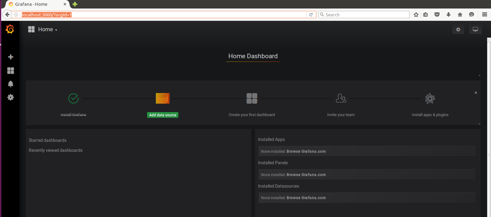

**Step-2:**

select Add Data Sources and select Influx DB. 

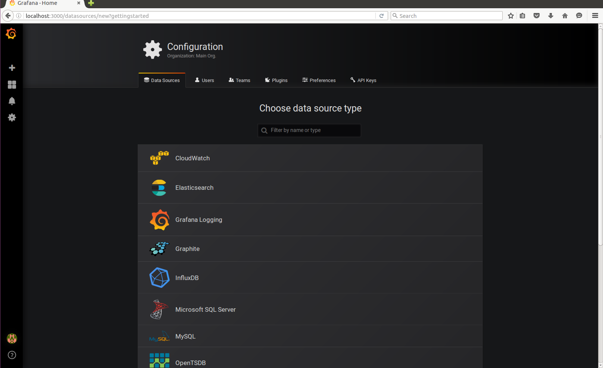

**Step-3:**

Provide Influx DB details i.e. URL, username/password i.e. admin/admin and Database name i.e. firewall_inspect.

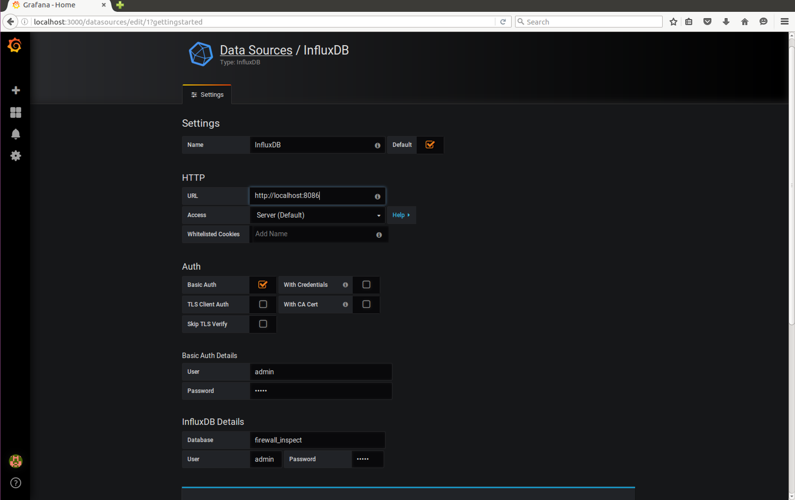

**Step-4:**

Select Save and Test option and check if Data source is working.

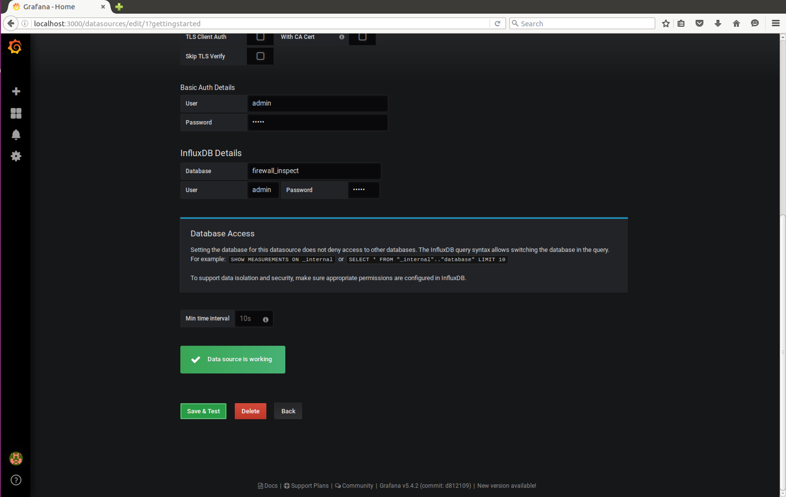


### Create a Dashboard

**Step-5:** 

Now let's create Dashboard by selecting New dashboard option


**Step-6:**

Select **Add Query** and define Query to retrieve the values from database. 
 
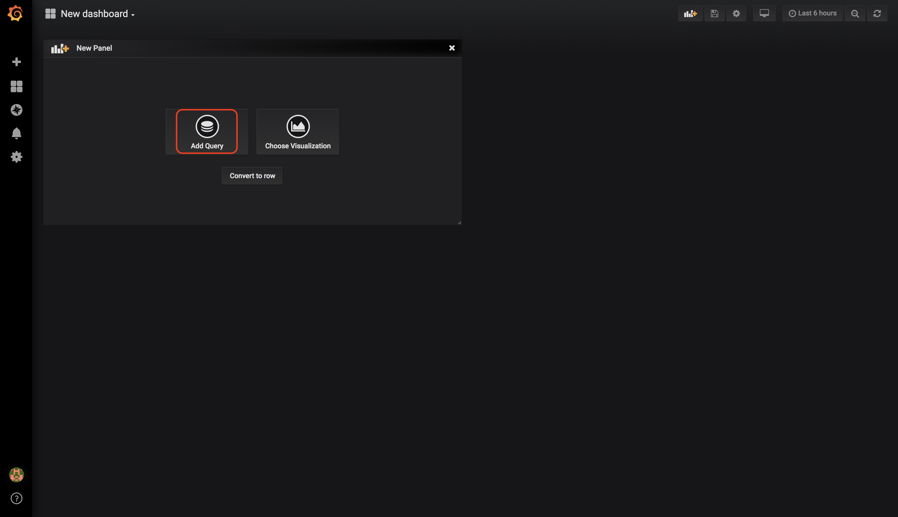

We have to query `firewall_inspect_count` values from Influx DB using below values 

**FROM** : default,firewall_inspect_count<br>
**GROUP BY** : time($_interval),fill(linear)<br>
**FORMAT AS** : Time series<br>

Now Grafana sends query to influx DB and plots the graph on Dashboard as seen below.

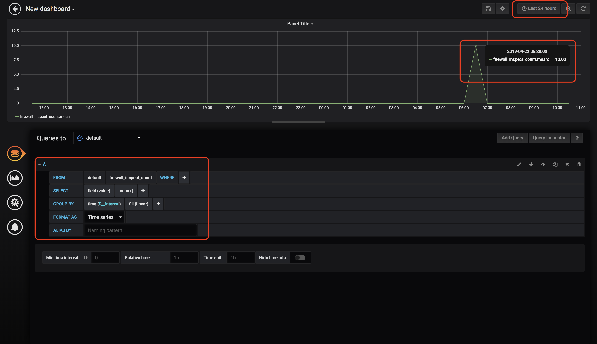

-	Above graph corresponds to this plot on vmanage

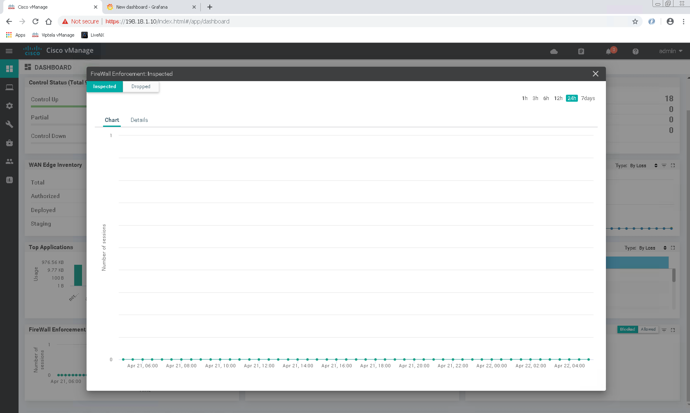

**Note:** You would see the different graph on Grafana dashboard based on the firewall inspect count on vManage in your dcloud set up. 

## Conclusion

In this section we have learned

-  How to collect firewall inspect counter values for last 24 hours.
-  Store these values in time-series Database(Influx DB)
-  Use Influx DB as datasource and plot the firewall Inspect count on Grafana Dashboard

# Usecase-4: Alarms API’s

## Objective

Demonstrating retrieval of alarms from vManage using REST API's.
  
## Resource URL Structure Components

https://<vmanage-ip:port>/dataservice/alarms 

| Component | Description |
| ------ | ------ |
| http:// or https://  | Protocol over which data is sent  between client and server |
| Server or Host  | Resolves to the IP and port to which to connect, example : "<vmanage-ip:port>" |
| Resource | The location of the data or object of  interest, example : "dataservice/alarms" |


Now let’s start using the python script to fetch the alarms by using below steps

  - login and authenticate to a vManage instance
  - Build Query to specify the rules and how to collect alarms
  - Perform the POST operation by sending query in payload

Using `login()` funtion in `rest_api_lib` we will authenticate with vManage and get cookie or JSESSIONID which is to be used in further API calls. 

Now let’s define the Query which can be used to collect alarms using POST operation on "dataservice/alarms"

##   Query Payload

###   Example-1

-	Between operator can be used to fetch the alarms for a custom interval for example i.e. 4:51:00 UTC to 4:57:00 UTC ( 6 mins interval )

```
{
  "query": {
    "condition": "AND",         # Logical AND Operation among rules defined below
    "rules": [
      {
        "value": [              # Alarms between 04:51:00 and 04:57:00 on 10/03/2019
          "2019-03-10T04:51:00 UTC",
          "2019-03-10T04:57:00 UTC"
        ],
        "field": "entry_time",
        "type": "date",
        "operator": "between"
      }
    ]
  },
  "size": 10000
}
```

###   Example-2

-	Collect only cleared Medium, Critical alarms between 4:57 and 4:58

```
{
  "query": {
    "condition": "AND",      # Logical AND Operation among rules defined below
    "rules": [
      {
        "value": [           # Alarms between 04:51:00 and 04:57:00 on 10/03/2019
          "2019-03-10T04:57:00 UTC",
          "2019-03-10T04:58:00 UTC"
        ],
        "field": "entry_time",
        "type": "date",
        "operator": "between"
      },
      {
        "value": [           # Only alarms with severity level Critical and Medium 
          "Medium",
          "Critical"
        ],
        "field": "severity",
        "type": "string",
        "operator": "in"
      },
      {
        "value": [   
          "false"       # Value is set to false for Cleared alarms and True for active alarms
        ],
        "field": "active",
        "type": "string",
        "operator": "in"
      }
    ]
  },
  "size": 10000
}

```

### Example-3

-	Collect *Active* Critical, Major, Medium, Minor alarms related to "Pseudo Commit Status" between 20:00 and 21:00

```

{
  "query": {
    "condition": "AND",         # Logical AND Operation among rules defined below
    "rules": [
      {
        "value": [              # Alarms between 20:00:00 and 21:00:00 on 10/03/2019
          "2019-03-10T20:00:00 UTC",
          "2019-03-10T21:00:00 UTC"
        ],
        "field": "entry_time",
        "type": "date",
        "operator": "between"
      },
      {
        "value": [              # Alarms with severity level Critical, Major, Medium, Minor
          "Critical",
          "Major",
          "Medium",
          "Minor"
        ],
        "field": "severity",
        "type": "string",
        "operator": "in"
      },
      {
        "value": [              # Value is set to true for Active alarms
          "true"
        ],
        "field": "active",
        "type": "string",
        "operator": "in"
      },
      {
        "value": [              # Pseudo Commit Status alarms are retrieved
          "Pseudo_Commit_Status"
        ],
        "field": "rule_name_display",
        "type": "string",
        "operator": "in"
      }
    ]
  },
  "size": 10000
}

```

Using these queries lets perform POST operation on resource URI to retrieve the alarms.

##   POST Operation

To fetch the alarms we need to perform POST operation using request method from the python requests library.

Input parameters for POST operation

-   endpoint (vmanage server ip address)
-   resource or mountpoint represented by the URL
-   headers (Content-type and Accept are set to application/json)
-   The query which defines how alarms are collected is sent using the payload. 

"verify=False" parameter is passed in POST operation because the SSL verification is disabled.

The result of the POST operation is stored in the response variable. The json() method is called on the response object and the JSON format of the response is returned. "data" key in the JSON output contains the alarm details retrieved.

Now let's have a look at the responses to POST operation

## Sample Responses

-   Every alarm can be uniquely identified based on the uuid value which is associated with it. 
-   In case alarm is cleared, then uuid of alarm which has cleared it is associated with key  `cleared_by` and cleared time is associated with key `cleared_time`

###   Example-1

```
"data": [
    {
      "devices": [
        {
          "system-ip": "1.1.1.15"
        }
      ],
      "eventname": "interface-state-change",
      "type": "interface-state-change",
      "rulename": "interface-state-change",
      "component": "VPN",
      "entry_time": 1552193785000,
      "statcycletime": 1552193785000,
      "message": "The interface oper-state changed to down",
      "severity": "Critical",
      "severity_number": 1,
      "uuid": "9f75552d-4a2b-4085-9dcc-fd15148cf078",  
      "values": [
        {
          "host-name": "Azure-Gateway-West",
          "system-ip": "1.1.1.15",
          "if-name": "ipsec4",
          "new-state": "down",
          "vpn-id": "1"
        }
      ],
      "rule_name_display": "Interface_State_Change",
      "receive_time": 1552194337469,
      "values_short_display": [
        {
          "host-name": "Azure-Gateway-West",
          "system-ip": "1.1.1.15",
          "if-name": "ipsec4",
          "new-state": "down"
        }
      ],
      "acknowledged": false,
      "active": false,
      "tenant": "default",
      "cleared_by": "36af5221-d248-4aef-bed6-0f9a59b30f98", 
      "cleared_time": 1552193878000,
      "id": "AWll_frUhE4U7yO21aG1"
    },
    {
      "devices": [
        {
          "system-ip": "1.1.1.14"
        }
      ],
      "eventname": "interface-state-change",
      "type": "interface-state-change",
      "rulename": "interface-state-change",
      "component": "VPN",
      "entry_time": 1552193772000,
      "statcycletime": 1552193772000,
      "message": "The interface oper-state changed to down",
      "severity": "Critical",
      "severity_number": 1,
      "uuid": "08dd7b00-3893-4809-9e22-1351a9f81776",
      "values": [
        {
          "host-name": "Azure-Gateway-West",
          "system-ip": "1.1.1.14",
          "if-name": "ipsec4",
          "new-state": "down",
          "vpn-id": "1"
        }
      ],
      "rule_name_display": "Interface_State_Change",
      "receive_time": 1552194337697,
      "values_short_display": [
        {
          "host-name": "Azure-Gateway-West",
          "system-ip": "1.1.1.14",
          "if-name": "ipsec4",
          "new-state": "down"
        }
      ],
      "acknowledged": false,
      "active": false,
      "tenant": "default",
      "cleared_by": "dec318ae-9b3e-4913-a083-6e4549ca710e",   ## Cleared Alarm uuid
      "cleared_time": 1552193864000,                          ## Cleared time
      "id": "AWll_fu3hE4U7yO21aG3"
    }
  ]
  
```

### Example-2

Response which has both Active and Cleared alarms , alarms can be correlated further based on uuid value. For example we can see alarm with uuid "36af5221-d248-4aef-bed6-0f9a59b30f98" is a cleared event which indicates *"The interface oper-state changed to up"* , The alarm that got cleared is provided by list of uuids in `cleared_events` : 9f75552d-4a2b-4085-9dcc-fd15148cf078

```
  {
    "devices": [
      {
        "system-ip": "1.1.1.15"
      }
    ],
    "eventname": "interface-state-change",
    "type": "interface-state-change",
    "rulename": "interface-state-change",
    "component": "VPN",
    "entry_time": 1552193878000,
    "statcycletime": 1552193878000,
    "message": "The interface oper-state changed to up",
    "severity": "Medium",
    "severity_number": 3,
    "uuid": "36af5221-d248-4aef-bed6-0f9a59b30f98",
    "values": [
      {
        "host-name": "Azure-Gateway-West",
        "system-ip": "1.1.1.15",
        "if-name": "ipsec4",
        "new-state": "up",
        "vpn-id": "1"
      }
    ],
    "rule_name_display": "Interface_State_Change",
    "receive_time": 1552194429966,
    "values_short_display": [
      {
        "host-name": "Azure-Gateway-West",
        "system-ip": "1.1.1.15",
        "if-name": "ipsec4",
        "new-state": "up"
      }
    ],
    "acknowledged": false,
    "cleared_events": [                     # list of uuid's which got cleared by this alarm
      "9f75552d-4a2b-4085-9dcc-fd15148cf078"
    ],
    "active": false,
    "tenant": "default",
    "id": "AWll_2RIhE4U7yO21aHG"
  },
  {
    "devices": [
      {
        "system-ip": "1.1.1.14"
      }
    ],
    "eventname": "interface-state-change",
    "type": "interface-state-change",
    "rulename": "interface-state-change",
    "component": "VPN",
    "entry_time": 1552193864000,
    "statcycletime": 1552193864000,
    "message": "The interface oper-state changed to up",
    "severity": "Medium",
    "severity_number": 3,
    "uuid": "dec318ae-9b3e-4913-a083-6e4549ca710e",
    "values": [
      {
        "host-name": "Azure-Gateway-West",
        "system-ip": "1.1.1.14",
        "if-name": "ipsec4",
        "new-state": "up",
        "vpn-id": "1"
      }
    ],
    "rule_name_display": "Interface_State_Change",
    "receive_time": 1552194429392,
    "values_short_display": [
      {
        "host-name": "Azure-Gateway-West",
        "system-ip": "1.1.1.14",
        "if-name": "ipsec4",
        "new-state": "up"
      }
    ],
    "acknowledged": false,
    "cleared_events": [
      "08dd7b00-3893-4809-9e22-1351a9f81776"
    ],
    "active": false,
    "tenant": "default",
    "id": "AWll_2H6hE4U7yO21aHE"
  },
  {
    "devices": [
      {
        "system-ip": "1.1.1.15"
      }
    ],
    "eventname": "interface-state-change",
    "type": "interface-state-change",
    "rulename": "interface-state-change",
    "component": "VPN",
    "entry_time": 1552193785000,
    "statcycletime": 1552193785000,
    "message": "The interface oper-state changed to down",
    "severity": "Critical",
    "severity_number": 1,
    "uuid": "9f75552d-4a2b-4085-9dcc-fd15148cf078",
    "values": [
      {
        "host-name": "Azure-Gateway-West",
        "system-ip": "1.1.1.15",
        "if-name": "ipsec4",
        "new-state": "down",
        "vpn-id": "1"
      }
    ],
    "rule_name_display": "Interface_State_Change",
    "receive_time": 1552194337469,
    "values_short_display": [
      {
        "host-name": "Azure-Gateway-West",
        "system-ip": "1.1.1.15",
        "if-name": "ipsec4",
        "new-state": "down"
      }
    ],
    "acknowledged": false,
    "active": false,
    "tenant": "default",
    "cleared_by": "36af5221-d248-4aef-bed6-0f9a59b30f98",
    "cleared_time": 1552193878000,
    "id": "AWll_frUhE4U7yO21aG1"
  },
  {
    "devices": [
      {
        "system-ip": "1.1.1.14"
      }
    ],
    "eventname": "interface-state-change",
    "type": "interface-state-change",
    "rulename": "interface-state-change",
    "component": "VPN",
    "entry_time": 1552193772000,
    "statcycletime": 1552193772000,
    "message": "The interface oper-state changed to down",
    "severity": "Critical",
    "severity_number": 1,
    "uuid": "08dd7b00-3893-4809-9e22-1351a9f81776",
    "values": [
      {
        "host-name": "Azure-Gateway-West",
        "system-ip": "1.1.1.14",
        "if-name": "ipsec4",
        "new-state": "down",
        "vpn-id": "1"
      }
    ],
    "rule_name_display": "Interface_State_Change",
    "receive_time": 1552194337697,
    "values_short_display": [
      {
        "host-name": "Azure-Gateway-West",
        "system-ip": "1.1.1.14",
        "if-name": "ipsec4",
        "new-state": "down"
      }
    ],
    "acknowledged": false,
    "active": false,
    "tenant": "default",
    "cleared_by": "dec318ae-9b3e-4913-a083-6e4549ca710e",
    "cleared_time": 1552193864000,
    "id": "AWll_fu3hE4U7yO21aG3"
  }
]
```

`entry_time`, `cleared_time` values are in epoch format.

**Step-1**

<pre>
On windows command prompt run the command <b>py -3.7 alarms_api.py</b> to fetch alarms from vManage <br>based on the queries. 
</pre>

**Sample Response**

```

C:\Users\Administrator\Desktop\sdwan_prog_lab>py -3.7 alarms_api.py


Fetch alarms for interval of 5 mins

 [{'devices': [{'system-ip': '22.22.22.22'}], 'eventname': 'security-root-cert-chain-installed', 'type': 'security-root-cert-chain-installed', 'rulename': 'security-root-cert-chain-installed', 'component': 'Security', 'entry_time': 1554138895000, 'statcycletime': 1554138895000, 'message': 'Root cert chain installed', 'severity': 'Critical', 'severity_number': 1, 'uuid': '05d20cd3-30a1-43df-9a35-c68ff5091d20', 'values': [{'system-ip': '22.22.22.22', 'host-name': 'vSmart-2'}], 'rule_name_display': 'Root_Cert_Chain_Installed', 'receive_time': 1554138896007, 'values_short_display': [{'host-name': 'vSmart-2', 'system-ip': '22.22.22.22'}], 'acknowledged': False, 'active': True, 'tenant': 'default', 'id': 'AWnZ5ZafEL7CrSdeSJrJ'}, {'devices': [{'system-ip': '10.10.10.10'}], 'eventname': 'security-root-cert-chain-installed', 'type': 'security-root-cert-chain-installed', 'rulename': 'security-root-cert-chain-installed', 'component': 'Security', 'entry_time': 1554138894000, 'statcycletime': 1554
138894000, 'message': 'Root cert chain installed', 'severity': 'Critical', 'severity_number': 1, 'uuid': '1939adff-831f-4ce7-879b-6c852b7b1762', 'values': [{'system-ip': '10.10.10.10', 'host-name': 'vManage'}], 'rule_name_display': 'Root_Cert_Chain_Installed', 'receive_time': 1554138894744, 'values_short_display': [{'host-name': 'vManage', 'system-ip': '10.10.10.10'}], 'acknowledged': False, 'active': True, 'tenant': 'default', 'id': 'AWnZ5ZICEL7CrSdeSJrF'}, {'message': 'OMP sessions for the site came up', 'type': 'site_up', 'eventname': 'site_up', 'rulename': 'site_up', 'component': 'OMP', 'severity': 'Medium', 'severity_number': 3, 'entry_time': 1554138892127, 'statcycletime': 1554138952217, 'receive_time': 1554138952217, 'rule_name_display': 'OMP_Site_Up', 'uuid': '29674be4-dcac-4f80-b3c7-a27eab44a218', 'values': [{'system-ip': '10.10.10.10', 'site-id': '10', 'host-name': 'vManage'}], 'values_short_display': [{'site-id': '10'}], 'devices': [{'system-ip': '10.10.10.10'}], 'cleared_e
vents': ['d1ac6a55-e3c4-4a98-b00b-5909863367dc'], 'active': False, 'consumed_events': [{'builtBy': 'LocalAlarmsGenerator', 'eventname': 'omp-peer-state-change', 'linkupdate': True, 'entry_time': 1554138892120, 'system-ip': '12.12.12.12', 'host-name': 'vSmart-1', 'component': 'OMP', 'receive_time': 1554138892121, 'vmanage-system-ip': '12.12.12.12', 'peer': '10.1.0.1', 'peer-new-state': 'up'}, {'builtBy': 'LocalAlarmsGenerator', 'eventname': 'omp-peer-state-change', 'linkupdate': True, 'entry_time': 1554138892121, 'system-ip': '12.12.12.12', 'host-name': 'vSmart-1', 'component': 'OMP', 'receive_time': 1554138892121, 'vmanage-system-ip': '12.12.12.12', 'peer': '10.1.0.2', 'peer-new-state': 'up'}, {'builtBy': 'LocalAlarmsGenerator', 'eventname': 'omp-peer-state-change', 'linkupdate': True, 'entry_time': 1554138892121, 'system-ip': '12.12.12.12', 'host-name': 'vSmart-1', 'component': 'OMP', 'receive_time': 1554138892121, 'vmanage-system-ip': '12.12.12.12', 'peer': '10.2.0.1', 'peer-new-sta
te': 'up'}, {'builtBy': 'LocalAlarmsGenerator', 'eventname': 'omp-peer-state-change', 'linkupdate': True, 'entry_time': 1554138892121, 'system-ip': '12.12.12.12', 'host-name': 'vSmart-1', 'component': 'OMP', 'receive_time': 1554138892121, 'vmanage-system-ip': '12.12.12.12', 'peer': '10.2.0.2', 'peer-new-state': 'up'}, {'builtBy': 'LocalAlarmsGenerator', 'eventname': 'omp-peer-state-change', 'linkupdate': True, 'entry_time': 1554138892121, 'system-ip': '12.12.12.12', 'host-name': 'vSmart-1', 'component': 'OMP', 'receive_time': 1554138892122, 'vmanage-system-ip': '12.12.12.12', 'peer': '10.3.0.1', 'peer-new-state': 'up'}, {'builtBy': 'LocalAlarmsGenerator', 'eventname': 'omp-peer-state-change', 'linkupdate': True, 'entry_time': 1554138892122, 'system-ip': '12.12.12.12', 'host-name': 'vSmart-1', 'component': 'OMP', 'receive_time': 1554138892122, 'vmanage-system-ip': '12.12.12.12', 'peer': '10.3.0.2', 'peer-new-state': 'up'}, {'builtBy': 'LocalAlarmsGenerator', 'eventname': 'omp-peer-stat
e-change', 'linkupdate': True, 'entry_time': 1554138892122, 'system-ip': '12.12.12.12', 'host-name': 'vSmart-1', 'component': 'OMP', 'receive_time': 1554138892126, 'vmanage-system-ip': '12.12.12.12', 'peer': '10.5.0.1', 'peer-new-state': 'up'}, {'builtBy': 'LocalAlarmsGenerator', 'eventname': 'omp-peer-state-change', 'linkupdate': True, 'entry_time': 1554138892127, 'system-ip': '12.12.12.12', 'host-name': 'vSmart-1', 'component': 'OMP', 'receive_time': 1554138892127, 'vmanage-system-ip': '12.12.12.12', 'peer': '22.22.22.22', 'peer-new-state': 'up'}], 'acknowledged': False, 'possible_causes': '', 'tenant': 'default', 'id': 'AWnZ5nIeEL7CrSdeSJsA'}, {'message': 'BFD sessions for the tloc came up', 'type': 'tloc_up', 'eventname': 'tloc_up', 'rulename': 'tloc_up', 'component': 'BFD', 'severity': 'Medium', 'severity_number': 3, 'entry_time': 1554138890892, 'statcycletime': 1554138951227, 'receive_time': 1554138951227, 'rule_name_display': 'BFD_TLOC_Up', 'uuid': '9de97a8c-7722-4235-a9b2-1324
630d9c9c', 'values': [{'color': 'biz-internet', 'system-ip': '10.5.0.1', 'host-name': 'BR3-CEDGE1', 'site-id': '500'}], 'values_short_display': [{'color': 'biz-internet', 'system-ip': '10.5.0.1', 'host-name': 'BR3-CEDGE1'}], 'devices': [{'color': 'biz-internet', 'system-ip': '10.5.0.1'}], 'cleared_events': ['1d8ba153-4ca1-43da-8c5e-d21154018e5f'], 'active': False, 'consumed_events': [{'builtBy': 'BFDDeviceDataCollector:createBFDConnections', 'eventname': 'bfd-state-change', 'linkupdate': True, 'entry_time': 1554138890554, 'system-ip': '10.5.0.1', 'host-name': 'BR3-CEDGE1', 'component': 'BFD', 'receive_time': 1554138890555, 'vmanage-system-ip': '10.5.0.1', 'local-system-ip': '10.5.0.1', 'peer-type': 'vedge', 'remote-system-ip': '10.1.0.1', 'local-color': 'mpls', 'remote-color': 'mpls', 'new-state': 'up'}, {'builtBy': 'BFDDeviceDataCollector:createBFDConnections', 'eventname': 'bfd-state-change', 'linkupdate': True, 'entry_time': 1554138890555, 'system-ip': '10.5.0.1', 'host-name': 'BR3
-CEDGE1', 'component': 'BFD', 'receive_time': 1554138890555, 'vmanage-system-ip': '10.5.0.1', 'local-system-ip': '10.5.0.1', 'peer-type': 'vedge', 'remote-system-ip': '10.1.0.2', 'local-color': 'mpls', 'remote-color': 'mpls', 'new-state': 'up'}, {'builtBy': 'BFDDeviceDataCollector:createBFDConnections', 'eventname': 'bfd-state-change', 'linkupdate': True, 'entry_time': 1554138890555, 'system-ip': '10.5.0.1', 'host-name': 'BR3-CEDGE1', 'component': 'BFD', 'receive_time': 1554138890571, 'vmanage-system-ip': '10.5.0.1', 'local-system-ip': '10.5.0.1', 'peer-type': 'vedge', 'remote-system-ip': '10.2.0.1', 'local-color': 'mpls', 'remote-color': 'mpls', 'new-state': 'up'}, {'builtBy': 'BFDDeviceDataCollector:createBFDConnections', 'eventname': 'bfd-state-change', 'linkupdate': True, 'entry_time': 1554138890571, 'system-ip': '10.5.0.1', 'host-name': 'BR3-CEDGE1', 'component': 'BFD', 'receive_time': 1554138890572, 'vmanage-system-ip': '10.5.0.1', 'local-system-ip': '10.5.0.1', 'peer-type': 've
dge', 'remote-system-ip': '10.2.0.2', 'local-color': 'mpls', 'remote-color': 'mpls', 'new-state': 'up'}, {'builtBy': 'BFDDeviceDataCollector:createBFDConnections', 'eventname': 'bfd-state-change', 'linkupdate': True, 'entry_time': 1554138890572, 'system-ip': '10.5.0.1', 'host-name': 'BR3-CEDGE1', 'component': 'BFD', 'receive_time': 1554138890572, 'vmanage-system-ip': '10.5.0.1', 'local-system-ip': '10.5.0.1', 'peer-type': 'vedge', 'remote-system-ip': '10.3.0.1', 'local-color': 'mpls', 'remote-color': 'mpls', 'new-state': 'up'}, {'builtBy': 'BFDDeviceDataCollector:createBFDConnections', 'eventname': 'bfd-state-change', 'linkupdate': True, 'entry_time': 1554138890572, 'system-ip': '10.5.0.1', 'host-name': 'BR3-CEDGE1', 'component': 'BFD', 'receive_time': 1554138890572, 'vmanage-system-ip': '10.5.0.1', 'local-system-ip': '10.5.0.1', 'peer-type': 'vedge', 'remote-system-ip': '10.3.0.2', 'local-color': 'mpls', 'remote-color': 'mpls', 'new-state': 'up'}, {'builtBy': 'BFDDeviceDataCollector:
createBFDConnections', 'eventname': 'bfd-state-change', 'linkupdate': True, 'entry_time': 1554138890572, 'system-ip': '10.5.0.1', 'host-name': 'BR3-CEDGE1', 'component': 'BFD', 'receive_time': 1554138890573, 'vmanage-system-ip': '10.5.0.1', 'local-system-ip': '10.5.0.1', 'peer-type': 'vedge', 'remote-system-ip': '10.3.0.1', 'local-color': 'biz-internet', 'remote-color': 'biz-internet', 'new-state': 'up'}, {'builtBy': 'BFDDeviceDataCollector:createBFDConnections', 'eventname': 'bfd-state-change', 'linkupdate': True, 'entry_time': 1554138890573, 'system-ip': '10.5.0.1', 'host-name': 'BR3-CEDGE1', 'component': 'BFD', 'receive_time': 1554138890573, 'vmanage-system-ip': '10.5.0.1', 'local-system-ip': '10.5.0.1', 'peer-type': 'vedge', 'remote-system-ip': '10.3.0.2', 'local-color': 'biz-internet', 'remote-color': 'biz-internet', 'new-state': 'up'}, {'builtBy': 'BFDDeviceDataCollector:createBFDConnections', 'eventname': 'bfd-state-change', 'linkupdate': True, 'entry_time': 1554138890573, 'sys
tem-ip': '10.5.0.1', 'host-name': 'BR3-CEDGE1', 'component': 'BFD', 'receive_time': 1554138890576, 'vmanage-system-ip': '10.5.0.1', 'local-system-ip': '10.5.0.1', 'peer-type': 'vedge', 'remote-system-ip': '10.2.0.1', 'local-color': 'biz-internet', 'remote-color': 'biz-internet', 'new-state': 'up'}, {'builtBy': 'BFDDeviceDataCollector:createBFDConnections', 'eventname': 'bfd-state-change', 'linkupdate': True, 'entry_time': 1554138890576, 'system-ip': '10.5.0.1', 'host-name': 'BR3-CEDGE1', 'component': 'BFD', 'receive_time': 1554138890578, 'vmanage-system-ip': '10.5.0.1', 'local-system-ip': '10.5.0.1', 'peer-type': 'vedge', 'remote-system-ip': '10.2.0.2', 'local-color': 'biz-internet', 'remote-color': 'biz-internet', 'new-state': 'up'}, {'builtBy': 'BFDDeviceDataCollector:createBFDConnections', 'eventname': 'bfd-state-change', 'linkupdate': True, 'entry_time': 1554138890578, 'system-ip': '10.5.0.1', 'host-name': 'BR3-CEDGE1', 'component': 'BFD', 'receive_time': 1554138890578, 'vmanage-s
ystem-ip': '10.5.0.1', 'local-system-ip': '10.5.0.1', 'peer-type': 'vedge', 'remote-system-ip': '10.1.0.1', 'local-color': 'biz-internet', 'remote-color': 'biz-internet', 'new-state': 'up'}, {'builtBy': 'BFDDeviceDataCollector:createBFDConnections', 'eventname': 'bfd-state-change', 'linkupdate': True, 'entry_time': 1554138890580, 'system-ip': '10.5.0.1', 'host-name': 'BR3-CEDGE1', 'component': 'BFD', 'receive_time': 1554138890580, 'vmanage-system-ip': '10.5.0.1', 'local-system-ip': '10.5.0.1', 'peer-type': 'vedge', 'remote-system-ip': '10.1.0.2', 'local-color': 'biz-internet', 'remote-color': 'biz-internet', 'new-state': 'up'}, {'builtBy': 'BFDDeviceDataCollector:createBFDConnections', 'eventname': 'bfd-state-change', 'linkupdate': True, 'entry_time': 1554138890580, 'system-ip': '10.5.0.1', 'host-name': 'BR3-CEDGE1', 'component': 'BFD', 'receive_time': 1554138890581, 'vmanage-system-ip': '10.5.0.1', 'local-system-ip': '10.5.0.1', 'peer-type': 'vedge', 'remote-system-ip': '10.3.0.1', '
local-color': 'lte', 'remote-color': 'biz-internet', 'new-state': 'up'}, {'builtBy': 'BFDDeviceDataCollector:createBFDConnections', 'eventname': 'bfd-state-change', 'linkupdate': True, 'entry_time': 1554138890581, 'system-ip': '10.5.0.1', 'host-name': 'BR3-CEDGE1', 'component': 'BFD', 'receive_time': 1554138890581, 'vmanage-system-ip': '10.5.0.1', 'local-system-ip': '10.5.0.1', 'peer-type': 'vedge', 'remote-system-ip': '10.3.0.2', 'local-color': 'lte', 'remote-color': 'biz-internet', 'new-state': 'up'}], 'acknowledged': False, 'possible_causes': '', 'tenant': 'default', 'id': 'AWnZ5m5CEL7CrSdeSJr_'}, {'message': 'BFD sessions for the tloc came up', 'type': 'tloc_up', 'eventname': 'tloc_up', 'rulename': 'tloc_up', 'component': 'BFD', 'severity': 'Medium', 'severity_number': 3, 'entry_time': 1554138890749, 'statcycletime': 1554138950881, 'receive_time': 1554138950881, 'rule_name_display': 'BFD_TLOC_Up', 'uuid': '1d013e52-f3b7-4555-af50-0c7b506c6c54', 'values': [{'color': 'lte', 'system-
ip': '10.5.0.1', 'host-name': 'BR3-CEDGE1', 'site-id': '500'}], 'values_short_display': [{'color': 'lte', 'system-ip': '10.5.0.1', 'host-name': 'BR3-CEDGE1'}], 'devices': [{'color': 'lte', 'system-ip': '10.5.0.1'}], 'cleared_events': ['999f243f-3e80-4ffa-b7db-3280606f1f71'], 'active': False, 'consumed_events': [{'builtBy': 'BFDDeviceDataCollector:createBFDConnections', 'eventname': 'bfd-state-change', 'linkupdate': True, 'entry_time': 1554138890554, 'system-ip': '10.5.0.1', 'host-name': 'BR3-CEDGE1', 'component': 'BFD', 'receive_time': 1554138890555, 'vmanage-system-ip': '10.5.0.1', 'local-system-ip': '10.5.0.1', 'peer-type': 'vedge', 'remote-system-ip': '10.1.0.1', 'local-color': 'mpls', 'remote-color': 'mpls', 'new-state': 'up'}, {'builtBy': 'BFDDeviceDataCollector:createBFDConnections', 'eventname': 'bfd-state-change', 'linkupdate': True, 'entry_time': 1554138890555, 'system-ip': '10.5.0.1', 'host-name': 'BR3-CEDGE1', 'component': 'BFD', 'receive_time': 1554138890555, 'vmanage-syst
em-ip': '10.5.0.1', 'local-system-ip': '10.5.0.1', 'peer-type': 'vedge', 'remote-system-ip': '10.1.0.2', 'local-color': 'mpls', 'remote-color': 'mpls', 'new-state': 'up'}, {'builtBy': 'BFDDeviceDataCollector:createBFDConnections', 'eventname': 'bfd-state-change', 'linkupdate': True, 'entry_time': 1554138890555, 'system-ip': '10.5.0.1', 'host-name': 'BR3-CEDGE1', 'component': 'BFD', 'receive_time': 1554138890571, 'vmanage-system-ip': '10.5.0.1', 'local-system-ip': '10.5.0.1', 'peer-type': 'vedge', 'remote-system-ip': '10.2.0.1', 'local-color': 'mpls', 'remote-color': 'mpls', 'new-state': 'up'}, {'builtBy': 'BFDDeviceDataCollector:createBFDConnections', 'eventname': 'bfd-state-change', 'linkupdate': True, 'entry_time': 1554138890571, 'system-ip': '10.5.0.1', 'host-name': 'BR3-CEDGE1', 'component': 'BFD', 'receive_time': 1554138890572, 'vmanage-system-ip': '10.5.0.1', 'local-system-ip': '10.5.0.1', 'peer-type': 'vedge', 'remote-system-ip': '10.2.0.2', 'local-color': 'mpls', 'remote-color
': 'mpls', 'new-state': 'up'}, {'builtBy': 'BFDDeviceDataCollector:createBFDConnections', 'eventname': 'bfd-state-change', 'linkupdate': True, 'entry_time': 1554138890572, 'system-ip': '10.5.0.1', 'host-name': 'BR3-CEDGE1', 'component': 'BFD', 'receive_time': 1554138890572, 'vmanage-system-ip': '10.5.0.1', 'local-system-ip': '10.5.0.1', 'peer-type': 'vedge', 'remote-system-ip': '10.3.0.1', 'local-color': 'mpls', 'remote-color': 'mpls', 'new-state': 'up'}, {'builtBy': 'BFDDeviceDataCollector:createBFDConnections', 'eventname': 'bfd-state-change', 'linkupdate': True, 'entry_time': 1554138890572, 'system-ip': '10.5.0.1', 'host-name': 'BR3-CEDGE1', 'component': 'BFD', 'receive_time': 1554138890572, 'vmanage-system-ip': '10.5.0.1', 'local-system-ip': '10.5.0.1', 'peer-type': 'vedge', 'remote-system-ip': '10.3.0.2', 'local-color': 'mpls', 'remote-color': 'mpls', 'new-state': 'up'}, {'builtBy': 'BFDDeviceDataCollector:createBFDConnections', 'eventname': 'bfd-state-change', 'linkupdate': True
, 'entry_time': 1554138890572, 'system-ip': '10.5.0.1', 'host-name': 'BR3-CEDGE1', 'component': 'BFD', 'receive_time': 1554138890573, 'vmanage-system-ip': '10.5.0.1', 'local-system-ip': '10.5.0.1', 'peer-type': 'vedge', 'remote-system-ip': '10.3.0.1', 'local-color': 'biz-internet', 'remote-color': 'biz-internet', 'new-state': 'up'}, {'builtBy': 'BFDDeviceDataCollector:createBFDConnections', 'eventname': 'bfd-state-change', 'linkupdate': True, 'entry_time': 1554138890573, 'system-ip': '10.5.0.1', 'host-name': 'BR3-CEDGE1', 'component': 'BFD', 'receive_time': 1554138890573, 'vmanage-system-ip': '10.5.0.1', 'local-system-ip': '10.5.0.1', 'peer-type': 'vedge', 'remote-system-ip': '10.3.0.2', 'local-color': 'biz-internet', 'remote-color': 'biz-internet', 'new-state': 'up'}, {'builtBy': 'BFDDeviceDataCollector:createBFDConnections', 'eventname': 'bfd-state-change', 'linkupdate': True, 'entry_time': 1554138890573, 'system-ip': '10.5.0.1', 'host-name': 'BR3-CEDGE1', 'component': 'BFD', 'recei
ve_time': 1554138890576, 'vmanage-system-ip': '10.5.0.1', 'local-system-ip': '10.5.0.1', 'peer-type': 'vedge', 'remote-system-ip': '10.2.0.1', 'local-color': 'biz-internet', 'remote-color': 'biz-internet', 'new-state': 'up'}, {'builtBy': 'BFDDeviceDataCollector:createBFDConnections', 'eventname': 'bfd-state-change', 'linkupdate': True, 'entry_time': 1554138890576, 'system-ip': '10.5.0.1', 'host-name': 'BR3-CEDGE1', 'component': 'BFD', 'receive_time': 1554138890578, 'vmanage-system-ip': '10.5.0.1', 'local-system-ip': '10.5.0.1', 'peer-type': 'vedge', 'remote-system-ip': '10.2.0.2', 'local-color': 'biz-internet', 'remote-color': 'biz-internet', 'new-state': 'up'}, {'builtBy': 'BFDDeviceDataCollector:createBFDConnections', 'eventname': 'bfd-state-change', 'linkupdate': True, 'entry_time': 1554138890578, 'system-ip': '10.5.0.1', 'host-name': 'BR3-CEDGE1', 'component': 'BFD', 'receive_time': 1554138890578, 'vmanage-system-ip': '10.5.0.1', 'local-system-ip': '10.5.0.1', 'peer-type': 'vedge'
, 'remote-system-ip': '10.1.0.1', 'local-color': 'biz-internet', 'remote-color': 'biz-internet', 'new-state': 'up'}, {'builtBy': 'BFDDeviceDataCollector:createBFDConnections', 'eventname': 'bfd-state-change', 'linkupdate': True, 'entry_time': 1554138890580, 'system-ip': '10.5.0.1', 'host-name': 'BR3-CEDGE1', 'component': 'BFD', 'receive_time': 1554138890580, 'vmanage-system-ip': '10.5.0.1', 'local-system-ip': '10.5.0.1', 'peer-type': 'vedge', 'remote-system-ip': '10.1.0.2', 'local-color': 'biz-internet', 'remote-color': 'biz-internet', 'new-state': 'up'}, {'builtBy': 'BFDDeviceDataCollector:createBFDConnections', 'eventname': 'bfd-state-change', 'linkupdate': True, 'entry_time': 1554138890580, 'system-ip': '10.5.0.1', 'host-name': 'BR3-CEDGE1', 'component': 'BFD', 'receive_time': 1554138890581, 'vmanage-system-ip': '10.5.0.1', 'local-system-ip': '10.5.0.1', 'peer-type': 'vedge', 'remote-system-ip': '10.3.0.1', 'local-color': 'lte', 'remote-color': 'biz-internet', 'new-state': 'up'}, {
'builtBy': 'BFDDeviceDataCollector:createBFDConnections', 'eventname': 'bfd-state-change', 'linkupdate': True, 'entry_time': 1554138890581, 'system-ip': '10.5.0.1', 'host-name': 'BR3-CEDGE1', 'component': 'BFD', 'receive_time': 1554138890581, 'vmanage-system-ip': '10.5.0.1', 'local-system-ip': '10.5.0.1', 'peer-type': 'vedge', 'remote-system-ip': '10.3.0.2', 'local-color': 'lte', 'remote-color': 'biz-internet', 'new-state': 'up'}], 'acknowledged': False, 'possible_causes': '', 'tenant': 'default', 'id': 'AWnZ5mzqEL7CrSdeSJr-'}, {'message': 'BFD sessions for the tloc came up', 'type': 'tloc_up', 'eventname': 'tloc_up', 'rulename': 'tloc_up', 'component': 'BFD', 'severity': 'Medium', 'severity_number': 3, 'entry_time': 1554138888958, 'statcycletime': 1554138949549, 'receive_time': 1554138949549, 'rule_name_display': 'BFD_TLOC_Up', 'uuid': 'aefb363c-06b1-4481-b9ef-dc1e60834a31', 'values': [{'color': 'biz-internet', 'system-ip': '10.2.0.2', 'host-name': 'DC2-VEDGE2', 'site-id': '200'}], '
values_short_display': [{'color': 'biz-internet', 'system-ip': '10.2.0.2', 'host-name': 'DC2-VEDGE2'}], 'devices': [{'color': 'biz-internet', 'system-ip': '10.2.0.2'}], 'cleared_events': ['725f59ac-ac29-40eb-9dcc-12d814619402'], 'active': False, 'consumed_events': [{'builtBy': 'BFDDeviceDataCollector:createBFDConnections', 'eventname': 'bfd-state-change', 'linkupdate': True, 'entry_time': 1554138888838, 'system-ip': '10.2.0.2', 'host-name': 'DC2-VEDGE2', 'component': 'BFD', 'receive_time': 1554138888838, 'vmanage-system-ip': '10.2.0.2', 'local-system-ip': '10.2.0.2', 'peer-type': 'vedge', 'remote-system-ip': '10.3.0.1', 'local-color': 'biz-internet', 'remote-color': 'biz-internet', 'new-state': 'up'}, {'builtBy': 'BFDDeviceDataCollector:createBFDConnections', 'eventname': 'bfd-state-change', 'linkupdate': True, 'entry_time': 1554138888838, 'system-ip': '10.2.0.2', 'host-name': 'DC2-VEDGE2', 'component': 'BFD', 'receive_time': 1554138888838, 'vmanage-system-ip': '10.2.0.2', 'local-syst
em-ip': '10.2.0.2', 'peer-type': 'vedge', 'remote-system-ip': '10.3.0.2', 'local-color': 'biz-internet', 'remote-color': 'biz-internet', 'new-state': 'up'}, {'builtBy': 'BFDDeviceDataCollector:createBFDConnections', 'eventname': 'bfd-state-change', 'linkupdate': True, 'entry_time': 1554138888838, 'system-ip': '10.2.0.2', 'host-name': 'DC2-VEDGE2', 'component': 'BFD', 'receive_time': 1554138888839, 'vmanage-system-ip': '10.2.0.2', 'local-system-ip': '10.2.0.2', 'peer-type': 'vedge', 'remote-system-ip': '10.5.0.1', 'local-color': 'biz-internet', 'remote-color': 'biz-internet', 'new-state': 'up'}, {'builtBy': 'BFDDeviceDataCollector:createBFDConnections', 'eventname': 'bfd-state-change', 'linkupdate': True, 'entry_time': 1554138888839, 'system-ip': '10.2.0.2', 'host-name': 'DC2-VEDGE2', 'component': 'BFD', 'receive_time': 1554138888839, 'vmanage-system-ip': '10.2.0.2', 'local-system-ip': '10.2.0.2', 'peer-type': 'vedge', 'remote-system-ip': '10.1.0.1', 'local-color': 'biz-internet', 'rem
ote-color': 'biz-internet', 'new-state': 'up'}, {'builtBy': 'BFDDeviceDataCollector:createBFDConnections', 'eventname': 'bfd-state-change', 'linkupdate': True, 'entry_time': 1554138888839, 'system-ip': '10.2.0.2', 'host-name': 'DC2-VEDGE2', 'component': 'BFD', 'receive_time': 1554138888839, 'vmanage-system-ip': '10.2.0.2', 'local-system-ip': '10.2.0.2', 'peer-type': 'vedge', 'remote-system-ip': '10.1.0.2', 'local-color': 'biz-internet', 'remote-color': 'biz-internet', 'new-state': 'up'}, {'builtBy': 'BFDDeviceDataCollector:createBFDConnections', 'eventname': 'bfd-state-change', 'linkupdate': True, 'entry_time': 1554138888839, 'system-ip': '10.2.0.2', 'host-name': 'DC2-VEDGE2', 'component': 'BFD', 'receive_time': 1554138888840, 'vmanage-system-ip': '10.2.0.2', 'local-system-ip': '10.2.0.2', 'peer-type': 'vedge', 'remote-system-ip': '10.1.0.1', 'local-color': 'mpls', 'remote-color': 'mpls', 'new-state': 'up'}, {'builtBy': 'BFDDeviceDataCollector:createBFDConnections', 'eventname': 'bfd-
state-change', 'linkupdate': True, 'entry_time': 1554138888840, 'system-ip': '10.2.0.2', 'host-name': 'DC2-VEDGE2', 'component': 'BFD', 'receive_time': 1554138888840, 'vmanage-system-ip': '10.2.0.2', 'local-system-ip': '10.2.0.2', 'peer-type': 'vedge', 'remote-system-ip': '10.1.0.2', 'local-color': 'mpls', 'remote-color': 'mpls', 'new-state': 'up'}, {'builtBy': 'BFDDeviceDataCollector:createBFDConnections', 'eventname': 'bfd-state-change', 'linkupdate': True, 'entry_time': 1554138888840, 'system-ip': '10.2.0.2', 'host-name': 'DC2-VEDGE2', 'component': 'BFD', 'receive_time': 1554138888840, 'vmanage-system-ip': '10.2.0.2', 'local-system-ip': '10.2.0.2', 'peer-type': 'vedge', 'remote-system-ip': '10.3.0.1', 'local-color': 'mpls', 'remote-color': 'mpls', 'new-state': 'up'}, {'builtBy': 'BFDDeviceDataCollector:createBFDConnections', 'eventname': 'bfd-state-change', 'linkupdate': True, 'entry_time': 1554138888840, 'system-ip': '10.2.0.2', 'host-name': 'DC2-VEDGE2', 'component': 'BFD', 'rece
ive_time': 1554138888841, 'vmanage-system-ip': '10.2.0.2', 'local-system-ip': '10.2.0.2', 'peer-type': 'vedge', 'remote-system-ip': '10.5.0.1', 'local-color': 'mpls', 'remote-color': 'mpls', 'new-state': 'up'}, {'builtBy': 'BFDDeviceDataCollector:createBFDConnections', 'eventname': 'bfd-state-change', 'linkupdate': True, 'entry_time': 1554138888841, 'system-ip': '10.2.0.2', 'host-name': 'DC2-VEDGE2', 'component': 'BFD', 'receive_time': 1554138888841, 'vmanage-system-ip': '10.2.0.2', 'local-system-ip': '10.2.0.2', 'peer-type': 'vedge', 'remote-system-ip': '10.3.0.2', 'local-color': 'mpls', 'remote-color': 'mpls', 'new-state': 'up'}], 'acknowledged': False, 'possible_causes': '', 'tenant': 'default', 'id': 'AWnZ5me0EL7CrSdeSJr7'}, {'message': 'BFD sessions for the tloc came up', 'type': 'tloc_up', 'eventname': 'tloc_up', 'rulename': 'tloc_up', 'component': 'BFD', 'severity': 'Medium', 'severity_number': 3, 'entry_time': 1554138888629, 'statcycletime': 1554138948886, 'receive_time': 1554
138948886, 'rule_name_display': 'BFD_TLOC_Up', 'uuid': '5c07990c-f580-4123-868d-cd6317af42d5', 'values': [{'color': 'biz-internet', 'system-ip': '10.2.0.1', 'host-name': 'DC2-VEDGE1', 'site-id': '200'}], 'values_short_display': [{'color': 'biz-internet', 'system-ip': '10.2.0.1', 'host-name': 'DC2-VEDGE1'}], 'devices': [{'color': 'biz-internet', 'system-ip': '10.2.0.1'}], 'cleared_events': ['77a556a2-bdf7-4330-9483-000cfad4b661'], 'active': False, 'consumed_events': [{'builtBy': 'BFDDeviceDataCollector:createBFDConnections', 'eventname': 'bfd-state-change', 'linkupdate': True, 'entry_time': 1554138888328, 'system-ip': '10.2.0.1', 'host-name': 'DC2-VEDGE1', 'component': 'BFD', 'receive_time': 1554138888357, 'vmanage-system-ip': '10.2.0.1', 'local-system-ip': '10.2.0.1', 'peer-type': 'vedge', 'remote-system-ip': '10.3.0.1', 'local-color': 'biz-internet', 'remote-color': 'biz-internet', 'new-state': 'up'}, {'builtBy': 'BFDDeviceDataCollector:createBFDConnections', 'eventname': 'bfd-state-
change', 'linkupdate': True, 'entry_time': 1554138888357, 'system-ip': '10.2.0.1', 'host-name': 'DC2-VEDGE1', 'component': 'BFD', 'receive_time': 1554138888357, 'vmanage-system-ip': '10.2.0.1', 'local-system-ip': '10.2.0.1', 'peer-type': 'vedge', 'remote-system-ip': '10.3.0.2', 'local-color': 'biz-internet', 'remote-color': 'biz-internet', 'new-state': 'up'}, {'builtBy': 'BFDDeviceDataCollector:createBFDConnections', 'eventname': 'bfd-state-change', 'linkupdate': True, 'entry_time': 1554138888357, 'system-ip': '10.2.0.1', 'host-name': 'DC2-VEDGE1', 'component': 'BFD', 'receive_time': 1554138888358, 'vmanage-system-ip': '10.2.0.1', 'local-system-ip': '10.2.0.1', 'peer-type': 'vedge', 'remote-system-ip': '10.5.0.1', 'local-color': 'biz-internet', 'remote-color': 'biz-internet', 'new-state': 'up'}, {'builtBy': 'BFDDeviceDataCollector:createBFDConnections', 'eventname': 'bfd-state-change', 'linkupdate': True, 'entry_time': 1554138888358, 'system-ip': '10.2.0.1', 'host-name': 'DC2-VEDGE1',
 'component': 'BFD', 'receive_time': 1554138888358, 'vmanage-system-ip': '10.2.0.1', 'local-system-ip': '10.2.0.1', 'peer-type': 'vedge', 'remote-system-ip': '10.1.0.1', 'local-color': 'biz-internet', 'remote-color': 'biz-internet', 'new-state': 'up'}, {'builtBy': 'BFDDeviceDataCollector:createBFDConnections', 'eventname': 'bfd-state-change', 'linkupdate': True, 'entry_time': 1554138888360, 'system-ip': '10.2.0.1', 'host-name': 'DC2-VEDGE1', 'component': 'BFD', 'receive_time': 1554138888360, 'vmanage-system-ip': '10.2.0.1', 'local-system-ip': '10.2.0.1', 'peer-type': 'vedge', 'remote-system-ip': '10.1.0.2', 'local-color': 'biz-internet', 'remote-color': 'biz-internet', 'new-state': 'up'}, {'builtBy': 'BFDDeviceDataCollector:createBFDConnections', 'eventname': 'bfd-state-change', 'linkupdate': True, 'entry_time': 1554138888361, 'system-ip': '10.2.0.1', 'host-name': 'DC2-VEDGE1', 'component': 'BFD', 'receive_time': 1554138888361, 'vmanage-system-ip': '10.2.0.1', 'local-system-ip': '10.2
.0.1', 'peer-type': 'vedge', 'remote-system-ip': '10.1.0.1', 'local-color': 'mpls', 'remote-color': 'mpls', 'new-state': 'up'}, {'builtBy': 'BFDDeviceDataCollector:createBFDConnections', 'eventname': 'bfd-state-change', 'linkupdate': True, 'entry_time': 1554138888361, 'system-ip': '10.2.0.1', 'host-name': 'DC2-VEDGE1', 'component': 'BFD', 'receive_time': 1554138888361, 'vmanage-system-ip': '10.2.0.1', 'local-system-ip': '10.2.0.1', 'peer-type': 'vedge', 'remote-system-ip': '10.1.0.2', 'local-color': 'mpls', 'remote-color': 'mpls', 'new-state': 'up'}, {'builtBy': 'BFDDeviceDataCollector:createBFDConnections', 'eventname': 'bfd-state-change', 'linkupdate': True, 'entry_time': 1554138888362, 'system-ip': '10.2.0.1', 'host-name': 'DC2-VEDGE1', 'component': 'BFD', 'receive_time': 1554138888362, 'vmanage-system-ip': '10.2.0.1', 'local-system-ip': '10.2.0.1', 'peer-type': 'vedge', 'remote-system-ip': '10.3.0.1', 'local-color': 'mpls', 'remote-color': 'mpls', 'new-state': 'up'}, {'builtBy': '
BFDDeviceDataCollector:createBFDConnections', 'eventname': 'bfd-state-change', 'linkupdate': True, 'entry_time': 1554138888362, 'system-ip': '10.2.0.1', 'host-name': 'DC2-VEDGE1', 'component': 'BFD', 'receive_time': 1554138888362, 'vmanage-system-ip': '10.2.0.1', 'local-system-ip': '10.2.0.1', 'peer-type': 'vedge', 'remote-system-ip': '10.5.0.1', 'local-color': 'mpls', 'remote-color': 'mpls', 'new-state': 'up'}, {'builtBy': 'BFDDeviceDataCollector:createBFDConnections', 'eventname': 'bfd-state-change', 'linkupdate': True, 'entry_time': 1554138888363, 'system-ip': '10.2.0.1', 'host-name': 'DC2-VEDGE1', 'component': 'BFD', 'receive_time': 1554138888363, 'vmanage-system-ip': '10.2.0.1', 'local-system-ip': '10.2.0.1', 'peer-type': 'vedge', 'remote-system-ip': '10.3.0.2', 'local-color': 'mpls', 'remote-color': 'mpls', 'new-state': 'up'}], 'acknowledged': False, 'possible_causes': '', 'tenant': 'default', 'id': 'AWnZ5mUdEL7CrSdeSJr5'}, {'message': 'BFD sessions for the tloc came up', 'type'
: 'tloc_up', 'eventname': 'tloc_up', 'rulename': 'tloc_up', 'component': 'BFD', 'severity': 'Medium', 'severity_number': 3, 'entry_time': 1554138888152, 'statcycletime': 1554138948289, 'receive_time': 1554138948289, 'rule_name_display': 'BFD_TLOC_Up', 'uuid': '905ede74-0c7f-49e1-b449-b77073e4eb5c', 'values': [{'color': 'biz-internet', 'system-ip': '10.1.0.2', 'host-name': 'DC1-VEDGE2', 'site-id': '100'}], 'values_short_display': [{'color': 'biz-internet', 'system-ip': '10.1.0.2', 'host-name': 'DC1-VEDGE2'}], 'devices': [{'color': 'biz-internet', 'system-ip': '10.1.0.2'}], 'cleared_events': ['33075419-3fcb-44be-8b6d-7ac54130f10b'], 'active': False, 'consumed_events': [{'builtBy': 'BFDDeviceDataCollector:createBFDConnections', 'eventname': 'bfd-state-change', 'linkupdate': True, 'entry_time': 1554138887995, 'system-ip': '10.1.0.2', 'host-name': 'DC1-VEDGE2', 'component': 'BFD', 'receive_time': 1554138887996, 'vmanage-system-ip': '10.1.0.2', 'local-system-ip': '10.1.0.2', 'peer-type': 'v
edge', 'remote-system-ip': '10.2.0.1', 'local-color': 'mpls', 'remote-color': 'mpls', 'new-state': 'up'}, {'builtBy': 'BFDDeviceDataCollector:createBFDConnections', 'eventname': 'bfd-state-change', 'linkupdate': True, 'entry_time': 1554138887996, 'system-ip': '10.1.0.2', 'host-name': 'DC1-VEDGE2', 'component': 'BFD', 'receive_time': 1554138887996, 'vmanage-system-ip': '10.1.0.2', 'local-system-ip': '10.1.0.2', 'peer-type': 'vedge', 'remote-system-ip': '10.2.0.2', 'local-color': 'mpls', 'remote-color': 'mpls', 'new-state': 'up'}, {'builtBy': 'BFDDeviceDataCollector:createBFDConnections', 'eventname': 'bfd-state-change', 'linkupdate': True, 'entry_time': 1554138887996, 'system-ip': '10.1.0.2', 'host-name': 'DC1-VEDGE2', 'component': 'BFD', 'receive_time': 1554138887996, 'vmanage-system-ip': '10.1.0.2', 'local-system-ip': '10.1.0.2', 'peer-type': 'vedge', 'remote-system-ip': '10.3.0.1', 'local-color': 'mpls', 'remote-color': 'mpls', 'new-state': 'up'}, {'builtBy': 'BFDDeviceDataCollector
:createBFDConnections', 'eventname': 'bfd-state-change', 'linkupdate': True, 'entry_time': 1554138887996, 'system-ip': '10.1.0.2', 'host-name': 'DC1-VEDGE2', 'component': 'BFD', 'receive_time': 1554138887997, 'vmanage-system-ip': '10.1.0.2', 'local-system-ip': '10.1.0.2', 'peer-type': 'vedge', 'remote-system-ip': '10.5.0.1', 'local-color': 'mpls', 'remote-color': 'mpls', 'new-state': 'up'}, {'builtBy': 'BFDDeviceDataCollector:createBFDConnections', 'eventname': 'bfd-state-change', 'linkupdate': True, 'entry_time': 1554138887997, 'system-ip': '10.1.0.2', 'host-name': 'DC1-VEDGE2', 'component': 'BFD', 'receive_time': 1554138887997, 'vmanage-system-ip': '10.1.0.2', 'local-system-ip': '10.1.0.2', 'peer-type': 'vedge', 'remote-system-ip': '10.3.0.2', 'local-color': 'mpls', 'remote-color': 'mpls', 'new-state': 'up'}, {'builtBy': 'BFDDeviceDataCollector:createBFDConnections', 'eventname': 'bfd-state-change', 'linkupdate': True, 'entry_time': 1554138887997, 'system-ip': '10.1.0.2', 'host-name
': 'DC1-VEDGE2', 'component': 'BFD', 'receive_time': 1554138887997, 'vmanage-system-ip': '10.1.0.2', 'local-system-ip': '10.1.0.2', 'peer-type': 'vedge', 'remote-system-ip': '10.3.0.1', 'local-color': 'biz-internet', 'remote-color': 'biz-internet', 'new-state': 'up'}, {'builtBy': 'BFDDeviceDataCollector:createBFDConnections', 'eventname': 'bfd-state-change', 'linkupdate': True, 'entry_time': 1554138887997, 'system-ip': '10.1.0.2', 'host-name': 'DC1-VEDGE2', 'component': 'BFD', 'receive_time': 1554138887998, 'vmanage-system-ip': '10.1.0.2', 'local-system-ip': '10.1.0.2', 'peer-type': 'vedge', 'remote-system-ip': '10.3.0.2', 'local-color': 'biz-internet', 'remote-color': 'biz-internet', 'new-state': 'up'}, {'builtBy': 'BFDDeviceDataCollector:createBFDConnections', 'eventname': 'bfd-state-change', 'linkupdate': True, 'entry_time': 1554138887998, 'system-ip': '10.1.0.2', 'host-name': 'DC1-VEDGE2', 'component': 'BFD', 'receive_time': 1554138887998, 'vmanage-system-ip': '10.1.0.2', 'local-s
ystem-ip': '10.1.0.2', 'peer-type': 'vedge', 'remote-system-ip': '10.5.0.1', 'local-color': 'biz-internet', 'remote-color': 'biz-internet', 'new-state': 'up'}, {'builtBy': 'BFDDeviceDataCollector:createBFDConnections', 'eventname': 'bfd-state-change', 'linkupdate': True, 'entry_time': 1554138887998, 'system-ip': '10.1.0.2', 'host-name': 'DC1-VEDGE2', 'component': 'BFD', 'receive_time': 1554138887999, 'vmanage-system-ip': '10.1.0.2', 'local-system-ip': '10.1.0.2', 'peer-type': 'vedge', 'remote-system-ip': '10.2.0.1', 'local-color': 'biz-internet', 'remote-color': 'biz-internet', 'new-state': 'up'}, {'builtBy': 'BFDDeviceDataCollector:createBFDConnections', 'eventname': 'bfd-state-change', 'linkupdate': True, 'entry_time': 1554138887999, 'system-ip': '10.1.0.2', 'host-name': 'DC1-VEDGE2', 'component': 'BFD', 'receive_time': 1554138887999, 'vmanage-system-ip': '10.1.0.2', 'local-system-ip': '10.1.0.2', 'peer-type': 'vedge', 'remote-system-ip': '10.2.0.2', 'local-color': 'biz-internet', '
remote-color': 'biz-internet', 'new-state': 'up'}], 'acknowledged': False, 'possible_causes': '', 'tenant': 'default', 'id': 'AWnZ5mLJEL7CrSdeSJr3'}, {'message': 'BFD sessions for the tloc came up', 'type': 'tloc_up', 'eventname': 'tloc_up', 'rulename': 'tloc_up', 'component': 'BFD', 'severity': 'Medium', 'severity_number': 3, 'entry_time': 1554138883713, 'statcycletime': 1554138945237, 'receive_time': 1554138945237, 'rule_name_display': 'BFD_TLOC_Up', 'uuid': '26ee16a3-5551-4563-91c9-2333442b1e52', 'values': [{'color': 'mpls', 'system-ip': '10.3.0.2', 'host-name': 'BR1-CEDGE2', 'site-id': '300'}], 'values_short_display': [{'color': 'mpls', 'system-ip': '10.3.0.2', 'host-name': 'BR1-CEDGE2'}], 'devices': [{'color': 'mpls', 'system-ip': '10.3.0.2'}], 'cleared_events': ['832f1fae-1d0f-47ca-be3a-ff8c2db3d890'], 'active': False, 'consumed_events': [{'builtBy': 'BFDDeviceDataCollector:createBFDConnections', 'eventname': 'bfd-state-change', 'linkupdate': True, 'entry_time': 1554138883539, '
system-ip': '10.3.0.2', 'host-name': 'BR1-CEDGE2', 'component': 'BFD', 'receive_time': 1554138883539, 'vmanage-system-ip': '10.3.0.2', 'local-system-ip': '10.3.0.2', 'peer-type': 'vedge', 'remote-system-ip': '10.1.0.1', 'local-color': 'mpls', 'remote-color': 'mpls', 'new-state': 'up'}, {'builtBy': 'BFDDeviceDataCollector:createBFDConnections', 'eventname': 'bfd-state-change', 'linkupdate': True, 'entry_time': 1554138883539, 'system-ip': '10.3.0.2', 'host-name': 'BR1-CEDGE2', 'component': 'BFD', 'receive_time': 1554138883540, 'vmanage-system-ip': '10.3.0.2', 'local-system-ip': '10.3.0.2', 'peer-type': 'vedge', 'remote-system-ip': '10.1.0.2', 'local-color': 'mpls', 'remote-color': 'mpls', 'new-state': 'up'}, {'builtBy': 'BFDDeviceDataCollector:createBFDConnections', 'eventname': 'bfd-state-change', 'linkupdate': True, 'entry_time': 1554138883540, 'system-ip': '10.3.0.2', 'host-name': 'BR1-CEDGE2', 'component': 'BFD', 'receive_time': 1554138883540, 'vmanage-system-ip': '10.3.0.2', 'local
-system-ip': '10.3.0.2', 'peer-type': 'vedge', 'remote-system-ip': '10.2.0.1', 'local-color': 'mpls', 'remote-color': 'mpls', 'new-state': 'up'}, {'builtBy': 'BFDDeviceDataCollector:createBFDConnections', 'eventname': 'bfd-state-change', 'linkupdate': True, 'entry_time': 1554138883540, 'system-ip': '10.3.0.2', 'host-name': 'BR1-CEDGE2', 'component': 'BFD', 'receive_time': 1554138883541, 'vmanage-system-ip': '10.3.0.2', 'local-system-ip': '10.3.0.2', 'peer-type': 'vedge', 'remote-system-ip': '10.2.0.2', 'local-color': 'mpls', 'remote-color': 'mpls', 'new-state': 'up'}, {'builtBy': 'BFDDeviceDataCollector:createBFDConnections', 'eventname': 'bfd-state-change', 'linkupdate': True, 'entry_time': 1554138883541, 'system-ip': '10.3.0.2', 'host-name': 'BR1-CEDGE2', 'component': 'BFD', 'receive_time': 1554138883541, 'vmanage-system-ip': '10.3.0.2', 'local-system-ip': '10.3.0.2', 'peer-type': 'vedge', 'remote-system-ip': '10.5.0.1', 'local-color': 'mpls', 'remote-color': 'mpls', 'new-state': 'u
p'}, {'builtBy': 'BFDDeviceDataCollector:createBFDConnections', 'eventname': 'bfd-state-change', 'linkupdate': True, 'entry_time': 1554138883541, 'system-ip': '10.3.0.2', 'host-name': 'BR1-CEDGE2', 'component': 'BFD', 'receive_time': 1554138883541, 'vmanage-system-ip': '10.3.0.2', 'local-system-ip': '10.3.0.2', 'peer-type': 'vedge', 'remote-system-ip': '10.5.0.1', 'local-color': 'biz-internet', 'remote-color': 'biz-internet', 'new-state': 'up'}, {'builtBy': 'BFDDeviceDataCollector:createBFDConnections', 'eventname': 'bfd-state-change', 'linkupdate': True, 'entry_time': 1554138883541, 'system-ip': '10.3.0.2', 'host-name': 'BR1-CEDGE2', 'component': 'BFD', 'receive_time': 1554138883542, 'vmanage-system-ip': '10.3.0.2', 'local-system-ip': '10.3.0.2', 'peer-type': 'vedge', 'remote-system-ip': '10.2.0.1', 'local-color': 'biz-internet', 'remote-color': 'biz-internet', 'new-state': 'up'}, {'builtBy': 'BFDDeviceDataCollector:createBFDConnections', 'eventname': 'bfd-state-change', 'linkupdate'
: True, 'entry_time': 1554138883542, 'system-ip': '10.3.0.2', 'host-name': 'BR1-CEDGE2', 'component': 'BFD', 'receive_time': 1554138883542, 'vmanage-system-ip': '10.3.0.2', 'local-system-ip': '10.3.0.2', 'peer-type': 'vedge', 'remote-system-ip': '10.2.0.2', 'local-color': 'biz-internet', 'remote-color': 'biz-internet', 'new-state': 'up'}, {'builtBy': 'BFDDeviceDataCollector:createBFDConnections', 'eventname': 'bfd-state-change', 'linkupdate': True, 'entry_time': 1554138883542, 'system-ip': '10.3.0.2', 'host-name': 'BR1-CEDGE2', 'component': 'BFD', 'receive_time': 1554138883542, 'vmanage-system-ip': '10.3.0.2', 'local-system-ip': '10.3.0.2', 'peer-type': 'vedge', 'remote-system-ip': '10.1.0.1', 'local-color': 'biz-internet', 'remote-color': 'biz-internet', 'new-state': 'up'}, {'builtBy': 'BFDDeviceDataCollector:createBFDConnections', 'eventname': 'bfd-state-change', 'linkupdate': True, 'entry_time': 1554138883542, 'system-ip': '10.3.0.2', 'host-name': 'BR1-CEDGE2', 'component': 'BFD',
'receive_time': 1554138883542, 'vmanage-system-ip': '10.3.0.2', 'local-system-ip': '10.3.0.2', 'peer-type': 'vedge', 'remote-system-ip': '10.1.0.2', 'local-color': 'biz-internet', 'remote-color': 'biz-internet', 'new-state': 'up'}, {'builtBy': 'BFDDeviceDataCollector:createBFDConnections', 'eventname': 'bfd-state-change', 'linkupdate': True, 'entry_time': 1554138883543, 'system-ip': '10.3.0.2', 'host-name': 'BR1-CEDGE2', 'component': 'BFD', 'receive_time': 1554138883543, 'vmanage-system-ip': '10.3.0.2', 'local-system-ip': '10.3.0.2', 'peer-type': 'vedge', 'remote-system-ip': '10.5.0.1', 'local-color': 'biz-internet', 'remote-color': 'lte', 'new-state': 'up'}], 'acknowledged': False, 'possible_causes': '', 'tenant': 'default', 'id': 'AWnZ5lbaEL7CrSdeSJr0'}, {'message': 'BFD sessions for the tloc came up', 'type': 'tloc_up', 'eventname': 'tloc_up', 'rulename': 'tloc_up', 'component': 'BFD', 'severity': 'Medium', 'severity_number': 3, 'entry_time': 1554138883240, 'statcycletime': 1554138
944230, 'receive_time': 1554138944230, 'rule_name_display': 'BFD_TLOC_Up', 'uuid': '2068b245-6cc0-4031-99f1-abd165930d7a', 'values': [{'color': 'biz-internet', 'system-ip': '10.1.0.1', 'host-name': 'DC1-VEDGE1', 'site-id': '100'}], 'values_short_display': [{'color': 'biz-internet', 'system-ip': '10.1.0.1', 'host-name': 'DC1-VEDGE1'}], 'devices': [{'color': 'biz-internet', 'system-ip': '10.1.0.1'}], 'cleared_events': ['b1d48162-ff8d-46ea-822d-2d3b4b7e8b6b'], 'active': False, 'consumed_events': [{'builtBy': 'BFDDeviceDataCollector:createBFDConnections', 'eventname': 'bfd-state-change', 'linkupdate': True, 'entry_time': 1554138883057, 'system-ip': '10.1.0.1', 'host-name': 'DC1-VEDGE1', 'component': 'BFD', 'receive_time': 1554138883057, 'vmanage-system-ip': '10.1.0.1', 'local-system-ip': '10.1.0.1', 'peer-type': 'vedge', 'remote-system-ip': '10.2.0.1', 'local-color': 'mpls', 'remote-color': 'mpls', 'new-state': 'up'}, {'builtBy': 'BFDDeviceDataCollector:createBFDConnections', 'eventname':
 'bfd-state-change', 'linkupdate': True, 'entry_time': 1554138883058, 'system-ip': '10.1.0.1', 'host-name': 'DC1-VEDGE1', 'component': 'BFD', 'receive_time': 1554138883058, 'vmanage-system-ip': '10.1.0.1', 'local-system-ip': '10.1.0.1', 'peer-type': 'vedge', 'remote-system-ip': '10.2.0.2', 'local-color': 'mpls', 'remote-color': 'mpls', 'new-state': 'up'}, {'builtBy': 'BFDDeviceDataCollector:createBFDConnections', 'eventname': 'bfd-state-change', 'linkupdate': True, 'entry_time': 1554138883058, 'system-ip': '10.1.0.1', 'host-name': 'DC1-VEDGE1', 'component': 'BFD', 'receive_time': 1554138883058, 'vmanage-system-ip': '10.1.0.1', 'local-system-ip': '10.1.0.1', 'peer-type': 'vedge', 'remote-system-ip': '10.3.0.1', 'local-color': 'mpls', 'remote-color': 'mpls', 'new-state': 'up'}, {'builtBy': 'BFDDeviceDataCollector:createBFDConnections', 'eventname': 'bfd-state-change', 'linkupdate': True, 'entry_time': 1554138883058, 'system-ip': '10.1.0.1', 'host-name': 'DC1-VEDGE1', 'component': 'BFD',
 'receive_time': 1554138883058, 'vmanage-system-ip': '10.1.0.1', 'local-system-ip': '10.1.0.1', 'peer-type': 'vedge', 'remote-system-ip': '10.5.0.1', 'local-color': 'mpls', 'remote-color': 'mpls', 'new-state': 'up'}, {'builtBy': 'BFDDeviceDataCollector:createBFDConnections', 'eventname': 'bfd-state-change', 'linkupdate': True, 'entry_time': 1554138883059, 'system-ip': '10.1.0.1', 'host-name': 'DC1-VEDGE1', 'component': 'BFD', 'receive_time': 1554138883059, 'vmanage-system-ip': '10.1.0.1', 'local-system-ip': '10.1.0.1', 'peer-type': 'vedge', 'remote-system-ip': '10.3.0.2', 'local-color': 'mpls', 'remote-color': 'mpls', 'new-state': 'up'}, {'builtBy': 'BFDDeviceDataCollector:createBFDConnections', 'eventname': 'bfd-state-change', 'linkupdate': True, 'entry_time': 1554138883059, 'system-ip': '10.1.0.1', 'host-name': 'DC1-VEDGE1', 'component': 'BFD', 'receive_time': 1554138883059, 'vmanage-system-ip': '10.1.0.1', 'local-system-ip': '10.1.0.1', 'peer-type': 'vedge', 'remote-system-ip': '10
.3.0.1', 'local-color': 'biz-internet', 'remote-color': 'biz-internet', 'new-state': 'up'}, {'builtBy': 'BFDDeviceDataCollector:createBFDConnections', 'eventname': 'bfd-state-change', 'linkupdate': True, 'entry_time': 1554138883059, 'system-ip': '10.1.0.1', 'host-name': 'DC1-VEDGE1', 'component': 'BFD', 'receive_time': 1554138883059, 'vmanage-system-ip': '10.1.0.1', 'local-system-ip': '10.1.0.1', 'peer-type': 'vedge', 'remote-system-ip': '10.3.0.2', 'local-color': 'biz-internet', 'remote-color': 'biz-internet', 'new-state': 'up'}, {'builtBy': 'BFDDeviceDataCollector:createBFDConnections', 'eventname': 'bfd-state-change', 'linkupdate': True, 'entry_time': 1554138883060, 'system-ip': '10.1.0.1', 'host-name': 'DC1-VEDGE1', 'component': 'BFD', 'receive_time': 1554138883060, 'vmanage-system-ip': '10.1.0.1', 'local-system-ip': '10.1.0.1', 'peer-type': 'vedge', 'remote-system-ip': '10.5.0.1', 'local-color': 'biz-internet', 'remote-color': 'biz-internet', 'new-state': 'up'}, {'builtBy': 'BFDD
eviceDataCollector:createBFDConnections', 'eventname': 'bfd-state-change', 'linkupdate': True, 'entry_time': 1554138883060, 'system-ip': '10.1.0.1', 'host-name': 'DC1-VEDGE1', 'component': 'BFD', 'receive_time': 1554138883060, 'vmanage-system-ip': '10.1.0.1', 'local-system-ip': '10.1.0.1', 'peer-type': 'vedge', 'remote-system-ip': '10.2.0.1', 'local-color': 'biz-internet', 'remote-color': 'biz-internet', 'new-state': 'up'}, {'builtBy': 'BFDDeviceDataCollector:createBFDConnections', 'eventname': 'bfd-state-change', 'linkupdate': True, 'entry_time': 1554138883060, 'system-ip': '10.1.0.1', 'host-name': 'DC1-VEDGE1', 'component': 'BFD', 'receive_time': 1554138883061, 'vmanage-system-ip': '10.1.0.1', 'local-system-ip': '10.1.0.1', 'peer-type': 'vedge', 'remote-system-ip': '10.2.0.2', 'local-color': 'biz-internet', 'remote-color': 'biz-internet', 'new-state': 'up'}], 'acknowledged': False, 'possible_causes': '', 'tenant': 'default', 'id': 'AWnZ5lLrEL7CrSdeSJrz'}, {'message': 'BFD sessions f
or the node came up', 'type': 'node_up', 'eventname': 'node_up', 'rulename': 'node_up', 'component': 'BFD', 'severity': 'Medium', 'severity_number': 3, 'entry_time': 1554138883238, 'statcycletime': 1554138943826, 'receive_time': 1554138943826, 'rule_name_display': 'BFD_Node_Up', 'uuid': 'ad2bee16-0fdd-4208-ac1d-a97b6ec5f8d6', 'values': [{'system-ip': '10.1.0.1', 'host-name': 'DC1-VEDGE1', 'site-id': '100'}], 'values_short_display': [{'system-ip': '10.1.0.1', 'host-name': 'DC1-VEDGE1'}], 'devices': [{'system-ip': '10.1.0.1'}], 'cleared_events': ['23426409-1d2d-4115-a324-e590344ca9ec'], 'active': False, 'consumed_events': [{'builtBy': 'BFDDeviceDataCollector:createBFDConnections', 'eventname': 'bfd-state-change', 'linkupdate': True, 'entry_time': 1554138883057, 'system-ip': '10.1.0.1', 'host-name': 'DC1-VEDGE1', 'component': 'BFD', 'receive_time': 1554138883057, 'vmanage-system-ip': '10.1.0.1', 'local-system-ip': '10.1.0.1', 'peer-type': 'vedge', 'remote-system-ip': '10.2.0.1', 'local-c
olor': 'mpls', 'remote-color': 'mpls', 'new-state': 'up'}, {'builtBy': 'BFDDeviceDataCollector:createBFDConnections', 'eventname': 'bfd-state-change', 'linkupdate': True, 'entry_time': 1554138883058, 'system-ip': '10.1.0.1', 'host-name': 'DC1-VEDGE1', 'component': 'BFD', 'receive_time': 1554138883058, 'vmanage-system-ip': '10.1.0.1', 'local-system-ip': '10.1.0.1', 'peer-type': 'vedge', 'remote-system-ip': '10.2.0.2', 'local-color': 'mpls', 'remote-color': 'mpls', 'new-state': 'up'}, {'builtBy': 'BFDDeviceDataCollector:createBFDConnections', 'eventname': 'bfd-state-change', 'linkupdate': True, 'entry_time': 1554138883058, 'system-ip': '10.1.0.1', 'host-name': 'DC1-VEDGE1', 'component': 'BFD', 'receive_time': 1554138883058, 'vmanage-system-ip': '10.1.0.1', 'local-system-ip': '10.1.0.1', 'peer-type': 'vedge', 'remote-system-ip': '10.3.0.1', 'local-color': 'mpls', 'remote-color': 'mpls', 'new-state': 'up'}, {'builtBy': 'BFDDeviceDataCollector:createBFDConnections', 'eventname': 'bfd-state
-change', 'linkupdate': True, 'entry_time': 1554138883058, 'system-ip': '10.1.0.1', 'host-name': 'DC1-VEDGE1', 'component': 'BFD', 'receive_time': 1554138883058, 'vmanage-system-ip': '10.1.0.1', 'local-system-ip': '10.1.0.1', 'peer-type': 'vedge', 'remote-system-ip': '10.5.0.1', 'local-color': 'mpls', 'remote-color': 'mpls', 'new-state': 'up'}, {'builtBy': 'BFDDeviceDataCollector:createBFDConnections', 'eventname': 'bfd-state-change', 'linkupdate': True, 'entry_time': 1554138883059, 'system-ip': '10.1.0.1', 'host-name': 'DC1-VEDGE1', 'component': 'BFD', 'receive_time': 1554138883059, 'vmanage-system-ip': '10.1.0.1', 'local-system-ip': '10.1.0.1', 'peer-type': 'vedge', 'remote-system-ip': '10.3.0.2', 'local-color': 'mpls', 'remote-color': 'mpls', 'new-state': 'up'}, {'builtBy': 'BFDDeviceDataCollector:createBFDConnections', 'eventname': 'bfd-state-change', 'linkupdate': True, 'entry_time': 1554138883059, 'system-ip': '10.1.0.1', 'host-name': 'DC1-VEDGE1', 'component': 'BFD', 'receive_t
ime': 1554138883059, 'vmanage-system-ip': '10.1.0.1', 'local-system-ip': '10.1.0.1', 'peer-type': 'vedge', 'remote-system-ip': '10.3.0.1', 'local-color': 'biz-internet', 'remote-color': 'biz-internet', 'new-state': 'up'}, {'builtBy': 'BFDDeviceDataCollector:createBFDConnections', 'eventname': 'bfd-state-change', 'linkupdate': True, 'entry_time': 1554138883059, 'system-ip': '10.1.0.1', 'host-name': 'DC1-VEDGE1', 'component': 'BFD', 'receive_time': 1554138883059, 'vmanage-system-ip': '10.1.0.1', 'local-system-ip': '10.1.0.1', 'peer-type': 'vedge', 'remote-system-ip': '10.3.0.2', 'local-color': 'biz-internet', 'remote-color': 'biz-internet', 'new-state': 'up'}, {'builtBy': 'BFDDeviceDataCollector:createBFDConnections', 'eventname': 'bfd-state-change', 'linkupdate': True, 'entry_time': 1554138883060, 'system-ip': '10.1.0.1', 'host-name': 'DC1-VEDGE1', 'component': 'BFD', 'receive_time': 1554138883060, 'vmanage-system-ip': '10.1.0.1', 'local-system-ip': '10.1.0.1', 'peer-type': 'vedge', 'r
emote-system-ip': '10.5.0.1', 'local-color': 'biz-internet', 'remote-color': 'biz-internet', 'new-state': 'up'}, {'builtBy': 'BFDDeviceDataCollector:createBFDConnections', 'eventname': 'bfd-state-change', 'linkupdate': True, 'entry_time': 1554138883060, 'system-ip': '10.1.0.1', 'host-name': 'DC1-VEDGE1', 'component': 'BFD', 'receive_time': 1554138883060, 'vmanage-system-ip': '10.1.0.1', 'local-system-ip': '10.1.0.1', 'peer-type': 'vedge', 'remote-system-ip': '10.2.0.1', 'local-color': 'biz-internet', 'remote-color': 'biz-internet', 'new-state': 'up'}, {'builtBy': 'BFDDeviceDataCollector:createBFDConnections', 'eventname': 'bfd-state-change', 'linkupdate': True, 'entry_time': 1554138883060, 'system-ip': '10.1.0.1', 'host-name': 'DC1-VEDGE1', 'component': 'BFD', 'receive_time': 1554138883061, 'vmanage-system-ip': '10.1.0.1', 'local-system-ip': '10.1.0.1', 'peer-type': 'vedge', 'remote-system-ip': '10.2.0.2', 'local-color': 'biz-internet', 'remote-color': 'biz-internet', 'new-state': 'up
'}], 'acknowledged': False, 'possible_causes': '', 'tenant': 'default', 'id': 'AWnZ5lFZEL7CrSdeSJry'}]


Fetch cleared critical alarms

 []


Fetch active alarms using filters

 [{'devices': [{'system-ip': '22.22.22.22'}], 'eventname': 'security-root-cert-chain-installed', 'type': 'security-root-cert-chain-installed', 'rulename': 'security-root-cert-chain-installed', 'component': 'Security', 'entry_time': 1554138895000, 'statcycletime': 1554138895000, 'message': 'Root cert chain installed', 'severity': 'Critical', 'severity_number': 1, 'uuid': '05d20cd3-30a1-43df-9a35-c68ff5091d20', 'values': [{'system-ip': '22.22.22.22', 'host-name': 'vSmart-2'}], 'rule_name_display': 'Root_Cert_Chain_Installed', 'receive_time': 1554138896007, 'values_short_display': [{'host-name': 'vSmart-2', 'system-ip': '22.22.22.22'}], 'acknowledged': False, 'active': True, 'tenant': 'default', 'id': 'AWnZ5ZafEL7CrSdeSJrJ'}, {'devices': [{'system-ip': '10.10.10.10'}], 'eventname': 'security-root-cert-chain-installed', 'type': 'security-root-cert-chain-installed', 'rulename': 'security-root-cert-chain-installed', 'component': 'Security', 'entry_time': 1554138894000, 'statcycletime': 1554
138894000, 'message': 'Root cert chain installed', 'severity': 'Critical', 'severity_number': 1, 'uuid': '1939adff-831f-4ce7-879b-6c852b7b1762', 'values': [{'system-ip': '10.10.10.10', 'host-name': 'vManage'}], 'rule_name_display': 'Root_Cert_Chain_Installed', 'receive_time': 1554138894744, 'values_short_display': [{'host-name': 'vManage', 'system-ip': '10.10.10.10'}], 'acknowledged': False, 'active': True, 'tenant': 'default', 'id': 'AWnZ5ZICEL7CrSdeSJrF'}]


Fetch based on name in alarm i.e. BFD TLOC Up

 [{'message': 'BFD sessions for the tloc came up', 'type': 'tloc_up', 'eventname': 'tloc_up', 'rulename': 'tloc_up', 'component': 'BFD', 'severity': 'Medium', 'severity_number': 3, 'entry_time': 1554138890892, 'statcycletime': 1554138951227, 'receive_time': 1554138951227, 'rule_name_display': 'BFD_TLOC_Up', 'uuid': '9de97a8c-7722-4235-a9b2-1324630d9c9c', 'values': [{'color': 'biz-internet', 'system-ip': '10.5.0.1', 'host-name': 'BR3-CEDGE1', 'site-id': '500'}], 'values_short_display': [{'color': 'biz-internet', 'system-ip': '10.5.0.1', 'host-name': 'BR3-CEDGE1'}], 'devices': [{'color': 'biz-internet', 'system-ip': '10.5.0.1'}], 'cleared_events': ['1d8ba153-4ca1-43da-8c5e-d21154018e5f'], 'active': False, 'consumed_events': [{'builtBy': 'BFDDeviceDataCollector:createBFDConnections', 'eventname': 'bfd-state-change', 'linkupdate': True, 'entry_time': 1554138890554, 'system-ip': '10.5.0.1', 'host-name': 'BR3-CEDGE1', 'component': 'BFD', 'receive_time': 1554138890555, 'vmanage-system-ip': '
10.5.0.1', 'local-system-ip': '10.5.0.1', 'peer-type': 'vedge', 'remote-system-ip': '10.1.0.1', 'local-color': 'mpls', 'remote-color': 'mpls', 'new-state': 'up'}, {'builtBy': 'BFDDeviceDataCollector:createBFDConnections', 'eventname': 'bfd-state-change', 'linkupdate': True, 'entry_time': 1554138890555, 'system-ip': '10.5.0.1', 'host-name': 'BR3-CEDGE1', 'component': 'BFD', 'receive_time': 1554138890555, 'vmanage-system-ip': '10.5.0.1', 'local-system-ip': '10.5.0.1', 'peer-type': 'vedge', 'remote-system-ip': '10.1.0.2', 'local-color': 'mpls', 'remote-color': 'mpls', 'new-state': 'up'}, {'builtBy': 'BFDDeviceDataCollector:createBFDConnections', 'eventname': 'bfd-state-change', 'linkupdate': True, 'entry_time': 1554138890555, 'system-ip': '10.5.0.1', 'host-name': 'BR3-CEDGE1', 'component': 'BFD', 'receive_time': 1554138890571, 'vmanage-system-ip': '10.5.0.1', 'local-system-ip': '10.5.0.1', 'peer-type': 'vedge', 'remote-system-ip': '10.2.0.1', 'local-color': 'mpls', 'remote-color': 'mpls'
, 'new-state': 'up'}, {'builtBy': 'BFDDeviceDataCollector:createBFDConnections', 'eventname': 'bfd-state-change', 'linkupdate': True, 'entry_time': 1554138890571, 'system-ip': '10.5.0.1', 'host-name': 'BR3-CEDGE1', 'component': 'BFD', 'receive_time': 1554138890572, 'vmanage-system-ip': '10.5.0.1', 'local-system-ip': '10.5.0.1', 'peer-type': 'vedge', 'remote-system-ip': '10.2.0.2', 'local-color': 'mpls', 'remote-color': 'mpls', 'new-state': 'up'}, {'builtBy': 'BFDDeviceDataCollector:createBFDConnections', 'eventname': 'bfd-state-change', 'linkupdate': True, 'entry_time': 1554138890572, 'system-ip': '10.5.0.1', 'host-name': 'BR3-CEDGE1', 'component': 'BFD', 'receive_time': 1554138890572, 'vmanage-system-ip': '10.5.0.1', 'local-system-ip': '10.5.0.1', 'peer-type': 'vedge', 'remote-system-ip': '10.3.0.1', 'local-color': 'mpls', 'remote-color': 'mpls', 'new-state': 'up'}, {'builtBy': 'BFDDeviceDataCollector:createBFDConnections', 'eventname': 'bfd-state-change', 'linkupdate': True, 'entry_
time': 1554138890572, 'system-ip': '10.5.0.1', 'host-name': 'BR3-CEDGE1', 'component': 'BFD', 'receive_time': 1554138890572, 'vmanage-system-ip': '10.5.0.1', 'local-system-ip': '10.5.0.1', 'peer-type': 'vedge', 'remote-system-ip': '10.3.0.2', 'local-color': 'mpls', 'remote-color': 'mpls', 'new-state': 'up'}, {'builtBy': 'BFDDeviceDataCollector:createBFDConnections', 'eventname': 'bfd-state-change', 'linkupdate': True, 'entry_time': 1554138890572, 'system-ip': '10.5.0.1', 'host-name': 'BR3-CEDGE1', 'component': 'BFD', 'receive_time': 1554138890573, 'vmanage-system-ip': '10.5.0.1', 'local-system-ip': '10.5.0.1', 'peer-type': 'vedge', 'remote-system-ip': '10.3.0.1', 'local-color': 'biz-internet', 'remote-color': 'biz-internet', 'new-state': 'up'}, {'builtBy': 'BFDDeviceDataCollector:createBFDConnections', 'eventname': 'bfd-state-change', 'linkupdate': True, 'entry_time': 1554138890573, 'system-ip': '10.5.0.1', 'host-name': 'BR3-CEDGE1', 'component': 'BFD', 'receive_time': 1554138890573,
'vmanage-system-ip': '10.5.0.1', 'local-system-ip': '10.5.0.1', 'peer-type': 'vedge', 'remote-system-ip': '10.3.0.2', 'local-color': 'biz-internet', 'remote-color': 'biz-internet', 'new-state': 'up'}, {'builtBy': 'BFDDeviceDataCollector:createBFDConnections', 'eventname': 'bfd-state-change', 'linkupdate': True, 'entry_time': 1554138890573, 'system-ip': '10.5.0.1', 'host-name': 'BR3-CEDGE1', 'component': 'BFD', 'receive_time': 1554138890576, 'vmanage-system-ip': '10.5.0.1', 'local-system-ip': '10.5.0.1', 'peer-type': 'vedge', 'remote-system-ip': '10.2.0.1', 'local-color': 'biz-internet', 'remote-color': 'biz-internet', 'new-state': 'up'}, {'builtBy': 'BFDDeviceDataCollector:createBFDConnections', 'eventname': 'bfd-state-change', 'linkupdate': True, 'entry_time': 1554138890576, 'system-ip': '10.5.0.1', 'host-name': 'BR3-CEDGE1', 'component': 'BFD', 'receive_time': 1554138890578, 'vmanage-system-ip': '10.5.0.1', 'local-system-ip': '10.5.0.1', 'peer-type': 'vedge', 'remote-system-ip': '10
.2.0.2', 'local-color': 'biz-internet', 'remote-color': 'biz-internet', 'new-state': 'up'}, {'builtBy': 'BFDDeviceDataCollector:createBFDConnections', 'eventname': 'bfd-state-change', 'linkupdate': True, 'entry_time': 1554138890578, 'system-ip': '10.5.0.1', 'host-name': 'BR3-CEDGE1', 'component': 'BFD', 'receive_time': 1554138890578, 'vmanage-system-ip': '10.5.0.1', 'local-system-ip': '10.5.0.1', 'peer-type': 'vedge', 'remote-system-ip': '10.1.0.1', 'local-color': 'biz-internet', 'remote-color': 'biz-internet', 'new-state': 'up'}, {'builtBy': 'BFDDeviceDataCollector:createBFDConnections', 'eventname': 'bfd-state-change', 'linkupdate': True, 'entry_time': 1554138890580, 'system-ip': '10.5.0.1', 'host-name': 'BR3-CEDGE1', 'component': 'BFD', 'receive_time': 1554138890580, 'vmanage-system-ip': '10.5.0.1', 'local-system-ip': '10.5.0.1', 'peer-type': 'vedge', 'remote-system-ip': '10.1.0.2', 'local-color': 'biz-internet', 'remote-color': 'biz-internet', 'new-state': 'up'}, {'builtBy': 'BFDD
eviceDataCollector:createBFDConnections', 'eventname': 'bfd-state-change', 'linkupdate': True, 'entry_time': 1554138890580, 'system-ip': '10.5.0.1', 'host-name': 'BR3-CEDGE1', 'component': 'BFD', 'receive_time': 1554138890581, 'vmanage-system-ip': '10.5.0.1', 'local-system-ip': '10.5.0.1', 'peer-type': 'vedge', 'remote-system-ip': '10.3.0.1', 'local-color': 'lte', 'remote-color': 'biz-internet', 'new-state': 'up'}, {'builtBy': 'BFDDeviceDataCollector:createBFDConnections', 'eventname': 'bfd-state-change', 'linkupdate': True, 'entry_time': 1554138890581, 'system-ip': '10.5.0.1', 'host-name': 'BR3-CEDGE1', 'component': 'BFD', 'receive_time': 1554138890581, 'vmanage-system-ip': '10.5.0.1', 'local-system-ip': '10.5.0.1', 'peer-type': 'vedge', 'remote-system-ip': '10.3.0.2', 'local-color': 'lte', 'remote-color': 'biz-internet', 'new-state': 'up'}], 'acknowledged': False, 'possible_causes': '', 'tenant': 'default', 'id': 'AWnZ5m5CEL7CrSdeSJr_'}, {'message': 'BFD sessions for the tloc came u
p', 'type': 'tloc_up', 'eventname': 'tloc_up', 'rulename': 'tloc_up', 'component': 'BFD', 'severity': 'Medium', 'severity_number': 3, 'entry_time': 1554138890749, 'statcycletime': 1554138950881, 'receive_time': 1554138950881, 'rule_name_display': 'BFD_TLOC_Up', 'uuid': '1d013e52-f3b7-4555-af50-0c7b506c6c54', 'values': [{'color': 'lte', 'system-ip': '10.5.0.1', 'host-name': 'BR3-CEDGE1', 'site-id': '500'}], 'values_short_display': [{'color': 'lte', 'system-ip': '10.5.0.1', 'host-name': 'BR3-CEDGE1'}], 'devices': [{'color': 'lte', 'system-ip': '10.5.0.1'}], 'cleared_events': ['999f243f-3e80-4ffa-b7db-3280606f1f71'], 'active': False, 'consumed_events': [{'builtBy': 'BFDDeviceDataCollector:createBFDConnections', 'eventname': 'bfd-state-change', 'linkupdate': True, 'entry_time': 1554138890554, 'system-ip': '10.5.0.1', 'host-name': 'BR3-CEDGE1', 'component': 'BFD', 'receive_time': 1554138890555, 'vmanage-system-ip': '10.5.0.1', 'local-system-ip': '10.5.0.1', 'peer-type': 'vedge', 'remote-sy
stem-ip': '10.1.0.1', 'local-color': 'mpls', 'remote-color': 'mpls', 'new-state': 'up'}, {'builtBy': 'BFDDeviceDataCollector:createBFDConnections', 'eventname': 'bfd-state-change', 'linkupdate': True, 'entry_time': 1554138890555, 'system-ip': '10.5.0.1', 'host-name': 'BR3-CEDGE1', 'component': 'BFD', 'receive_time': 1554138890555, 'vmanage-system-ip': '10.5.0.1', 'local-system-ip': '10.5.0.1', 'peer-type': 'vedge', 'remote-system-ip': '10.1.0.2', 'local-color': 'mpls', 'remote-color': 'mpls', 'new-state': 'up'}, {'builtBy': 'BFDDeviceDataCollector:createBFDConnections', 'eventname': 'bfd-state-change', 'linkupdate': True, 'entry_time': 1554138890555, 'system-ip': '10.5.0.1', 'host-name': 'BR3-CEDGE1', 'component': 'BFD', 'receive_time': 1554138890571, 'vmanage-system-ip': '10.5.0.1', 'local-system-ip': '10.5.0.1', 'peer-type': 'vedge', 'remote-system-ip': '10.2.0.1', 'local-color': 'mpls', 'remote-color': 'mpls', 'new-state': 'up'}, {'builtBy': 'BFDDeviceDataCollector:createBFDConnect
ions', 'eventname': 'bfd-state-change', 'linkupdate': True, 'entry_time': 1554138890571, 'system-ip': '10.5.0.1', 'host-name': 'BR3-CEDGE1', 'component': 'BFD', 'receive_time': 1554138890572, 'vmanage-system-ip': '10.5.0.1', 'local-system-ip': '10.5.0.1', 'peer-type': 'vedge', 'remote-system-ip': '10.2.0.2', 'local-color': 'mpls', 'remote-color': 'mpls', 'new-state': 'up'}, {'builtBy': 'BFDDeviceDataCollector:createBFDConnections', 'eventname': 'bfd-state-change', 'linkupdate': True, 'entry_time': 1554138890572, 'system-ip': '10.5.0.1', 'host-name': 'BR3-CEDGE1', 'component': 'BFD', 'receive_time': 1554138890572, 'vmanage-system-ip': '10.5.0.1', 'local-system-ip': '10.5.0.1', 'peer-type': 'vedge', 'remote-system-ip': '10.3.0.1', 'local-color': 'mpls', 'remote-color': 'mpls', 'new-state': 'up'}, {'builtBy': 'BFDDeviceDataCollector:createBFDConnections', 'eventname': 'bfd-state-change', 'linkupdate': True, 'entry_time': 1554138890572, 'system-ip': '10.5.0.1', 'host-name': 'BR3-CEDGE1',
'component': 'BFD', 'receive_time': 1554138890572, 'vmanage-system-ip': '10.5.0.1', 'local-system-ip': '10.5.0.1', 'peer-type': 'vedge', 'remote-system-ip': '10.3.0.2', 'local-color': 'mpls', 'remote-color': 'mpls', 'new-state': 'up'}, {'builtBy': 'BFDDeviceDataCollector:createBFDConnections', 'eventname': 'bfd-state-change', 'linkupdate': True, 'entry_time': 1554138890572, 'system-ip': '10.5.0.1', 'host-name': 'BR3-CEDGE1', 'component': 'BFD', 'receive_time': 1554138890573, 'vmanage-system-ip': '10.5.0.1', 'local-system-ip': '10.5.0.1', 'peer-type': 'vedge', 'remote-system-ip': '10.3.0.1', 'local-color': 'biz-internet', 'remote-color': 'biz-internet', 'new-state': 'up'}, {'builtBy': 'BFDDeviceDataCollector:createBFDConnections', 'eventname': 'bfd-state-change', 'linkupdate': True, 'entry_time': 1554138890573, 'system-ip': '10.5.0.1', 'host-name': 'BR3-CEDGE1', 'component': 'BFD', 'receive_time': 1554138890573, 'vmanage-system-ip': '10.5.0.1', 'local-system-ip': '10.5.0.1', 'peer-type
': 'vedge', 'remote-system-ip': '10.3.0.2', 'local-color': 'biz-internet', 'remote-color': 'biz-internet', 'new-state': 'up'}, {'builtBy': 'BFDDeviceDataCollector:createBFDConnections', 'eventname': 'bfd-state-change', 'linkupdate': True, 'entry_time': 1554138890573, 'system-ip': '10.5.0.1', 'host-name': 'BR3-CEDGE1', 'component': 'BFD', 'receive_time': 1554138890576, 'vmanage-system-ip': '10.5.0.1', 'local-system-ip': '10.5.0.1', 'peer-type': 'vedge', 'remote-system-ip': '10.2.0.1', 'local-color': 'biz-internet', 'remote-color': 'biz-internet', 'new-state': 'up'}, {'builtBy': 'BFDDeviceDataCollector:createBFDConnections', 'eventname': 'bfd-state-change', 'linkupdate': True, 'entry_time': 1554138890576, 'system-ip': '10.5.0.1', 'host-name': 'BR3-CEDGE1', 'component': 'BFD', 'receive_time': 1554138890578, 'vmanage-system-ip': '10.5.0.1', 'local-system-ip': '10.5.0.1', 'peer-type': 'vedge', 'remote-system-ip': '10.2.0.2', 'local-color': 'biz-internet', 'remote-color': 'biz-internet', 'n
ew-state': 'up'}, {'builtBy': 'BFDDeviceDataCollector:createBFDConnections', 'eventname': 'bfd-state-change', 'linkupdate': True, 'entry_time': 1554138890578, 'system-ip': '10.5.0.1', 'host-name': 'BR3-CEDGE1', 'component': 'BFD', 'receive_time': 1554138890578, 'vmanage-system-ip': '10.5.0.1', 'local-system-ip': '10.5.0.1', 'peer-type': 'vedge', 'remote-system-ip': '10.1.0.1', 'local-color': 'biz-internet', 'remote-color': 'biz-internet', 'new-state': 'up'}, {'builtBy': 'BFDDeviceDataCollector:createBFDConnections', 'eventname': 'bfd-state-change', 'linkupdate': True, 'entry_time': 1554138890580, 'system-ip': '10.5.0.1', 'host-name': 'BR3-CEDGE1', 'component': 'BFD', 'receive_time': 1554138890580, 'vmanage-system-ip': '10.5.0.1', 'local-system-ip': '10.5.0.1', 'peer-type': 'vedge', 'remote-system-ip': '10.1.0.2', 'local-color': 'biz-internet', 'remote-color': 'biz-internet', 'new-state': 'up'}, {'builtBy': 'BFDDeviceDataCollector:createBFDConnections', 'eventname': 'bfd-state-change',
 'linkupdate': True, 'entry_time': 1554138890580, 'system-ip': '10.5.0.1', 'host-name': 'BR3-CEDGE1', 'component': 'BFD', 'receive_time': 1554138890581, 'vmanage-system-ip': '10.5.0.1', 'local-system-ip': '10.5.0.1', 'peer-type': 'vedge', 'remote-system-ip': '10.3.0.1', 'local-color': 'lte', 'remote-color': 'biz-internet', 'new-state': 'up'}, {'builtBy': 'BFDDeviceDataCollector:createBFDConnections', 'eventname': 'bfd-state-change', 'linkupdate': True, 'entry_time': 1554138890581, 'system-ip': '10.5.0.1', 'host-name': 'BR3-CEDGE1', 'component': 'BFD', 'receive_time': 1554138890581, 'vmanage-system-ip': '10.5.0.1', 'local-system-ip': '10.5.0.1', 'peer-type': 'vedge', 'remote-system-ip': '10.3.0.2', 'local-color': 'lte', 'remote-color': 'biz-internet', 'new-state': 'up'}], 'acknowledged': False, 'possible_causes': '', 'tenant': 'default', 'id': 'AWnZ5mzqEL7CrSdeSJr-'}, {'message': 'BFD sessions for the tloc came up', 'type': 'tloc_up', 'eventname': 'tloc_up', 'rulename': 'tloc_up', 'com
ponent': 'BFD', 'severity': 'Medium', 'severity_number': 3, 'entry_time': 1554138888958, 'statcycletime': 1554138949549, 'receive_time': 1554138949549, 'rule_name_display': 'BFD_TLOC_Up', 'uuid': 'aefb363c-06b1-4481-b9ef-dc1e60834a31', 'values': [{'color': 'biz-internet', 'system-ip': '10.2.0.2', 'host-name': 'DC2-VEDGE2', 'site-id': '200'}], 'values_short_display': [{'color': 'biz-internet', 'system-ip': '10.2.0.2', 'host-name': 'DC2-VEDGE2'}], 'devices': [{'color': 'biz-internet', 'system-ip': '10.2.0.2'}], 'cleared_events': ['725f59ac-ac29-40eb-9dcc-12d814619402'], 'active': False, 'consumed_events': [{'builtBy': 'BFDDeviceDataCollector:createBFDConnections', 'eventname': 'bfd-state-change', 'linkupdate': True, 'entry_time': 1554138888838, 'system-ip': '10.2.0.2', 'host-name': 'DC2-VEDGE2', 'component': 'BFD', 'receive_time': 1554138888838, 'vmanage-system-ip': '10.2.0.2', 'local-system-ip': '10.2.0.2', 'peer-type': 'vedge', 'remote-system-ip': '10.3.0.1', 'local-color': 'biz-inter
net', 'remote-color': 'biz-internet', 'new-state': 'up'}, {'builtBy': 'BFDDeviceDataCollector:createBFDConnections', 'eventname': 'bfd-state-change', 'linkupdate': True, 'entry_time': 1554138888838, 'system-ip': '10.2.0.2', 'host-name': 'DC2-VEDGE2', 'component': 'BFD', 'receive_time': 1554138888838, 'vmanage-system-ip': '10.2.0.2', 'local-system-ip': '10.2.0.2', 'peer-type': 'vedge', 'remote-system-ip': '10.3.0.2', 'local-color': 'biz-internet', 'remote-color': 'biz-internet', 'new-state': 'up'}, {'builtBy': 'BFDDeviceDataCollector:createBFDConnections', 'eventname': 'bfd-state-change', 'linkupdate': True, 'entry_time': 1554138888838, 'system-ip': '10.2.0.2', 'host-name': 'DC2-VEDGE2', 'component': 'BFD', 'receive_time': 1554138888839, 'vmanage-system-ip': '10.2.0.2', 'local-system-ip': '10.2.0.2', 'peer-type': 'vedge', 'remote-system-ip': '10.5.0.1', 'local-color': 'biz-internet', 'remote-color': 'biz-internet', 'new-state': 'up'}, {'builtBy': 'BFDDeviceDataCollector:createBFDConnec
tions', 'eventname': 'bfd-state-change', 'linkupdate': True, 'entry_time': 1554138888839, 'system-ip': '10.2.0.2', 'host-name': 'DC2-VEDGE2', 'component': 'BFD', 'receive_time': 1554138888839, 'vmanage-system-ip': '10.2.0.2', 'local-system-ip': '10.2.0.2', 'peer-type': 'vedge', 'remote-system-ip': '10.1.0.1', 'local-color': 'biz-internet', 'remote-color': 'biz-internet', 'new-state': 'up'}, {'builtBy': 'BFDDeviceDataCollector:createBFDConnections', 'eventname': 'bfd-state-change', 'linkupdate': True, 'entry_time': 1554138888839, 'system-ip': '10.2.0.2', 'host-name': 'DC2-VEDGE2', 'component': 'BFD', 'receive_time': 1554138888839, 'vmanage-system-ip': '10.2.0.2', 'local-system-ip': '10.2.0.2', 'peer-type': 'vedge', 'remote-system-ip': '10.1.0.2', 'local-color': 'biz-internet', 'remote-color': 'biz-internet', 'new-state': 'up'}, {'builtBy': 'BFDDeviceDataCollector:createBFDConnections', 'eventname': 'bfd-state-change', 'linkupdate': True, 'entry_time': 1554138888839, 'system-ip': '10.2.
0.2', 'host-name': 'DC2-VEDGE2', 'component': 'BFD', 'receive_time': 1554138888840, 'vmanage-system-ip': '10.2.0.2', 'local-system-ip': '10.2.0.2', 'peer-type': 'vedge', 'remote-system-ip': '10.1.0.1', 'local-color': 'mpls', 'remote-color': 'mpls', 'new-state': 'up'}, {'builtBy': 'BFDDeviceDataCollector:createBFDConnections', 'eventname': 'bfd-state-change', 'linkupdate': True, 'entry_time': 1554138888840, 'system-ip': '10.2.0.2', 'host-name': 'DC2-VEDGE2', 'component': 'BFD', 'receive_time': 1554138888840, 'vmanage-system-ip': '10.2.0.2', 'local-system-ip': '10.2.0.2', 'peer-type': 'vedge', 'remote-system-ip': '10.1.0.2', 'local-color': 'mpls', 'remote-color': 'mpls', 'new-state': 'up'}, {'builtBy': 'BFDDeviceDataCollector:createBFDConnections', 'eventname': 'bfd-state-change', 'linkupdate': True, 'entry_time': 1554138888840, 'system-ip': '10.2.0.2', 'host-name': 'DC2-VEDGE2', 'component': 'BFD', 'receive_time': 1554138888840, 'vmanage-system-ip': '10.2.0.2', 'local-system-ip': '10.2
.0.2', 'peer-type': 'vedge', 'remote-system-ip': '10.3.0.1', 'local-color': 'mpls', 'remote-color': 'mpls', 'new-state': 'up'}, {'builtBy': 'BFDDeviceDataCollector:createBFDConnections', 'eventname': 'bfd-state-change', 'linkupdate': True, 'entry_time': 1554138888840, 'system-ip': '10.2.0.2', 'host-name': 'DC2-VEDGE2', 'component': 'BFD', 'receive_time': 1554138888841, 'vmanage-system-ip': '10.2.0.2', 'local-system-ip': '10.2.0.2', 'peer-type': 'vedge', 'remote-system-ip': '10.5.0.1', 'local-color': 'mpls', 'remote-color': 'mpls', 'new-state': 'up'}, {'builtBy': 'BFDDeviceDataCollector:createBFDConnections', 'eventname': 'bfd-state-change', 'linkupdate': True, 'entry_time': 1554138888841, 'system-ip': '10.2.0.2', 'host-name': 'DC2-VEDGE2', 'component': 'BFD', 'receive_time': 1554138888841, 'vmanage-system-ip': '10.2.0.2', 'local-system-ip': '10.2.0.2', 'peer-type': 'vedge', 'remote-system-ip': '10.3.0.2', 'local-color': 'mpls', 'remote-color': 'mpls', 'new-state': 'up'}], 'acknowledge
d': False, 'possible_causes': '', 'tenant': 'default', 'id': 'AWnZ5me0EL7CrSdeSJr7'}, {'message': 'BFD sessions for the tloc came up', 'type': 'tloc_up', 'eventname': 'tloc_up', 'rulename': 'tloc_up', 'component': 'BFD', 'severity': 'Medium', 'severity_number': 3, 'entry_time': 1554138888629, 'statcycletime': 1554138948886, 'receive_time': 1554138948886, 'rule_name_display': 'BFD_TLOC_Up', 'uuid': '5c07990c-f580-4123-868d-cd6317af42d5', 'values': [{'color': 'biz-internet', 'system-ip': '10.2.0.1', 'host-name': 'DC2-VEDGE1', 'site-id': '200'}], 'values_short_display': [{'color': 'biz-internet', 'system-ip': '10.2.0.1', 'host-name': 'DC2-VEDGE1'}], 'devices': [{'color': 'biz-internet', 'system-ip': '10.2.0.1'}], 'cleared_events': ['77a556a2-bdf7-4330-9483-000cfad4b661'], 'active': False, 'consumed_events': [{'builtBy': 'BFDDeviceDataCollector:createBFDConnections', 'eventname': 'bfd-state-change', 'linkupdate': True, 'entry_time': 1554138888328, 'system-ip': '10.2.0.1', 'host-name': 'DC
2-VEDGE1', 'component': 'BFD', 'receive_time': 1554138888357, 'vmanage-system-ip': '10.2.0.1', 'local-system-ip': '10.2.0.1', 'peer-type': 'vedge', 'remote-system-ip': '10.3.0.1', 'local-color': 'biz-internet', 'remote-color': 'biz-internet', 'new-state': 'up'}, {'builtBy': 'BFDDeviceDataCollector:createBFDConnections', 'eventname': 'bfd-state-change', 'linkupdate': True, 'entry_time': 1554138888357, 'system-ip': '10.2.0.1', 'host-name': 'DC2-VEDGE1', 'component': 'BFD', 'receive_time': 1554138888357, 'vmanage-system-ip': '10.2.0.1', 'local-system-ip': '10.2.0.1', 'peer-type': 'vedge', 'remote-system-ip': '10.3.0.2', 'local-color': 'biz-internet', 'remote-color': 'biz-internet', 'new-state': 'up'}, {'builtBy': 'BFDDeviceDataCollector:createBFDConnections', 'eventname': 'bfd-state-change', 'linkupdate': True, 'entry_time': 1554138888357, 'system-ip': '10.2.0.1', 'host-name': 'DC2-VEDGE1', 'component': 'BFD', 'receive_time': 1554138888358, 'vmanage-system-ip': '10.2.0.1', 'local-system-
ip': '10.2.0.1', 'peer-type': 'vedge', 'remote-system-ip': '10.5.0.1', 'local-color': 'biz-internet', 'remote-color': 'biz-internet', 'new-state': 'up'}, {'builtBy': 'BFDDeviceDataCollector:createBFDConnections', 'eventname': 'bfd-state-change', 'linkupdate': True, 'entry_time': 1554138888358, 'system-ip': '10.2.0.1', 'host-name': 'DC2-VEDGE1', 'component': 'BFD', 'receive_time': 1554138888358, 'vmanage-system-ip': '10.2.0.1', 'local-system-ip': '10.2.0.1', 'peer-type': 'vedge', 'remote-system-ip': '10.1.0.1', 'local-color': 'biz-internet', 'remote-color': 'biz-internet', 'new-state': 'up'}, {'builtBy': 'BFDDeviceDataCollector:createBFDConnections', 'eventname': 'bfd-state-change', 'linkupdate': True, 'entry_time': 1554138888360, 'system-ip': '10.2.0.1', 'host-name': 'DC2-VEDGE1', 'component': 'BFD', 'receive_time': 1554138888360, 'vmanage-system-ip': '10.2.0.1', 'local-system-ip': '10.2.0.1', 'peer-type': 'vedge', 'remote-system-ip': '10.1.0.2', 'local-color': 'biz-internet', 'remote
-color': 'biz-internet', 'new-state': 'up'}, {'builtBy': 'BFDDeviceDataCollector:createBFDConnections', 'eventname': 'bfd-state-change', 'linkupdate': True, 'entry_time': 1554138888361, 'system-ip': '10.2.0.1', 'host-name': 'DC2-VEDGE1', 'component': 'BFD', 'receive_time': 1554138888361, 'vmanage-system-ip': '10.2.0.1', 'local-system-ip': '10.2.0.1', 'peer-type': 'vedge', 'remote-system-ip': '10.1.0.1', 'local-color': 'mpls', 'remote-color': 'mpls', 'new-state': 'up'}, {'builtBy': 'BFDDeviceDataCollector:createBFDConnections', 'eventname': 'bfd-state-change', 'linkupdate': True, 'entry_time': 1554138888361, 'system-ip': '10.2.0.1', 'host-name': 'DC2-VEDGE1', 'component': 'BFD', 'receive_time': 1554138888361, 'vmanage-system-ip': '10.2.0.1', 'local-system-ip': '10.2.0.1', 'peer-type': 'vedge', 'remote-system-ip': '10.1.0.2', 'local-color': 'mpls', 'remote-color': 'mpls', 'new-state': 'up'}, {'builtBy': 'BFDDeviceDataCollector:createBFDConnections', 'eventname': 'bfd-state-change', 'lin
kupdate': True, 'entry_time': 1554138888362, 'system-ip': '10.2.0.1', 'host-name': 'DC2-VEDGE1', 'component': 'BFD', 'receive_time': 1554138888362, 'vmanage-system-ip': '10.2.0.1', 'local-system-ip': '10.2.0.1', 'peer-type': 'vedge', 'remote-system-ip': '10.3.0.1', 'local-color': 'mpls', 'remote-color': 'mpls', 'new-state': 'up'}, {'builtBy': 'BFDDeviceDataCollector:createBFDConnections', 'eventname': 'bfd-state-change', 'linkupdate': True, 'entry_time': 1554138888362, 'system-ip': '10.2.0.1', 'host-name': 'DC2-VEDGE1', 'component': 'BFD', 'receive_time': 1554138888362, 'vmanage-system-ip': '10.2.0.1', 'local-system-ip': '10.2.0.1', 'peer-type': 'vedge', 'remote-system-ip': '10.5.0.1', 'local-color': 'mpls', 'remote-color': 'mpls', 'new-state': 'up'}, {'builtBy': 'BFDDeviceDataCollector:createBFDConnections', 'eventname': 'bfd-state-change', 'linkupdate': True, 'entry_time': 1554138888363, 'system-ip': '10.2.0.1', 'host-name': 'DC2-VEDGE1', 'component': 'BFD', 'receive_time': 15541388
88363, 'vmanage-system-ip': '10.2.0.1', 'local-system-ip': '10.2.0.1', 'peer-type': 'vedge', 'remote-system-ip': '10.3.0.2', 'local-color': 'mpls', 'remote-color': 'mpls', 'new-state': 'up'}], 'acknowledged': False, 'possible_causes': '', 'tenant': 'default', 'id': 'AWnZ5mUdEL7CrSdeSJr5'}, {'message': 'BFD sessions for the tloc came up', 'type': 'tloc_up', 'eventname': 'tloc_up', 'rulename': 'tloc_up', 'component': 'BFD', 'severity': 'Medium', 'severity_number': 3, 'entry_time': 1554138888152, 'statcycletime': 1554138948289, 'receive_time': 1554138948289, 'rule_name_display': 'BFD_TLOC_Up', 'uuid': '905ede74-0c7f-49e1-b449-b77073e4eb5c', 'values': [{'color': 'biz-internet', 'system-ip': '10.1.0.2', 'host-name': 'DC1-VEDGE2', 'site-id': '100'}], 'values_short_display': [{'color': 'biz-internet', 'system-ip': '10.1.0.2', 'host-name': 'DC1-VEDGE2'}], 'devices': [{'color': 'biz-internet', 'system-ip': '10.1.0.2'}], 'cleared_events': ['33075419-3fcb-44be-8b6d-7ac54130f10b'], 'active': Fals
e, 'consumed_events': [{'builtBy': 'BFDDeviceDataCollector:createBFDConnections', 'eventname': 'bfd-state-change', 'linkupdate': True, 'entry_time': 1554138887995, 'system-ip': '10.1.0.2', 'host-name': 'DC1-VEDGE2', 'component': 'BFD', 'receive_time': 1554138887996, 'vmanage-system-ip': '10.1.0.2', 'local-system-ip': '10.1.0.2', 'peer-type': 'vedge', 'remote-system-ip': '10.2.0.1', 'local-color': 'mpls', 'remote-color': 'mpls', 'new-state': 'up'}, {'builtBy': 'BFDDeviceDataCollector:createBFDConnections', 'eventname': 'bfd-state-change', 'linkupdate': True, 'entry_time': 1554138887996, 'system-ip': '10.1.0.2', 'host-name': 'DC1-VEDGE2', 'component': 'BFD', 'receive_time': 1554138887996, 'vmanage-system-ip': '10.1.0.2', 'local-system-ip': '10.1.0.2', 'peer-type': 'vedge', 'remote-system-ip': '10.2.0.2', 'local-color': 'mpls', 'remote-color': 'mpls', 'new-state': 'up'}, {'builtBy': 'BFDDeviceDataCollector:createBFDConnections', 'eventname': 'bfd-state-change', 'linkupdate': True, 'entry
_time': 1554138887996, 'system-ip': '10.1.0.2', 'host-name': 'DC1-VEDGE2', 'component': 'BFD', 'receive_time': 1554138887996, 'vmanage-system-ip': '10.1.0.2', 'local-system-ip': '10.1.0.2', 'peer-type': 'vedge', 'remote-system-ip': '10.3.0.1', 'local-color': 'mpls', 'remote-color': 'mpls', 'new-state': 'up'}, {'builtBy': 'BFDDeviceDataCollector:createBFDConnections', 'eventname': 'bfd-state-change', 'linkupdate': True, 'entry_time': 1554138887996, 'system-ip': '10.1.0.2', 'host-name': 'DC1-VEDGE2', 'component': 'BFD', 'receive_time': 1554138887997, 'vmanage-system-ip': '10.1.0.2', 'local-system-ip': '10.1.0.2', 'peer-type': 'vedge', 'remote-system-ip': '10.5.0.1', 'local-color': 'mpls', 'remote-color': 'mpls', 'new-state': 'up'}, {'builtBy': 'BFDDeviceDataCollector:createBFDConnections', 'eventname': 'bfd-state-change', 'linkupdate': True, 'entry_time': 1554138887997, 'system-ip': '10.1.0.2', 'host-name': 'DC1-VEDGE2', 'component': 'BFD', 'receive_time': 1554138887997, 'vmanage-system
-ip': '10.1.0.2', 'local-system-ip': '10.1.0.2', 'peer-type': 'vedge', 'remote-system-ip': '10.3.0.2', 'local-color': 'mpls', 'remote-color': 'mpls', 'new-state': 'up'}, {'builtBy': 'BFDDeviceDataCollector:createBFDConnections', 'eventname': 'bfd-state-change', 'linkupdate': True, 'entry_time': 1554138887997, 'system-ip': '10.1.0.2', 'host-name': 'DC1-VEDGE2', 'component': 'BFD', 'receive_time': 1554138887997, 'vmanage-system-ip': '10.1.0.2', 'local-system-ip': '10.1.0.2', 'peer-type': 'vedge', 'remote-system-ip': '10.3.0.1', 'local-color': 'biz-internet', 'remote-color': 'biz-internet', 'new-state': 'up'}, {'builtBy': 'BFDDeviceDataCollector:createBFDConnections', 'eventname': 'bfd-state-change', 'linkupdate': True, 'entry_time': 1554138887997, 'system-ip': '10.1.0.2', 'host-name': 'DC1-VEDGE2', 'component': 'BFD', 'receive_time': 1554138887998, 'vmanage-system-ip': '10.1.0.2', 'local-system-ip': '10.1.0.2', 'peer-type': 'vedge', 'remote-system-ip': '10.3.0.2', 'local-color': 'biz-in
ternet', 'remote-color': 'biz-internet', 'new-state': 'up'}, {'builtBy': 'BFDDeviceDataCollector:createBFDConnections', 'eventname': 'bfd-state-change', 'linkupdate': True, 'entry_time': 1554138887998, 'system-ip': '10.1.0.2', 'host-name': 'DC1-VEDGE2', 'component': 'BFD', 'receive_time': 1554138887998, 'vmanage-system-ip': '10.1.0.2', 'local-system-ip': '10.1.0.2', 'peer-type': 'vedge', 'remote-system-ip': '10.5.0.1', 'local-color': 'biz-internet', 'remote-color': 'biz-internet', 'new-state': 'up'}, {'builtBy': 'BFDDeviceDataCollector:createBFDConnections', 'eventname': 'bfd-state-change', 'linkupdate': True, 'entry_time': 1554138887998, 'system-ip': '10.1.0.2', 'host-name': 'DC1-VEDGE2', 'component': 'BFD', 'receive_time': 1554138887999, 'vmanage-system-ip': '10.1.0.2', 'local-system-ip': '10.1.0.2', 'peer-type': 'vedge', 'remote-system-ip': '10.2.0.1', 'local-color': 'biz-internet', 'remote-color': 'biz-internet', 'new-state': 'up'}, {'builtBy': 'BFDDeviceDataCollector:createBFDCon
nections', 'eventname': 'bfd-state-change', 'linkupdate': True, 'entry_time': 1554138887999, 'system-ip': '10.1.0.2', 'host-name': 'DC1-VEDGE2', 'component': 'BFD', 'receive_time': 1554138887999, 'vmanage-system-ip': '10.1.0.2', 'local-system-ip': '10.1.0.2', 'peer-type': 'vedge', 'remote-system-ip': '10.2.0.2', 'local-color': 'biz-internet', 'remote-color': 'biz-internet', 'new-state': 'up'}], 'acknowledged': False, 'possible_causes': '', 'tenant': 'default', 'id': 'AWnZ5mLJEL7CrSdeSJr3'}, {'message': 'BFD sessions for the tloc came up', 'type': 'tloc_up', 'eventname': 'tloc_up', 'rulename': 'tloc_up', 'component': 'BFD', 'severity': 'Medium', 'severity_number': 3, 'entry_time': 1554138883713, 'statcycletime': 1554138945237, 'receive_time': 1554138945237, 'rule_name_display': 'BFD_TLOC_Up', 'uuid': '26ee16a3-5551-4563-91c9-2333442b1e52', 'values': [{'color': 'mpls', 'system-ip': '10.3.0.2', 'host-name': 'BR1-CEDGE2', 'site-id': '300'}], 'values_short_display': [{'color': 'mpls', 'sys
tem-ip': '10.3.0.2', 'host-name': 'BR1-CEDGE2'}], 'devices': [{'color': 'mpls', 'system-ip': '10.3.0.2'}], 'cleared_events': ['832f1fae-1d0f-47ca-be3a-ff8c2db3d890'], 'active': False, 'consumed_events': [{'builtBy': 'BFDDeviceDataCollector:createBFDConnections', 'eventname': 'bfd-state-change', 'linkupdate': True, 'entry_time': 1554138883539, 'system-ip': '10.3.0.2', 'host-name': 'BR1-CEDGE2', 'component': 'BFD', 'receive_time': 1554138883539, 'vmanage-system-ip': '10.3.0.2', 'local-system-ip': '10.3.0.2', 'peer-type': 'vedge', 'remote-system-ip': '10.1.0.1', 'local-color': 'mpls', 'remote-color': 'mpls', 'new-state': 'up'}, {'builtBy': 'BFDDeviceDataCollector:createBFDConnections', 'eventname': 'bfd-state-change', 'linkupdate': True, 'entry_time': 1554138883539, 'system-ip': '10.3.0.2', 'host-name': 'BR1-CEDGE2', 'component': 'BFD', 'receive_time': 1554138883540, 'vmanage-system-ip': '10.3.0.2', 'local-system-ip': '10.3.0.2', 'peer-type': 'vedge', 'remote-system-ip': '10.1.0.2', 'loc
al-color': 'mpls', 'remote-color': 'mpls', 'new-state': 'up'}, {'builtBy': 'BFDDeviceDataCollector:createBFDConnections', 'eventname': 'bfd-state-change', 'linkupdate': True, 'entry_time': 1554138883540, 'system-ip': '10.3.0.2', 'host-name': 'BR1-CEDGE2', 'component': 'BFD', 'receive_time': 1554138883540, 'vmanage-system-ip': '10.3.0.2', 'local-system-ip': '10.3.0.2', 'peer-type': 'vedge', 'remote-system-ip': '10.2.0.1', 'local-color': 'mpls', 'remote-color': 'mpls', 'new-state': 'up'}, {'builtBy': 'BFDDeviceDataCollector:createBFDConnections', 'eventname': 'bfd-state-change', 'linkupdate': True, 'entry_time': 1554138883540, 'system-ip': '10.3.0.2', 'host-name': 'BR1-CEDGE2', 'component': 'BFD', 'receive_time': 1554138883541, 'vmanage-system-ip': '10.3.0.2', 'local-system-ip': '10.3.0.2', 'peer-type': 'vedge', 'remote-system-ip': '10.2.0.2', 'local-color': 'mpls', 'remote-color': 'mpls', 'new-state': 'up'}, {'builtBy': 'BFDDeviceDataCollector:createBFDConnections', 'eventname': 'bfd-s
tate-change', 'linkupdate': True, 'entry_time': 1554138883541, 'system-ip': '10.3.0.2', 'host-name': 'BR1-CEDGE2', 'component': 'BFD', 'receive_time': 1554138883541, 'vmanage-system-ip': '10.3.0.2', 'local-system-ip': '10.3.0.2', 'peer-type': 'vedge', 'remote-system-ip': '10.5.0.1', 'local-color': 'mpls', 'remote-color': 'mpls', 'new-state': 'up'}, {'builtBy': 'BFDDeviceDataCollector:createBFDConnections', 'eventname': 'bfd-state-change', 'linkupdate': True, 'entry_time': 1554138883541, 'system-ip': '10.3.0.2', 'host-name': 'BR1-CEDGE2', 'component': 'BFD', 'receive_time': 1554138883541, 'vmanage-system-ip': '10.3.0.2', 'local-system-ip': '10.3.0.2', 'peer-type': 'vedge', 'remote-system-ip': '10.5.0.1', 'local-color': 'biz-internet', 'remote-color': 'biz-internet', 'new-state': 'up'}, {'builtBy': 'BFDDeviceDataCollector:createBFDConnections', 'eventname': 'bfd-state-change', 'linkupdate': True, 'entry_time': 1554138883541, 'system-ip': '10.3.0.2', 'host-name': 'BR1-CEDGE2', 'component
': 'BFD', 'receive_time': 1554138883542, 'vmanage-system-ip': '10.3.0.2', 'local-system-ip': '10.3.0.2', 'peer-type': 'vedge', 'remote-system-ip': '10.2.0.1', 'local-color': 'biz-internet', 'remote-color': 'biz-internet', 'new-state': 'up'}, {'builtBy': 'BFDDeviceDataCollector:createBFDConnections', 'eventname': 'bfd-state-change', 'linkupdate': True, 'entry_time': 1554138883542, 'system-ip': '10.3.0.2', 'host-name': 'BR1-CEDGE2', 'component': 'BFD', 'receive_time': 1554138883542, 'vmanage-system-ip': '10.3.0.2', 'local-system-ip': '10.3.0.2', 'peer-type': 'vedge', 'remote-system-ip': '10.2.0.2', 'local-color': 'biz-internet', 'remote-color': 'biz-internet', 'new-state': 'up'}, {'builtBy': 'BFDDeviceDataCollector:createBFDConnections', 'eventname': 'bfd-state-change', 'linkupdate': True, 'entry_time': 1554138883542, 'system-ip': '10.3.0.2', 'host-name': 'BR1-CEDGE2', 'component': 'BFD', 'receive_time': 1554138883542, 'vmanage-system-ip': '10.3.0.2', 'local-system-ip': '10.3.0.2', 'pee
r-type': 'vedge', 'remote-system-ip': '10.1.0.1', 'local-color': 'biz-internet', 'remote-color': 'biz-internet', 'new-state': 'up'}, {'builtBy': 'BFDDeviceDataCollector:createBFDConnections', 'eventname': 'bfd-state-change', 'linkupdate': True, 'entry_time': 1554138883542, 'system-ip': '10.3.0.2', 'host-name': 'BR1-CEDGE2', 'component': 'BFD', 'receive_time': 1554138883542, 'vmanage-system-ip': '10.3.0.2', 'local-system-ip': '10.3.0.2', 'peer-type': 'vedge', 'remote-system-ip': '10.1.0.2', 'local-color': 'biz-internet', 'remote-color': 'biz-internet', 'new-state': 'up'}, {'builtBy': 'BFDDeviceDataCollector:createBFDConnections', 'eventname': 'bfd-state-change', 'linkupdate': True, 'entry_time': 1554138883543, 'system-ip': '10.3.0.2', 'host-name': 'BR1-CEDGE2', 'component': 'BFD', 'receive_time': 1554138883543, 'vmanage-system-ip': '10.3.0.2', 'local-system-ip': '10.3.0.2', 'peer-type': 'vedge', 'remote-system-ip': '10.5.0.1', 'local-color': 'biz-internet', 'remote-color': 'lte', 'new-
state': 'up'}], 'acknowledged': False, 'possible_causes': '', 'tenant': 'default', 'id': 'AWnZ5lbaEL7CrSdeSJr0'}, {'message': 'BFD sessions for the tloc came up', 'type': 'tloc_up', 'eventname': 'tloc_up', 'rulename': 'tloc_up', 'component': 'BFD', 'severity': 'Medium', 'severity_number': 3, 'entry_time': 1554138883240, 'statcycletime': 1554138944230, 'receive_time': 1554138944230, 'rule_name_display': 'BFD_TLOC_Up', 'uuid': '2068b245-6cc0-4031-99f1-abd165930d7a', 'values': [{'color': 'biz-internet', 'system-ip': '10.1.0.1', 'host-name': 'DC1-VEDGE1', 'site-id': '100'}], 'values_short_display': [{'color': 'biz-internet', 'system-ip': '10.1.0.1', 'host-name': 'DC1-VEDGE1'}], 'devices': [{'color': 'biz-internet', 'system-ip': '10.1.0.1'}], 'cleared_events': ['b1d48162-ff8d-46ea-822d-2d3b4b7e8b6b'], 'active': False, 'consumed_events': [{'builtBy': 'BFDDeviceDataCollector:createBFDConnections', 'eventname': 'bfd-state-change', 'linkupdate': True, 'entry_time': 1554138883057, 'system-ip':
'10.1.0.1', 'host-name': 'DC1-VEDGE1', 'component': 'BFD', 'receive_time': 1554138883057, 'vmanage-system-ip': '10.1.0.1', 'local-system-ip': '10.1.0.1', 'peer-type': 'vedge', 'remote-system-ip': '10.2.0.1', 'local-color': 'mpls', 'remote-color': 'mpls', 'new-state': 'up'}, {'builtBy': 'BFDDeviceDataCollector:createBFDConnections', 'eventname': 'bfd-state-change', 'linkupdate': True, 'entry_time': 1554138883058, 'system-ip': '10.1.0.1', 'host-name': 'DC1-VEDGE1', 'component': 'BFD', 'receive_time': 1554138883058, 'vmanage-system-ip': '10.1.0.1', 'local-system-ip': '10.1.0.1', 'peer-type': 'vedge', 'remote-system-ip': '10.2.0.2', 'local-color': 'mpls', 'remote-color': 'mpls', 'new-state': 'up'}, {'builtBy': 'BFDDeviceDataCollector:createBFDConnections', 'eventname': 'bfd-state-change', 'linkupdate': True, 'entry_time': 1554138883058, 'system-ip': '10.1.0.1', 'host-name': 'DC1-VEDGE1', 'component': 'BFD', 'receive_time': 1554138883058, 'vmanage-system-ip': '10.1.0.1', 'local-system-ip':
 '10.1.0.1', 'peer-type': 'vedge', 'remote-system-ip': '10.3.0.1', 'local-color': 'mpls', 'remote-color': 'mpls', 'new-state': 'up'}, {'builtBy': 'BFDDeviceDataCollector:createBFDConnections', 'eventname': 'bfd-state-change', 'linkupdate': True, 'entry_time': 1554138883058, 'system-ip': '10.1.0.1', 'host-name': 'DC1-VEDGE1', 'component': 'BFD', 'receive_time': 1554138883058, 'vmanage-system-ip': '10.1.0.1', 'local-system-ip': '10.1.0.1', 'peer-type': 'vedge', 'remote-system-ip': '10.5.0.1', 'local-color': 'mpls', 'remote-color': 'mpls', 'new-state': 'up'}, {'builtBy': 'BFDDeviceDataCollector:createBFDConnections', 'eventname': 'bfd-state-change', 'linkupdate': True, 'entry_time': 1554138883059, 'system-ip': '10.1.0.1', 'host-name': 'DC1-VEDGE1', 'component': 'BFD', 'receive_time': 1554138883059, 'vmanage-system-ip': '10.1.0.1', 'local-system-ip': '10.1.0.1', 'peer-type': 'vedge', 'remote-system-ip': '10.3.0.2', 'local-color': 'mpls', 'remote-color': 'mpls', 'new-state': 'up'}, {'built
By': 'BFDDeviceDataCollector:createBFDConnections', 'eventname': 'bfd-state-change', 'linkupdate': True, 'entry_time': 1554138883059, 'system-ip': '10.1.0.1', 'host-name': 'DC1-VEDGE1', 'component': 'BFD', 'receive_time': 1554138883059, 'vmanage-system-ip': '10.1.0.1', 'local-system-ip': '10.1.0.1', 'peer-type': 'vedge', 'remote-system-ip': '10.3.0.1', 'local-color': 'biz-internet', 'remote-color': 'biz-internet', 'new-state': 'up'}, {'builtBy': 'BFDDeviceDataCollector:createBFDConnections', 'eventname': 'bfd-state-change', 'linkupdate': True, 'entry_time': 1554138883059, 'system-ip': '10.1.0.1', 'host-name': 'DC1-VEDGE1', 'component': 'BFD', 'receive_time': 1554138883059, 'vmanage-system-ip': '10.1.0.1', 'local-system-ip': '10.1.0.1', 'peer-type': 'vedge', 'remote-system-ip': '10.3.0.2', 'local-color': 'biz-internet', 'remote-color': 'biz-internet', 'new-state': 'up'}, {'builtBy': 'BFDDeviceDataCollector:createBFDConnections', 'eventname': 'bfd-state-change', 'linkupdate': True, 'ent
ry_time': 1554138883060, 'system-ip': '10.1.0.1', 'host-name': 'DC1-VEDGE1', 'component': 'BFD', 'receive_time': 1554138883060, 'vmanage-system-ip': '10.1.0.1', 'local-system-ip': '10.1.0.1', 'peer-type': 'vedge', 'remote-system-ip': '10.5.0.1', 'local-color': 'biz-internet', 'remote-color': 'biz-internet', 'new-state': 'up'}, {'builtBy': 'BFDDeviceDataCollector:createBFDConnections', 'eventname': 'bfd-state-change', 'linkupdate': True, 'entry_time': 1554138883060, 'system-ip': '10.1.0.1', 'host-name': 'DC1-VEDGE1', 'component': 'BFD', 'receive_time': 1554138883060, 'vmanage-system-ip': '10.1.0.1', 'local-system-ip': '10.1.0.1', 'peer-type': 'vedge', 'remote-system-ip': '10.2.0.1', 'local-color': 'biz-internet', 'remote-color': 'biz-internet', 'new-state': 'up'}, {'builtBy': 'BFDDeviceDataCollector:createBFDConnections', 'eventname': 'bfd-state-change', 'linkupdate': True, 'entry_time': 1554138883060, 'system-ip': '10.1.0.1', 'host-name': 'DC1-VEDGE1', 'component': 'BFD', 'receive_tim
e': 1554138883061, 'vmanage-system-ip': '10.1.0.1', 'local-system-ip': '10.1.0.1', 'peer-type': 'vedge', 'remote-system-ip': '10.2.0.2', 'local-color': 'biz-internet', 'remote-color': 'biz-internet', 'new-state': 'up'}], 'acknowledged': False, 'possible_causes': '', 'tenant': 'default', 'id': 'AWnZ5lLrEL7CrSdeSJrz'}]

C:\Users\Administrator\Desktop\sdwan_prog_lab>
```

**Note:** You would see different output based on the alarms reported in vManage of your dcloud setup. 

## Conclusion

In this section we have learned how to build Query to diferent scenarios to retrieve the alarms and how to parse the alarms data i.e. recieved from the vManage.  

# Usecase-5: Webhook 

-   Webhooks enable push-model mechanism to send notifications in real-time.
-   In order to retrieve alarms in real-time from the vManage using the REST API's, we need to poll for the data frequently. However by using webhooks, vManage can send HTTP POST request to the external systems in real-time once alarm is received. 
-   Webhooks are sometimes referred to as “Reverse APIs,” and we must design an API to consume or process the data sent via webhook.

## Objective

Enable webhooks on vManage and write API to consume the data sent from vManage to webhook server. 

## Prerequisites

-  This feature is supported from vManage 18.3 release onwards

## Configure

Steps to enable webhook notifications for pushing alarms to external systems.

**Step-1:**

-	Select "Email Notifications" from "Monitor -> Alarms"

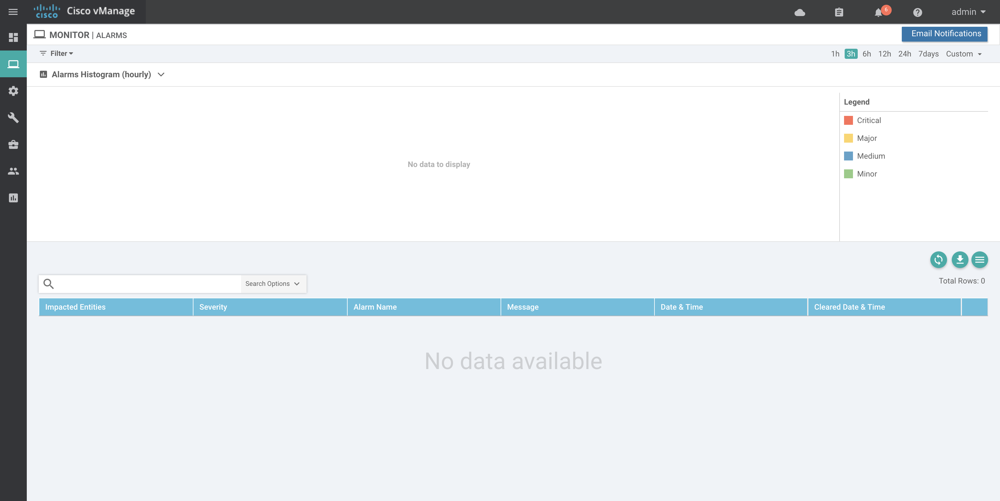

**Step-2:**

-  Enter name of the webhook as `webhook_test`
-	Select severity level as Critical and Medium.
-	Select Alarm Name as Interface Admin State Change, Interface State Change.

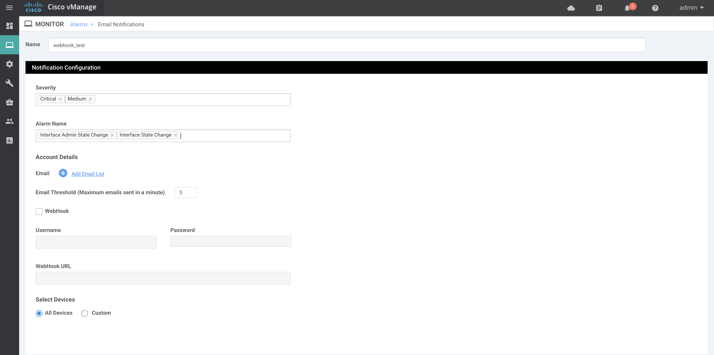

**Step-3:**

-	Click on `Add Email list` and provide dummy emailid `test@test.com` as we are using only webhooks in our lab.

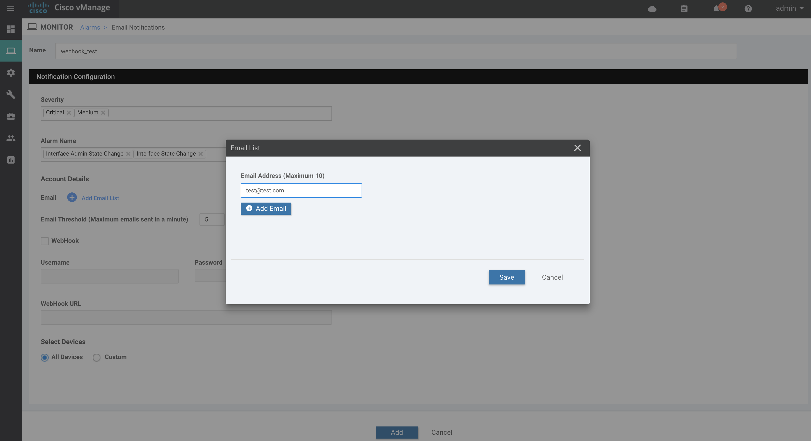

**Step-4:**

-	Enable webhook checkbox.
-	Provide the webhook server URL, username and password for webhook. ( Note : Here webhook	server doesn't have authentication configured, please provide dummy username and password i.e test/test ) 
-	Webhook URL should be `http://198.18.133.36:5001/`
-  Select `All Devices` option and click on `Add` to complete the webhook settings. 

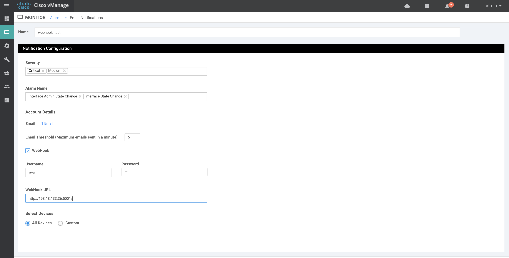

**Step-5:**

-	Enable email notifications in Administration settings of vManage.
-  Select Security option `None` and enter SMTP Server as `test.mail.com`
-  Enter From address and Reply to address as `test@test.com`

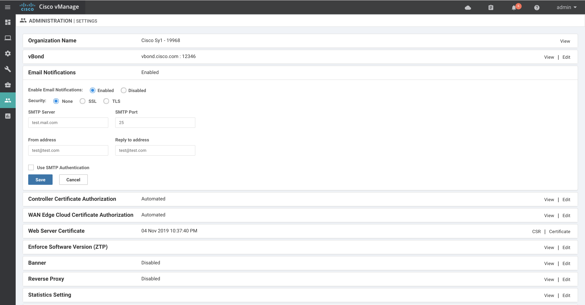


##	 Notifications Dashboard 

- List of webhooks or notifications configured can be seen in section `Alarms > Email Notifications`

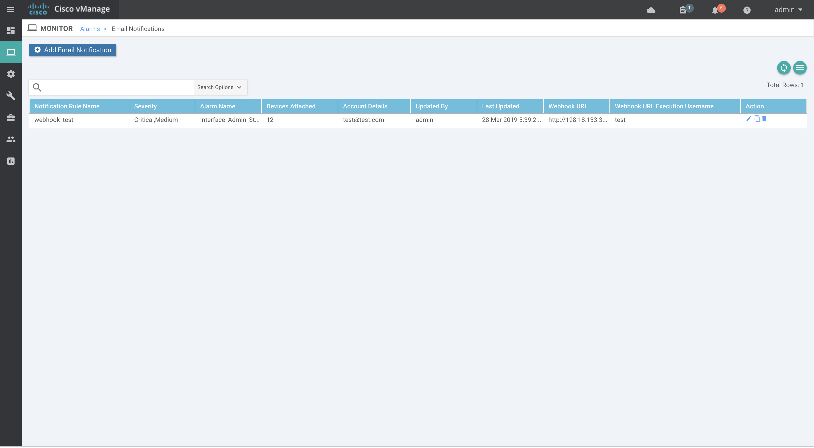

## Set up Webhook server on Windows VM

Now let’s try to set up webhook server on windows VM to accept notifications sent from vManage

- In order to accept HTTP post requests sent from vManage, we need to enable http web server and design API route.
- Below code spins up flask web server listening on port 5001 for HTTP POST request
- Defined alarms() functions accepts the POST request at route http://server-ip:port/ and extracts the data from request.

```
from flask import Flask, request
import json

app = Flask(__name__)

@app.route('/',methods=['POST'])
def alarms():
   data = json.loads(request.data)
   print(data)
   return "OK"

if __name__ == '__main__':
   app.run(host='0.0.0.0', port=5001, debug=True)
```

## Enable Webhook Server

**Step-1:**

On windows command prompt, run the command `py -3.7 webhook.py` to spin up http webhook server.

**Sample Response**

```
C:\Users\Administrator\Desktop\sdwan_prog_lab>py -3.7 webhook.py
 * Serving Flask app "webhook" (lazy loading)
 * Environment: production
   WARNING: Do not use the development server in a production environment.
   Use a production WSGI server instead.
 * Debug mode: on
 * Restarting with stat
 * Debugger is active!
 * Debugger PIN: 213-160-007
 * Running on http://0.0.0.0:5001/ (Press CTRL+C to quit)
```

**Step-2**

- Login to mputty software and select `vBond` under `Infrastructure` 
- Login details for vBond is username/password : admin/admin
- In vpn512, `shut` and `no shut` interface eth0 to trigger an alarm. Please see below screenshot for command output. 


Once alarm is received on vmanage, vmanage pushes the notification to webhook server and below is the sample output on webhook server on receiving notifications from the vManage.

**Sample Response**

```
{'devices': [{'system-ip': '21.21.21.21'}], 'eventname': 'interface-admin-state-change', 'type': 'interface-admin-state-change', 'rulename': 'interface-admin-state-change', 'component': 'VPN', 'entry_time': 1553775129000, 'statcycletime': 1553775129000, 'message': 'The interface admin-state changed to down', 'severity': 'Critical', 'severity_number': 1, 'uuid': '6ac8ad69-b821-47ba-90f7-49cfcf86cf43', 'values': [{'host-name': 'vBond-2', 'system-ip': '21.21.21.21', 'if-name': 'eth0', 'new-admin-state': 'down', 'vpn-id': '512'}], 'rule_name_display': 'Interface_Admin_State_Change', 'receive_time': 1553775129959, 'values_short_display': [{'host-name': 'vBond-2', 'system-ip': '21.21.21.21', 'if-name': 'eth0', 'new-admin-state': 'down'}], 'acknowledged': False, 'active': True}
vmanage-ip - - [28/Mar/2019 08:12:07] "POST / HTTP/1.1" 200 -
{'devices': [{'system-ip': '21.21.21.21'}], 'eventname': 'interface-state-change', 'type': 'interface-state-change', 'rulename': 'interface-state-change', 'component': 'VPN', 'entry_time': 1553775129000, 'statcycletime': 1553775129000, 'message': 'The interface oper-state changed to down', 'severity': 'Critical', 'severity_number': 1, 'uuid': '952a966a-5968-4a81-ab3c-0c817bfb39b9', 'values': [{'host-name': 'vBond-2', 'system-ip': '21.21.21.21', 'if-name': 'eth0', 'new-state': 'down', 'vpn-id': '512'}], 'rule_name_display': 'Interface_State_Change', 'receive_time': 1553775130145, 'values_short_display': [{'host-name': 'vBond-2', 'system-ip': '21.21.21.21', 'if-name': 'eth0', 'new-state': 'down'}], 'acknowledged': False, 'active': True}
vmanage-ip - - [28/Mar/2019 08:12:07] "POST / HTTP/1.1" 200 -
{'devices': [{'system-ip': '21.21.21.21'}], 'eventname': 'interface-state-change', 'type': 'interface-state-change', 'rulename': 'interface-state-change', 'component': 'VPN', 'entry_time': 1553775133000, 'statcycletime': 1553775133000, 'message': 'The interface oper-state changed to up', 'severity': 'Medium', 'severity_number': 3, 'uuid': '66ec20f7-7a87-4280-b4b4-d23dcc9d83ca', 'values': [{'host-name': 'vBond-2', 'system-ip': '21.21.21.21', 'if-name': 'eth0', 'new-state': 'up', 'vpn-id': '512'}], 'rule_name_display': 'Interface_State_Change', 'receive_time': 1553775133686, 'values_short_display': [{'host-name': 'vBond-2', 'system-ip': '21.21.21.21', 'if-name': 'eth0', 'new-state': 'up'}], 'acknowledged': False, 'cleared_events': ['952a966a-5968-4a81-ab3c-0c817bfb39b9'], 'active': False}
vmanage-ip - - [28/Mar/2019 08:12:11] "POST / HTTP/1.1" 200 -
{'devices': [{'system-ip': '21.21.21.21'}], 'eventname': 'interface-admin-state-change', 'type': 'interface-admin-state-change', 'rulename': 'interface-admin-state-change', 'component': 'VPN', 'entry_time': 1553775133000, 'statcycletime': 1553775133000, 'message': 'The interface admin-state changed to up', 'severity': 'Medium', 'severity_number': 3, 'uuid': '32b55c04-ee36-4dfe-bc2c-8e7494c1ae9a', 'values': [{'host-name': 'vBond-2', 'system-ip': '21.21.21.21', 'if-name': 'eth0', 'new-admin-state': 'up', 'vpn-id': '512'}], 'rule_name_display': 'Interface_Admin_State_Change', 'receive_time': 1553775133713, 'values_short_display': [{'host-name': 'vBond-2', 'system-ip': '21.21.21.21', 'if-name': 'eth0', 'new-admin-state': 'up'}], 'acknowledged': False, 'cleared_events': ['6ac8ad69-b821-47ba-90f7-49cfcf86cf43'], 'active': False}
vmanage-ip - - [28/Mar/2019 08:12:11] "POST / HTTP/1.1" 200 -
```

## Alarms on vManage

-	Above webhook logs corresponds to these alarms which were recieved by vManage.

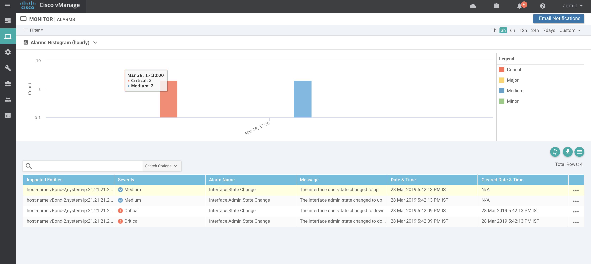

## Conclusion

In this section, we learned how to enable webhook notifications on the vManage and how to build the API route to process the data recieved from vManage via webhook notifications.


# References

[sdwan docs](https://sdwan-docs.cisco.com/Product_Documentation/Command_Reference/vManage_REST_APIs/vManage_REST_APIs_Overview/Using_the_vManage_REST_APIs)

**Grafana Download link** 

`https://dl.grafana.com/oss/release/grafana-6.0.2.windows-amd64.zip`

**Influxdb Download link**

`https://dl.influxdata.com/influxdb/releases/influxdb-1.7.4_windows_amd64.zip`
