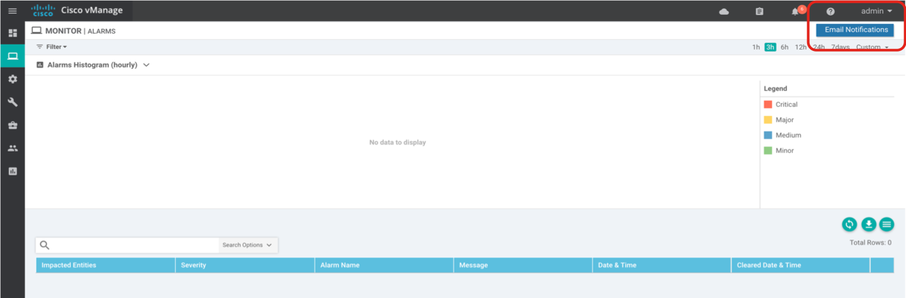
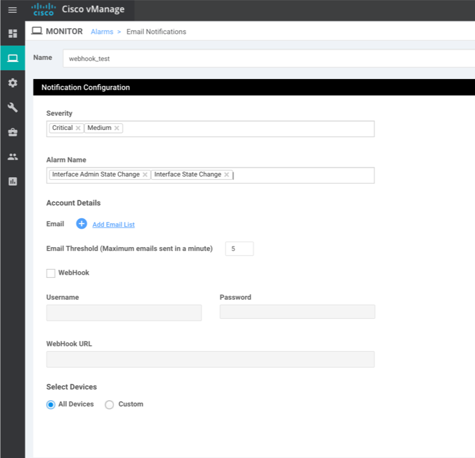
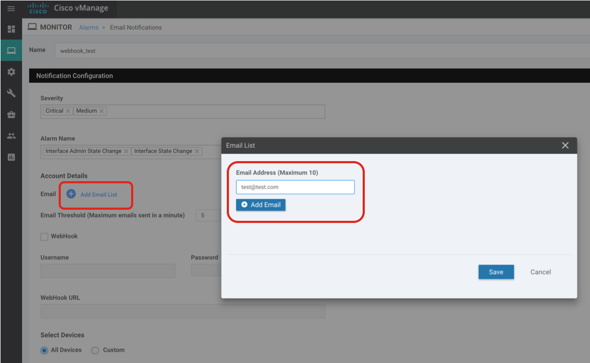
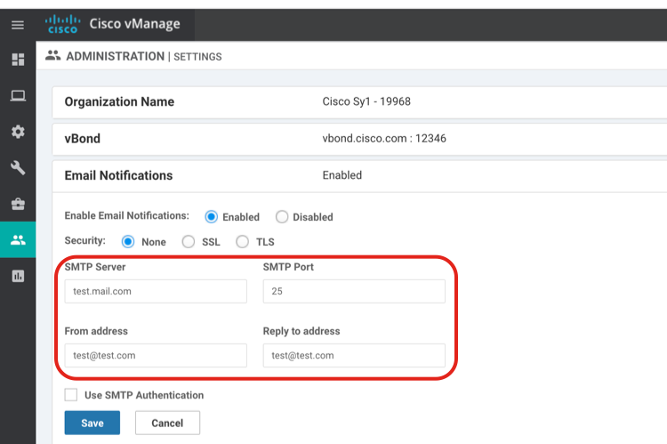
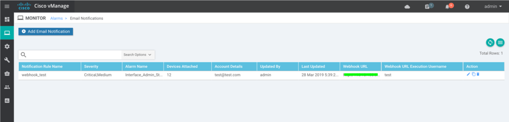
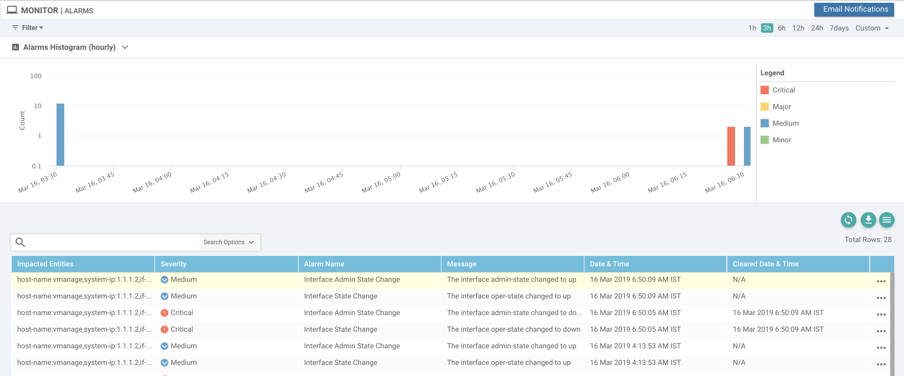
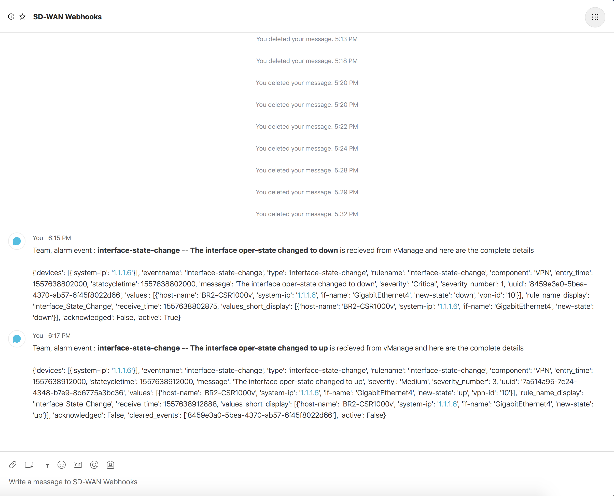

# Webhook 

-   Webhooks enable push-model mechanism to send notifications in real-time.
-   In order to retrieve alarms in real-time from the vManage using the REST API's, we need to poll for the data frequently. However by using webhooks, vManage can send HTTP POST request to the external systems in real-time once alarm is received. 
-   Webhooks are sometimes referred to as “Reverse APIs,” and we must design an API to consume or process the data sent via webhook.

# Prerequisites

-  This feature is supported from vManage 18.3 release onwards

# Requirements

To use this application you will need:

* Python 3.7+
* Cisco SD-WAN 18.3+

# Install and Setup

Clone the code to local machine.

```
git clone https://github.com/suchandanreddy/sdwan-apis.git
cd sdwan-apis/webhooks
```

Setup Python Virtual Environment (requires Python 3.7+)

```
python3.7 -m venv venv
source venv/bin/activate
pip3 install -r requirements.txt
```

Setup local environment variables to provide Webex Teams Authorization and Room ID details.

Examples:

For MAC OSX and Ubuntu Environment:

```
export bearer_token=<authorization bearer token>
export room_id=<webex teams room-id>
```

For Windows Environment:

```
set bearer_token=<authorization bearer token>
set room_id=<webex teams room-id>
```

# vManage Configuration

Steps to enable webhook notifications for pushing alarms to external systems.

**Step-1:**

- Select "Email Notifications" from "Monitor -> Alarms"



**Step-2:**

- Enter name of the webhook as <b>webhook_test</b>
- Select severity level for example, <b>Critical and Medium</b>
- Select Alarm Name for example,  <b>Interface Admin State Change and Interface State Change</b>



**Step-3:**

- Click on <b>Add Email list</b> and provide dummy email-id **test@test.com** , If you are using only webhooks.



**Step-4:**

- Enable webhook checkbox.
- Provide the webhook server URL, username and password for webhook. 

(**Note:** If webhook server doesn't have authentication configured, please provide dummy username and password)

- Provide the Webhook Server URL
- Select **All Devices** or **Custom** option and click on **Add** to complete the webhook settings.


**Step-5:**

- Enable email notifications in Administration settings of vManage.

(**Note:** Email notifications should be enabled in order to use Webhooks.)

- For using only Webhooks, please provide dummy values so, Select Security option **None** and enter SMTP Server as **test.mail.com**

- Enter dummy values for **From address** and **Reply to address** as **test@test.com**



This completes the configuration on vManage to enable webhooks  

#	Notifications Dashboard 

List of webhooks or email notifications configured can be seen in section **Alarms > Email Notifications**



# Test Webhook

From vManage shell, run curl command and send dummy HTTP POST request to webhook server to make sure it is reachable.

**Sample output**

```
vmanage# vshell
vmanage:~$ curl -v -X POST -H 'Content-type: application/json' http://<webhook-server-ip>:5001/
*   Trying <webhook-server-ip>...
* TCP_NODELAY set
* Connected to <webhook-server-ip> (<webhook-server-ip>) port 5001 (#0)
> POST / HTTP/1.1
> Host: <webhook-server-ip>:5001
> User-Agent: curl/7.58.0
> Accept: */*
> Content-type: application/json
>
* HTTP 1.0, assume close after body
< HTTP/1.0 500 INTERNAL SERVER ERROR
< Content-Type: application/json
< Content-Length: 44
< Server: Werkzeug/0.15.2 Python/3.7.3
< Date: Sun, 12 May 2019 13:22:25 GMT
<
"Expecting value: line 1 column 1 (char 0)"
* Closing connection 0
```

# Set up Webhook server on ubuntu

Now let’s try to set up webhook server on ubuntu to accept notifications sent from vManage

- In order to accept HTTP post requests sent from vManage, we need to enable http web server and design API route.
- Below code spins up flask web server listening on port 5001 for HTTP POST request
- Defined alarms() function that accepts the POST request at route http://server-ip:port/ and extracts the data from request, then it sends message
to Webex Teams Room. 

```
@app.route('/',methods=['POST'])
def alarms():
   try:
      data = json.loads(request.data)
      print(data)
      message =  '''Team, alarm event : **''' + data['eventname'] + '** ------ **' + data['message'] + '''** is recieved from vManage and here are the complete details <br><br>'''  + str(data)
      api = CiscoSparkAPI(access_token=bearer_token)
      res=api.messages.create(roomId=room_id, markdown=message)
      print(res)
   except Exception as exc:
      return jsonify(str(exc)), 500 
   
   return jsonify("Message sent to Webex Teams"), 200
```

## Logs from Webhook Server:

Spin up http webhook server as background process

```
$python3 webhook.py &
[1] 7889

 * Serving Flask app "webhook" (lazy loading)
 * Environment: production
   WARNING: Do not use the development server in a production environment.
   Use a production WSGI server instead.
 * Debug mode: on
 * Running on http://0.0.0.0:5001/ (Press CTRL+C to quit)
 * Restarting with stat
 * Debugger is active!
 * Debugger PIN: 216-076-679
```

Sample JSON output on webhook server on receiving notifications from the vManage.

<pre>

<b>Interface Down Alarm:</b>

{
  "entry_time": 1557638802000,
  "severity": "Critical",
  "rule_name_display": "Interface_State_Change",
  "severity_number": 1,
  "component": "VPN",
  "values_short_display": [
    {
      "if-name": "GigabitEthernet4",
      "host-name": "BR2-CSR1000v",
      "system-ip": "1.1.1.6",
      "new-state": "down"
    }
  ],
  "devices": [
    {
      "system-ip": "1.1.1.6"
    }
  ],
  "eventname": "interface-state-change",
  "receive_time": 1557638802875,
  "statcycletime": 1557638802000,
  "values": [
    {
      "if-name": "GigabitEthernet4",
      "vpn-id": "10",
      "host-name": "BR2-CSR1000v",
      "system-ip": "1.1.1.6",
      "new-state": "down"
    }
  ],
  "rulename": "interface-state-change",
  "active": true,
  "message": "The interface oper-state changed to down",
  "type": "interface-state-change",
  "acknowledged": false,
  "uuid": "8459e3a0-5bea-4370-ab57-6f45f8022d66"
}

<b>Interface Up Alarm:</b>

{
  "entry_time": 1557638912000,
  "severity": "Medium",
  "rule_name_display": "Interface_State_Change",
  "severity_number": 3,
  "component": "VPN",
  "values_short_display": [
    {
      "if-name": "GigabitEthernet4",
      "host-name": "BR2-CSR1000v",
      "system-ip": "1.1.1.6",
      "new-state": "up"
    }
  ],
  "devices": [
    {
      "system-ip": "1.1.1.6"
    }
  ],
  "eventname": "interface-state-change",
  "receive_time": 1557638912888,
  "statcycletime": 1557638912000,
  "values": [
    {
      "if-name": "GigabitEthernet4",
      "vpn-id": "10",
      "host-name": "BR2-CSR1000v",
      "system-ip": "1.1.1.6",
      "new-state": "up"
    }
  ],
  "cleared_events": [
    "8459e3a0-5bea-4370-ab57-6f45f8022d66"
  ],
  "rulename": "interface-state-change",
  "active": false,
  "message": "The interface oper-state changed to up",
  "type": "interface-state-change",
  "acknowledged": false,
  "uuid": "7a514a95-7c24-4348-b7e9-8d6775a3bc36"
}

</pre>

# Alarms on vManage

-	Above webhook logs corresponds to these alarms which were recieved by vManage.



# Alert on Webex Teams Space

- The script sends the message to provided Webex Teams Space/Room and here is the sample output. 



# References

Online webhooks can be set up using https://webhook.site

SD-WAN Docs : https://sdwan-docs.cisco.com/Product_Documentation/vManage_How-Tos/Operation/Configure_Email_Notifications_for_Alarms
